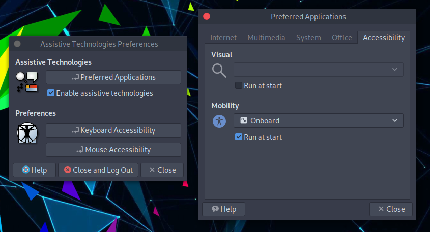

# Assistive Technologies

## Onscreen Keyboard

To enable the onscreen keyboard please follow these steps.

From the top panel menu: 

Or from the bottom panel's searchbar write `Assistive Technologies`

Then

`Enable assistive technologies -> click on Preferred Applications -> select Onboard keyboard -> Run at start`. 

