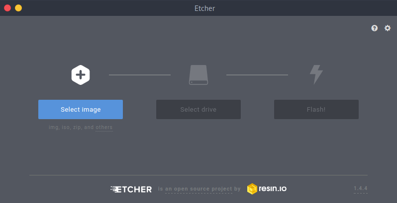
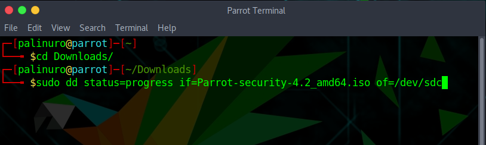

## The ISO Formats

ISO is a special file format that represents the content of a small storage device.

The ParrotOS ISO file is a bit-per-bit representation of the content of a Parrot USB or DVD drive.

You can use a special software like [Etcher](https://www.etcher.io) to clone the content of the Parrot ISO to a USB drive and transform such USB drive into a full Parrot USB device.

The Parrot ISO uses the iso9660 format (also known as isohybrid). It is a special ISO format that contains not only the partition content, but also the partition table.

Some ISO writing programs do not write the iso bit-per-bit into the usb drive at a low level. They create a custom partition table and just copy the file in the USB drive in an unofficial and non-standard way. This behavior is against what the isohybrid was created for, and may break core system functionalities and make the system uninstallable from such USB drives.

It is highly recommended **NOT** to use programs like **unetbootin**, or any program which not isohybrid compliant.

---

## How to create a Parrot USB drives 

To create a Parrot bootable device you need a USB drive of at least 4gb for the Security edition or 2gb for the Home edition

## __Etcher__

Our official ISO Writing Tool is [Etcher - www.etcher.io](https://www.etcher.io).

It works on GNU/Linux, Mac OS and Windows. We **highly** suggest Etcher over all other methods.

---

## __DD__

__[dd](https://en.wikipedia.org/wiki/Dd_(Unix))__ (and its derivatives) is a command line tool integrated in every UNIX and UNIX-like system, and it can be used to write the ISO file into a block device bit per bit. Due to the potential to brick your system, if you are not familiar with Linux we strongly recommend to use Etcher.

&nbsp;

[Using Parrot](https://docs.parrotlinux.org/info/start/) | [Troubleshooting](https://docs.parrotlinux.org/trbl/start/) | [Linux Beginner Guide](https://docs.parrotlinux.org/library/lbg-basics/) | [Home](https://docs.parrotlinux.org/)