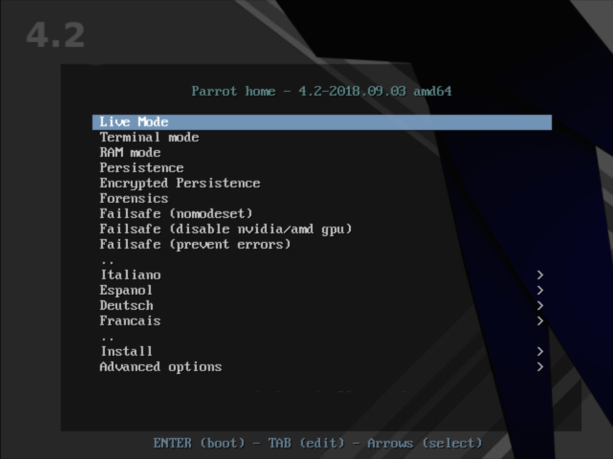

# Parrot Images

## Security/Home/Workstation

These images can be installed from removable DVD, USB or SD storage media. 

The easiest way to prepare the installation media is to download any of the 64-bit Parrot images that will fit on the device and burn it. Of course this will destroy anything already there.

To learn how to burn the images, please see [here](create-boot-device.md).

Some BIOSes can boot USB or SD card storage directly or allow to boot temporarily from them, and some cannot. You may need to configure your BIOS to boot from a “Removable Drive” or even a “USB-ZIP” to get it done.

For detailed instructions visit the [here](install-debian.md)

## Netinstall

This image is intended to boot from small storage media (like an old USB drive or CD) and install additional packages over a network; hence the name 'netinst'.

The image has the software components needed to run the installer and the base packages to provide a minimal Parrot system. There are several architectures to select: amd64, arm64 and armhf.

Download whichever type you prefer and burn it. The procedure is the same as described on the above link.

### I have a Parrot USB or DVD, now what?

If you properly followed the precedent tutorial, then you have a bootable USB drive or DVD.

These storage devices can be used to boot the computer up with Parrot live environment.

Every computer firmware is different, and an unique omnicomprehensive tutorial to boot an external system from USB just does not exist.

It is your responsibility to know how your own computer works and how to change boot device on it.

Once you booted the system from the USB device you can choose many ways to boot the system from the **Parrot Live Boot Menu**.

### Live Mode and Installer

The Parrot Boot Menu can let you install the system on your computer, or start it in Live Mode.

The live mode is a special boot mode offered by many linux distributions, including Parrot OS, which allows the users to load a fully working linux environment without the need to install it.

This is possible because the system is not loaded onto the system's hard drive, instead it is loaded into memory.

Parrot OS offers the ability to install the OS while in the live environment offers the ability to test the system without interfering with the computer's hard drive.

&nbsp;

[Using Parrot Linux](https://www.parrotsec.org/docs/info/startpage/) | [Troubleshooting](https://www.parrotsec.org/docs/trbl/trbl-start/) | [Linux Beginner Guide](https://www.parrotsec.org/docs/library/lbg-start/) | [Home](https://www.parrotsec.org/docs/) 