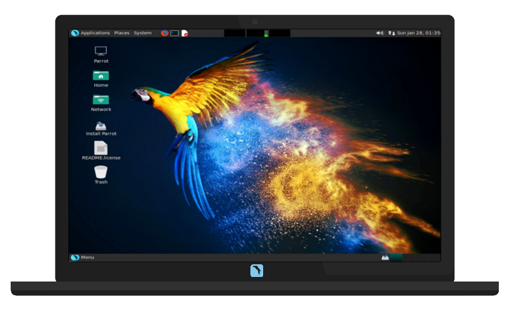

# Home

For the Parrot Project homepage, visit [parrotsec.org](https://parrotsec.org).

An important part of any operating system is documentation, the technical manuals that describe the operation and use of programs. As part of its efforts to create a high-quality free operating system, the Parrot Project is making every effort to provide all of its users with proper documentation in an easily accessible form.

The documentation is still under construction, and all the Parrot users are invited to contribute to the creation and translation process of this portal.

&nbsp;

&nbsp;

&nbsp;

# Documentation

## Introduction

[What is Parrot](intro/what-is-parrot)

[Should i use Parrot?](intro/should-i-use-parrot)

## Getting Started

[Download](getting-started/download.md)

[Create a boot device](getting-started/create-boot-device.md)

[How to boot](getting-started/how-to-boot.md)

[Use Parrot](getting-started/use-parrot.md)

[Install Parrot](getting-started/install-parrot.md)

&nbsp;

&nbsp;

&nbsp;

### Need help? [Contact our Staff](https://community.parrotsec.org)

We have a staff of volunteers and community members who can help you
troubleshooting system bugs and guiding you from the installation to the
configuration and customization of the system.

&nbsp;

&nbsp;

&nbsp;

### Debian Documentation

The Parrot Project is based on top of the testing branch of Debian GNU/Linux, then most of the [Debian Documentation](https://www.debian.org/doc) is valid for Parrot as well.

 * [Debian Handbook](https://www.debian.org/doc/manuals/debian-handbook/), the comprehensive user manual
 * [Debian Reference](https://www.debian.org/doc/manuals/debian-reference/), a terse user's guide with the focus on the shell command line
 * [The Debian Wiki](https://wiki.debian.org/)

 &nbsp;

 &nbsp;

 &nbsp;

 &nbsp;

 &nbsp;

 &nbsp;

 &nbsp;

 &nbsp;
