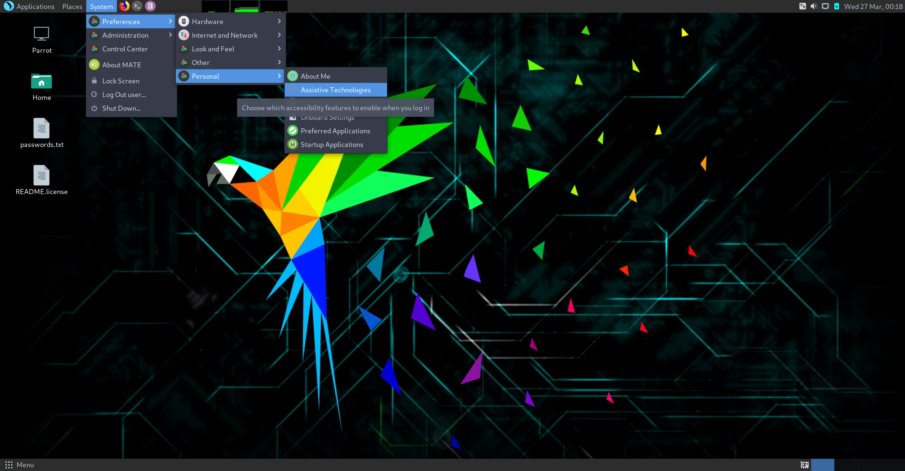
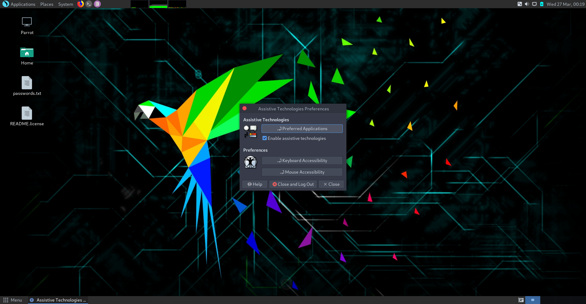
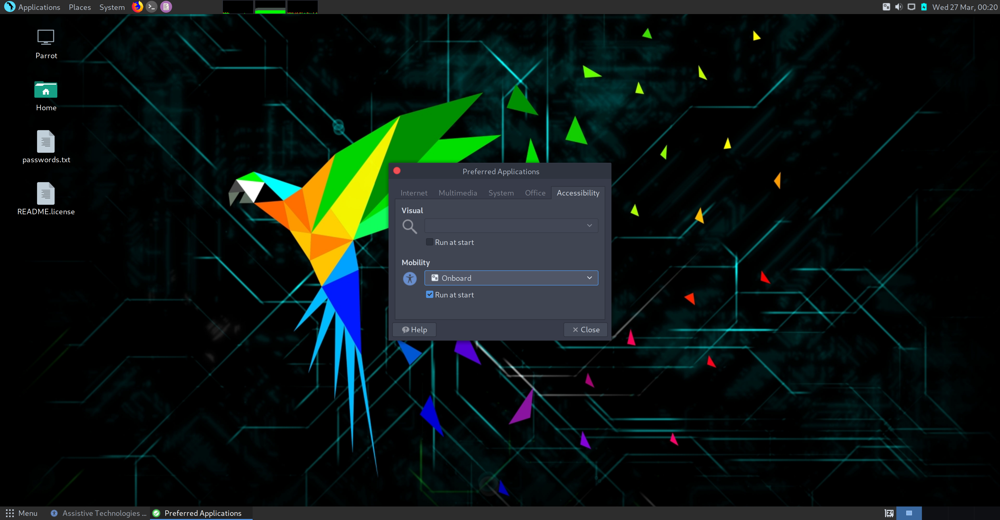
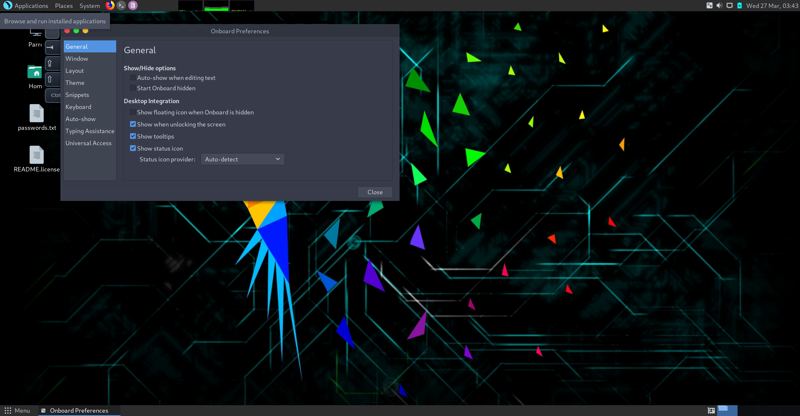
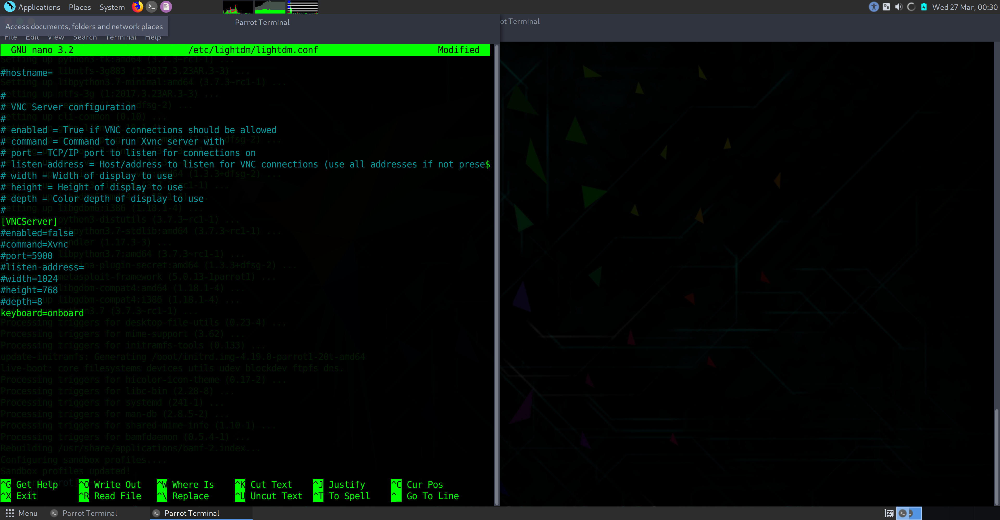

&nbsp;

&nbsp;

&nbsp;

NOTE: Currently a WIP (work in progress, some links might not work and some documentation is likely missing.)

## Onscreen Keyboard

To enable the onscreen keyboard please follow these steps.
 
1. From the bottom panel menu:
Search>Assistive Technologies>enable assistive technologies>
click on prefered applications>select onboard keyboard
enable at startup.
OR




2. Then open onboard settings>Desktop Integration>check
show when unlocking screen
 <a
then open a terminal (ALT+T default)
```bash
sudo nano /etc/lightdm/lightdm.conf
```
and add

`keyboard=onboard`

to the bottom

Reboot
At login if you don't see onboard hit F3 and it should appear.

Please let us know if this solves your issue.

[Using Parrot](https://docs.parrot.sh/info/start/) | [Troubleshooting](https://docs.parrot.sh/trbl/start/) | [Linux Beginner Guide](https://docs.parrot.sh/library/lbg-basics/) | [Home](https://docs.parrot.sh/) 