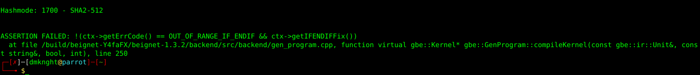
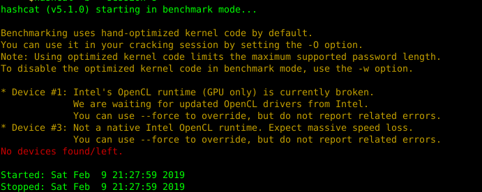
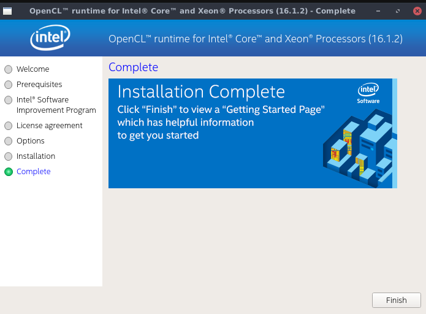
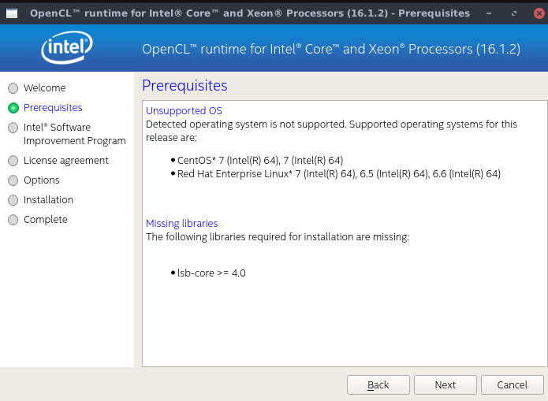
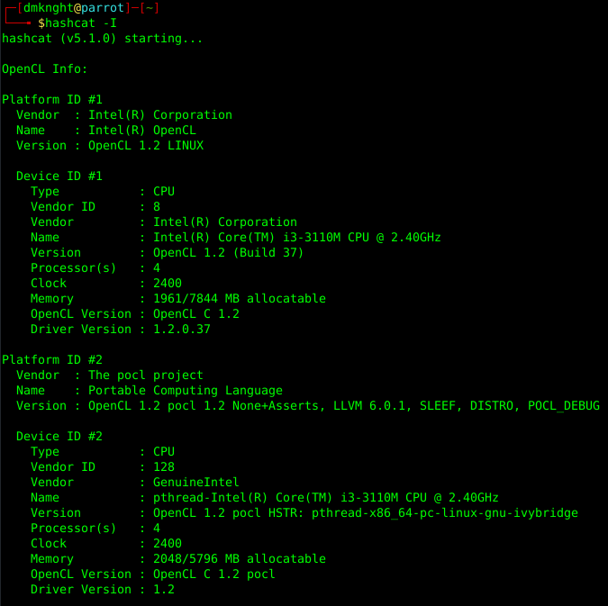
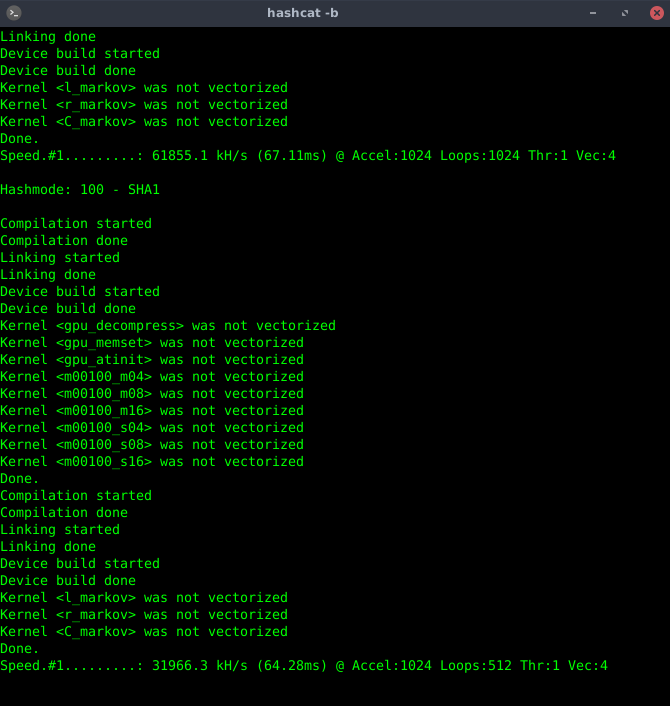

### 1. Why?
- Your machine has no AMD / Nvidia graphic card, but you still want to use hashcat.
- You want it more stable and faster than pre-installed driver (beignet)



- Hashcat doesn't detect your devices (even if beignet was pre-installed)
 
### 2. How?
- Remove beignet: 
```bash
sudo apt purge beignet
```
- Download _`opencl_runtime_16.1.2_x64_rh_6.4.0.37.tgz`_ from `http://registrationcenter-download.intel.com/akdlm/irc_nas/12556/opencl_runtime_16.1.2_x64_rh_6.4.0.37.tgz`. Currently, Intel opencl has github project with 18.X versions. All 18.X versions don't work for me, and 16.1.2 version is latest workable version I can find.
- Extract downloaded file
```
tar -xvf opencl_runtime_16.1.2_x64_rh_6.4.0.37.tgz
``` 
Then run 

```
install.sh
```
If you have missing libraries in this step (screenshot bellow), you can exit installation and install libraries. If there is only lsb-core>=4.0 is missing, you can move to next step (it worked for me).
- Accept their license, choose next and wait.
 
 
- Hashcat now detect my devices (it shows error with beignet driver)
 
- Benchmark is not very fast (compare AMD / Nvidia devices) but it looks faster than beignet


Written by dmknight

If you run into any issues please post in [support](https://community.parrotsec.org/c/support) on the forum.

&nbsp;

[Using Parrot Linux](https://www.parrotsec.org/docs/info/startpage/) | [Troubleshooting](https://www.parrotsec.org/docs/trbl/trbl-start/) | [Linux Beginner Guide](https://www.parrotsec.org/docs/library/lbg-start/) | [Home](https://www.parrotsec.org/docs/) 