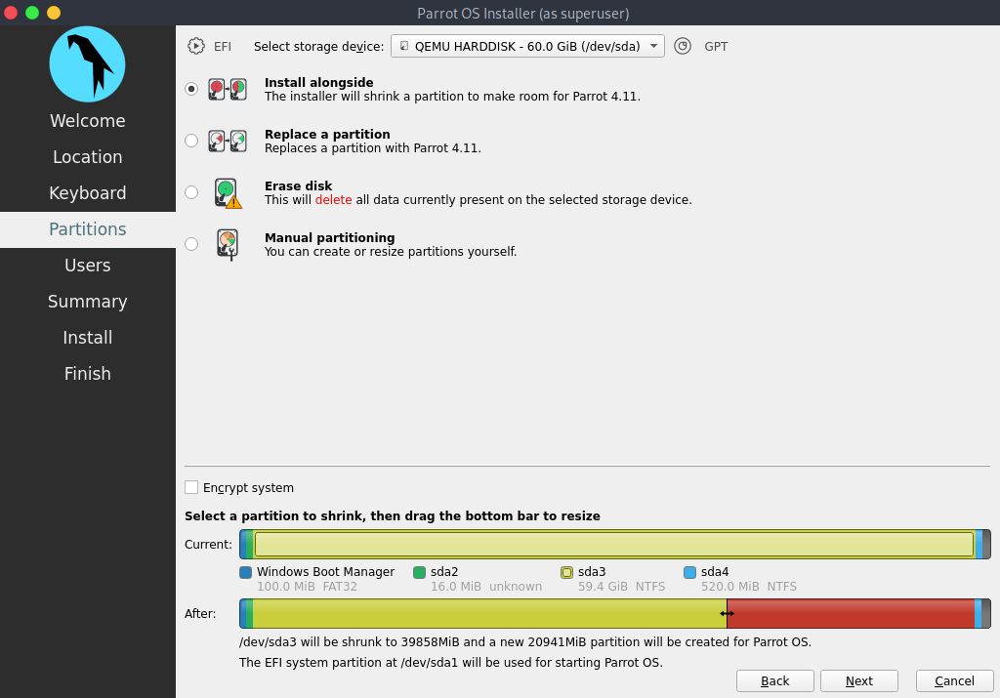
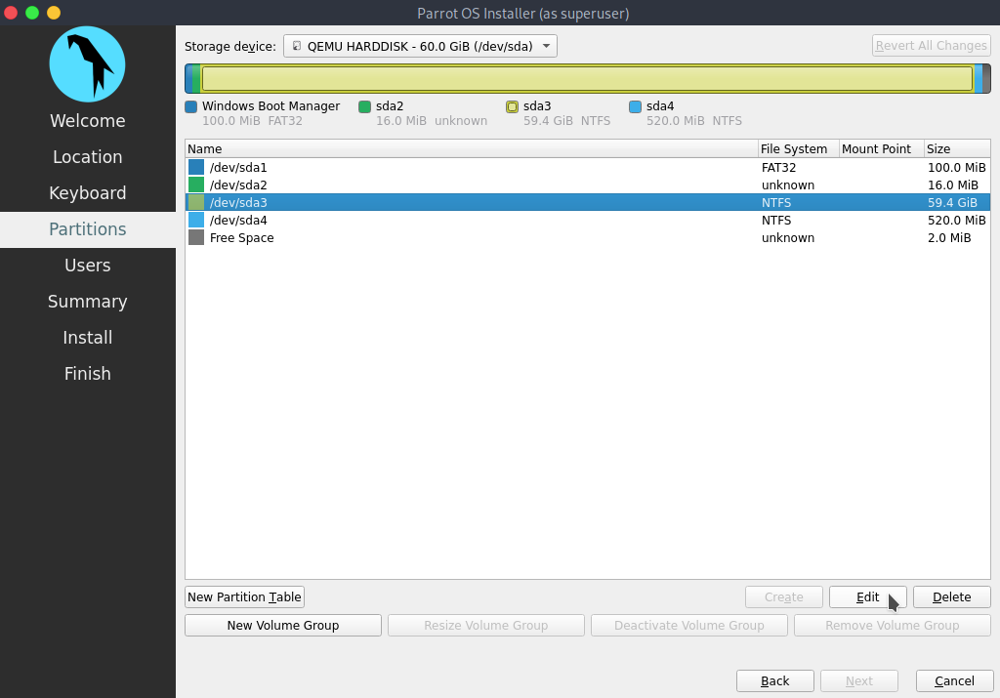
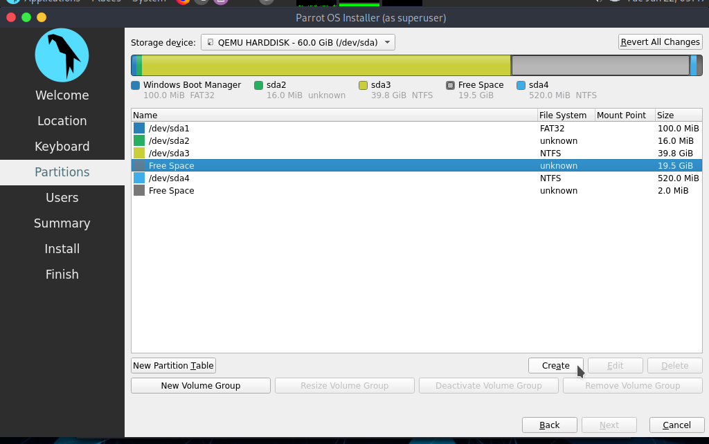
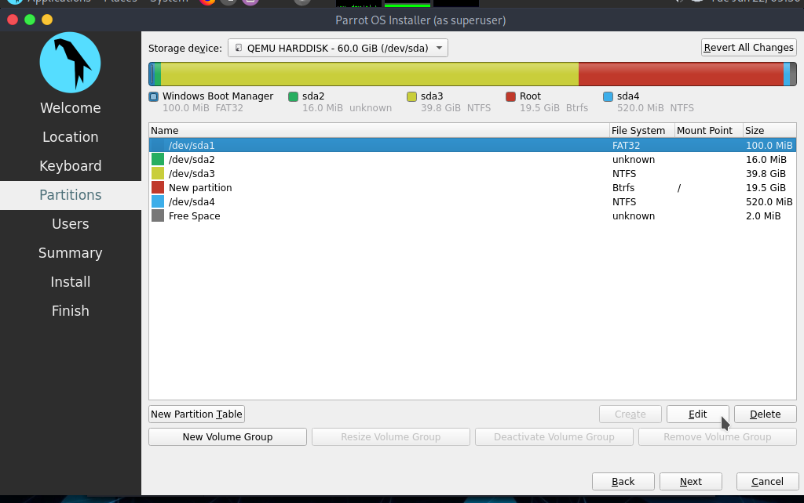
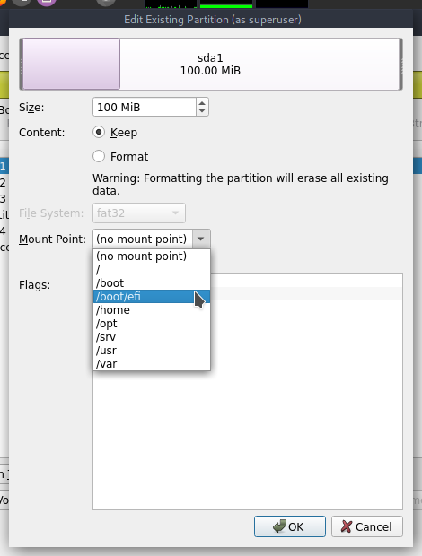
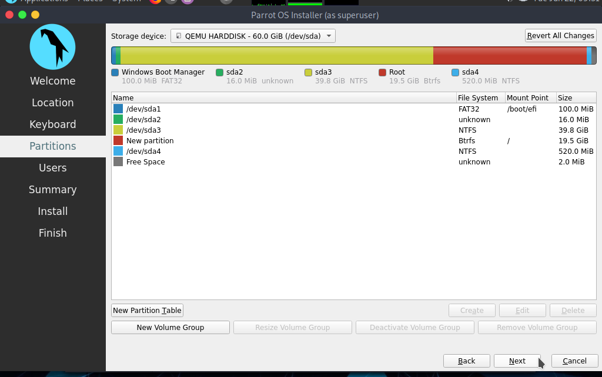

# Dualboot with Windows

It's possible to install ParrotOS alongside Windows, thanks to GRUB and a correct partitioning. 

:::info Note
  Disable Secure Boot and CSM from UEFI settings in your machine.
:::

After following the steps for setting the [Parrot Installation](./) before partitioning, the situation will be similar to this:

There are two ways for proceeding: 

 - [Method 1: Automated Partitioning](<./dualboot-with-windows.html#method-1-automated-partitioning>)
 - [Method 2: Manual Partitioning](<./dualboot-with-windows.html#method-2-manual-partitioning>)

## Method 1: Automated Partitioning

This is more way easier. You just have to select **Install alongside** then select **/dev/sda3** within the bar, drag the bottom bar to resize the partition in order to assign the desired amount of space for ParrotOS, then click on *Next* and proceed with the installation.

## Method 2: Manual Partitioning

This method gives the freedom to choose for ParrotOS the desired amount of space and the number of partitions wanted.

**NOTE:** The **Security** edition needs *at least* 40GB of space, **Home** edition needs *at least* 20GB of space (which has been used for this guide.). No Swap partition has been set because it has been used on an SSD.

Select **Manual Partitioning** then click on *Next*.

You'll see something similar to this:

In detail:

* **/dev/sda1** is the boot partition.
* **/dev/sda2** is MSR (Microsoft Reserved partition).
* **/dev/sda3** is where Windows 10 exists.
* **/dev/sda4** is a hidden partition which contains Windows Files for Recovery.

This is the standard partitioning for Windows, which follows this exact order.
Select **/dev/sda3** then click on *Edit*.

This window will open up:

Here is possible to shrink/resize partitions (by dragging the bar or inserting the size in MiB), set flags and mount point.

Drag the bar or set the value for getting the desired partition size (in this case the total amount of the partition size is 60GB, and we dedicated 40GB to Windows, and thereby the remaining 20GB have been assigned to ParrotOS.) then click on *OK*.

This is the updated situation, after shrinking the Windows partition, an unallocated space of 20GB is available. Select it, then click on *Create*:

These are the settings for new partition, set the file system you want (ParrotOS uses BTRFS by default), set the mount point in / (**root**), then click on *OK*:

Now, the last step: Set up the boot partition.

Select **/dev/sda1** and click on *Edit*:

Set the mount point in **/boot/efi** then click on *OK*:

This is the final situation, proceed with the installation by clicking on *Next*:

