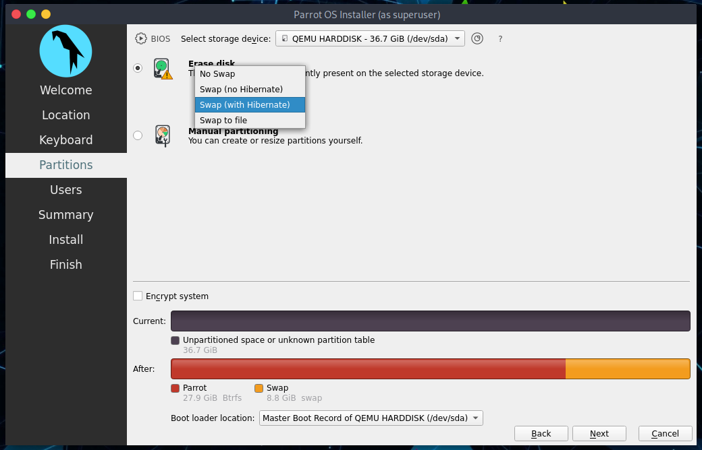
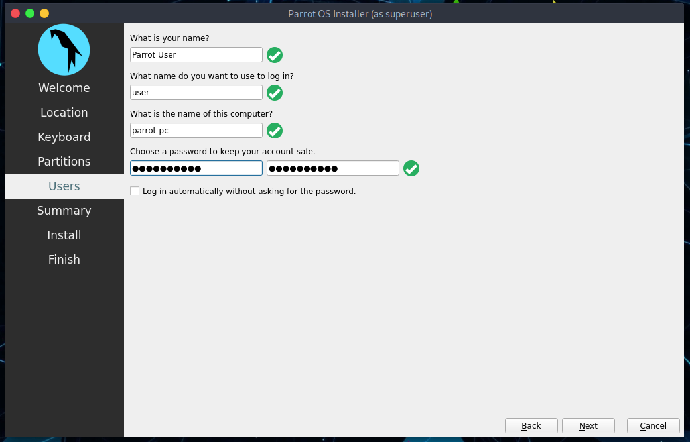
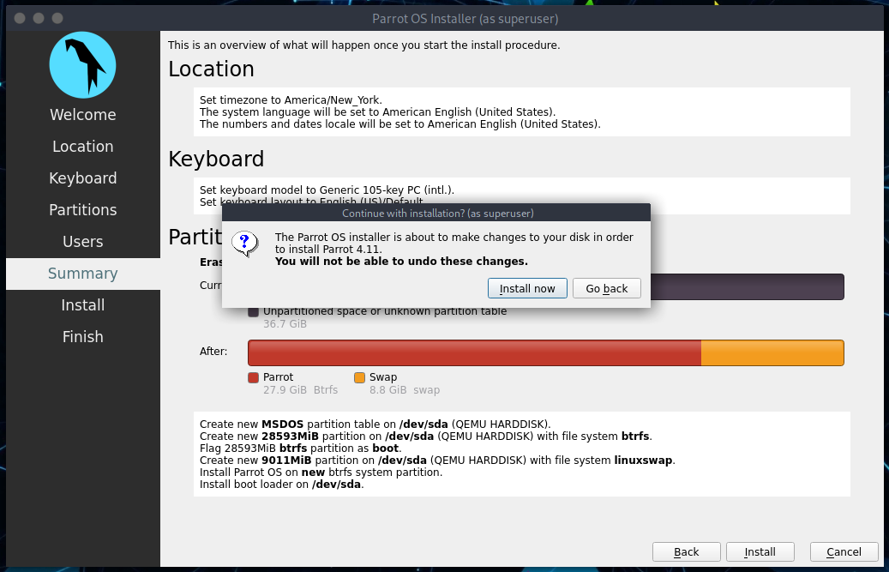

# How to install ParrotOS

This guide will help you install ParrotOS (latest version) on your computer step-by-step through the default official installer: *Calamares*. 

This guide applies to both the [Security](https://parrotsec.org/download/?version=security) and [Home](https://parrotsec.org/download/?version=home) Edition.

Any problems or missing details, please report it to the official [Parrot forum](https://community.parrotsec.org).

Insert your installation media into your computer and through your BIOS settings start Parrot. A screen will appear with several options, including some more advanced. 

Select **Try/Install** and press *Enter*.

Wait for the OS to load (few seconds).

## Welcome in Parrot Live

Here you can test the OS in its entirety, then you can proceed with the installation.

Click on **Install Parrot**:

and the installer, Calamares, will start.

## Let's start!

The next step is selecting the system's language. Choose your language and click on *Next*.

Then select your Region and Zone. Click on *Next*.

Now, you can select the keyboard layout. There are many variations available, and you can test them where its written *"Type here to test your keyboard"*.

Click on *Next*.

### Parrot Security disk partitioning

We think guided partitioning for less experienced users is recommended, 40 GB or more is enough, unless your going to want to install a lot of programs or keep larger file on your hard drive.

Here you can decide whether to enable swap or not. For more information about swap:

[https://wiki.debian.org/Swap](https://wiki.debian.org/Swap)

[https://www.kernel.org/doc/html/latest/power/swsusp.html](https://www.kernel.org/doc/html/latest/power/swsusp.html)

*If you want*, you can also encrypt the system by adding a passphrase:

Select the options that you think will be most useful to you and click on *Next*.

### Creating a new user account

You will be asked to create a new user, for simplicity we have chosen a **user**.
You can enter any name in here.

Remember that it is the password to access your OS account, we recommend you to create a long and complex one.

Then, click on *Next*.

### Completing the installation process

Finally, a summary of the choices made during the procedure:

You can decide whether to change the chosen settings, and then go back, or proceed with the installation of the system. Click on **Install**.

Confirm by clicking **Install now**

And wait for the installation to complete!

With an SSD (Sata), it will take a few minutes.

**Well done! You have successfully installed Parrot OS on your computer!**

### Login to Parrot for the first time

Enter your Password:

**Welcome to Parrot! Congrats!**

