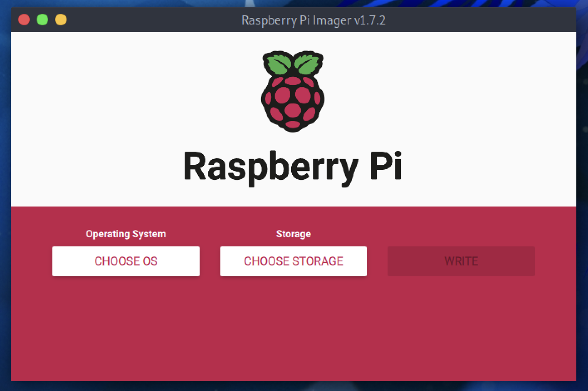
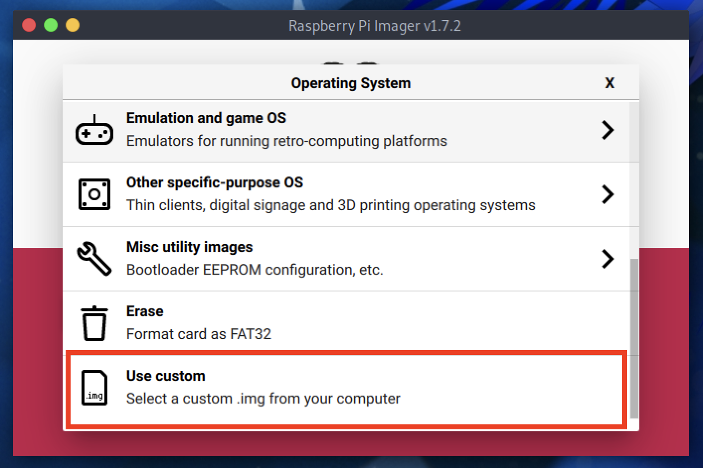

# ParrotOS on Raspberry Pi

One of the novelties of Parrot 5.x is the version dedicated to Raspberry Pi devices. From now on you can harness the full power of ParrotOS on your Raspberry!

This version is available in all the variants offered by Parrot: [Core, Home and Security editions](https://parrotsec.org/download/?version=raspberry).

## Installation process

To proceed with the installation, you will need to get a micro sd card of at least 8 GB (the Core edition however can also be installed on a 4 GB micro sd).

:::info Note
  This procedure applies to any edition of Parrot on Raspberry Pi. Currently ParrotOS has been successfully tested on a Raspberry Pi 3B, 4B and 400.
:::

Now, download the ParrotOS edition of your choice from our [website](https://parrotsec.org).

Then, insert the micro sd into your computer, and in the meantime, download the Raspberry Pi Imager or Balena Etcher. We will need one of these two to install the system in the micro sd.

Click on *Choose OS* and select **Use custom**.

Now a window will open where you can select the downloaded ParrotOS edition. It is a compressed **img.xz** file.

Then select your micro sd by clicking on *Choose Storage*.

Everything is ready, click on *Write* and the writing procedure on the micro sd will start. Once finished, you can insert your micro sd into your Raspberry Pi. Enjoy!

For any questions and/or problems, we kindly ask you to contact us through [our social channels](https://parrotsec.org/community/).