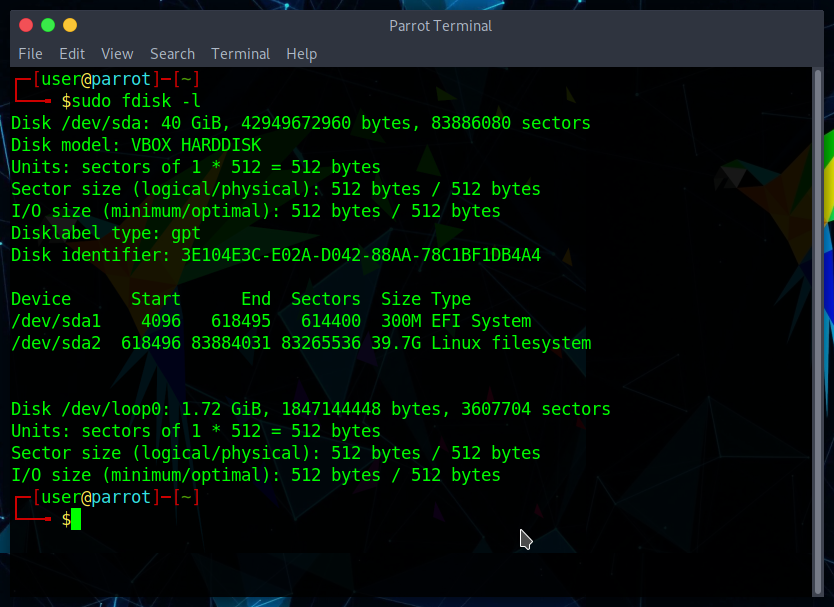
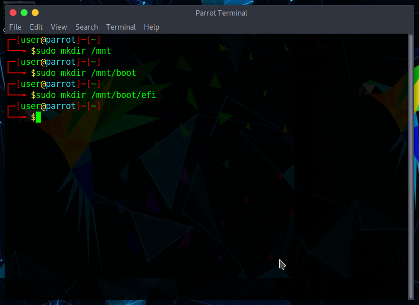
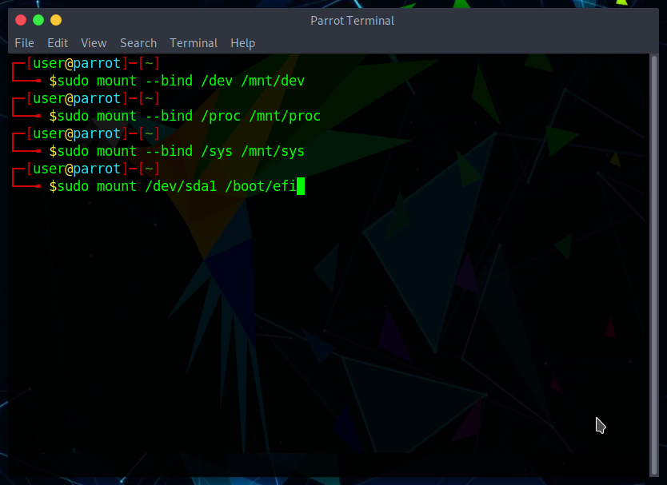
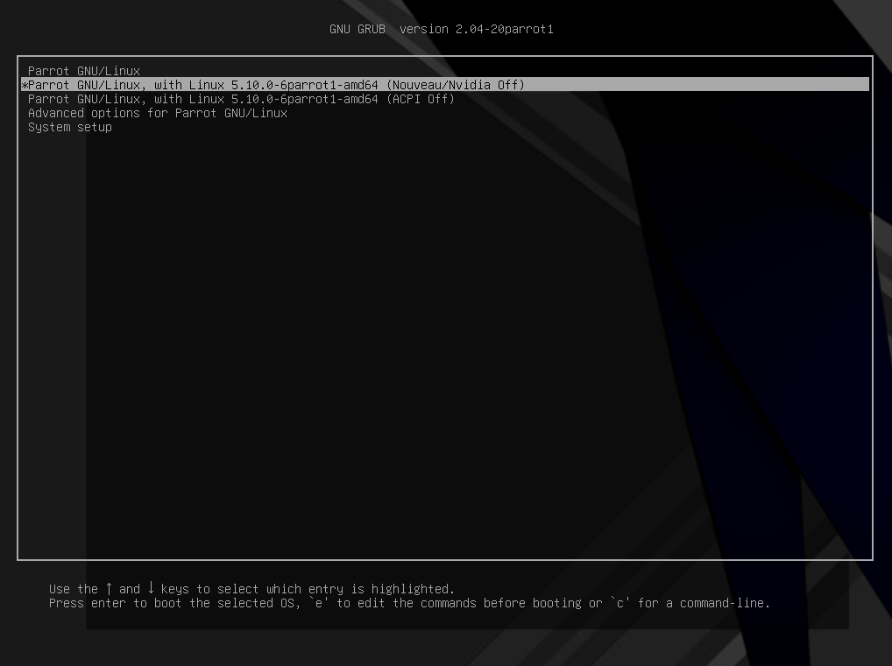

# GRUB

This guide will give you a list of known solutions to use when you are having problems with GRUB. 

If you want to know more about GRUB: 

[GRUB - gnu.org](https://www.gnu.org/software/grub/)

[GRUB -  Wikipedia](https://en.wikipedia.org/wiki/GNU_GRUB)

In order to repair GRUB:

## Step 1 - Pick up ParrotOS Live ISO

[Download](https://parrotsec.org/download/) the latest ParrotOS .iso, [flash it onto an USB drive](https://parrotsec.org/docs/how-to-create-a-parrot-usb-drive.html) and boot it.

## Step 2 - Disk and partition identification

Once you entered the live mode, open terminal and type 

    sudo fdisk -l

The output should be similar to this. `/dev/sda` is usually the first SSD or HDD. If you have an NVMe M.2, the disk will be named `/dev/nvme0n1`. 

* `/dev/sda1` usually is the EFI partition, used for booting the OS in UEFI systems.
* `/dev/sda2` is ParrotOS partition.

## Step 3 - Create the mount folder

A mount folder is needed to perform this operation. So, in the same terminal window, type
    
    mkdir /mnt 

This is the main folder. Next type 

    mkdir /mnt/boot 

followed by

    mkdir /boot/efi

Which creates the directory used for mounting the EFI partition. This is needed for installing the correct GRUB package. 
 

 
## Step 4 - Mount Partitions

Now it's time to mount the partitions. In the same terminal window, type 

    sudo mount -o subvol=@ /dev/sda2 /mnt

:::info Note
  This is needed since ParrotOS default filesystem is BTRFS and it has subvolumes enabled. 
:::

Mount the `dev`, `proc`, `sys` folders and the `EFI` partion in order to get access to the system.  

In the same terminal window, type

    sudo mount --bind /dev /mnt/dev

    sudo mount --bind /proc /mnt/proc

    sudo mount --bind /sys /mnt/sys

    sudo mount /dev/sda1 /mnt/boot/efi
   

## Step 5 - Chrooting and installing GRUB

Time to enter the system. In the same terminal window, type 

    sudo chroot /mnt

Once in chroot environment, type 

    grub-install /dev/sda

After the installation is finished, type `exit` so as to exit the chroot environment. 

## Step 6 - Unmounting partitions and rebooting system

After exiting the chroot environment, unmount all of the partitions and folders used.
In the same terminal window type:

    sudo umount /mnt/dev

    sudo umount /mnt/proc

    sudo umount /mnt/sys

    sudo umount /mnt/boot/efi

    sudo umount /mnt
   

Type `reboot` and press enter. You should now have a restored GRUB working flawlessly.

