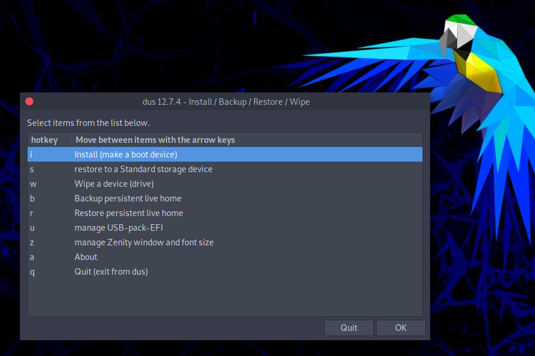

# How to create persistent partition on USB

This guide will show you how to create a persistent partition inside a USB with ParrotOS. To do this we will use the [**mkusb**](https://github.com/sudodus/tarballs) tool.

## Install mkusb

After downloading the ParrotOS *.iso* file from our website, download mkusb from the [repository](https://github.com/sudodus/tarballs).

    git clone https://github.com/sudodus/tarballs.git

Enter the folder just downloaded and extract the tool with *tar*:

    cd tarballs && tar -xf dus.tar.xz

A *dus-tmp* folder will be created from which the tool can be installed, open the terminal and type:

    sudo ./dus-installer i

In the same terminal session, type dus and the program will start:

This tool can also be used to make a USB bootable, recover it, format it and other interesting things.

## Create the persistent partition

Now we can continue with the procedure to create the persistent partition.

Choose the mode to create persistence and select the *.iso* to install:

Now you can select the USB that you can use to create the live.

Here select the upefi package and click *Ok*.

From this window you can assign the amount of space to dedicate to the persistent partition, as desired:

From here on click on Go to confirm the operation and in a few minutes the USB will be ready.

