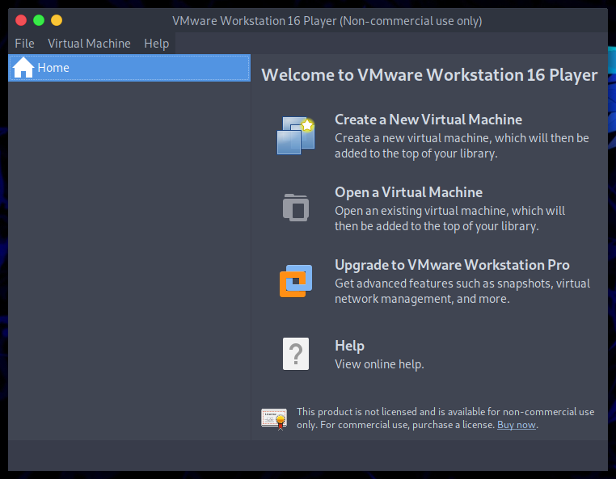
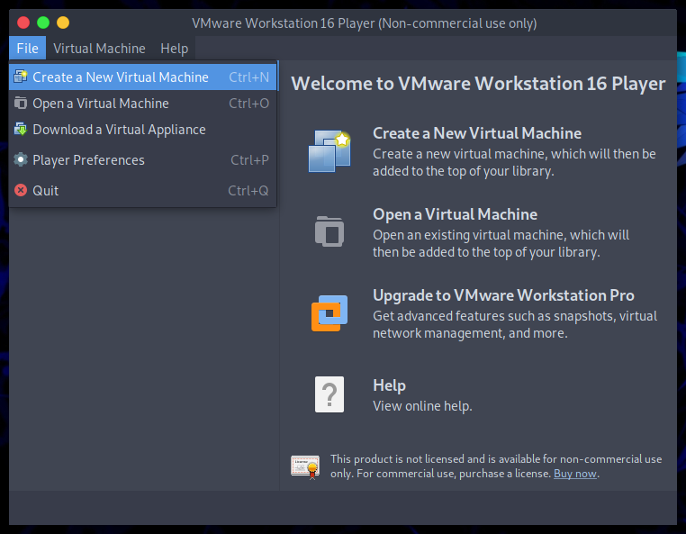
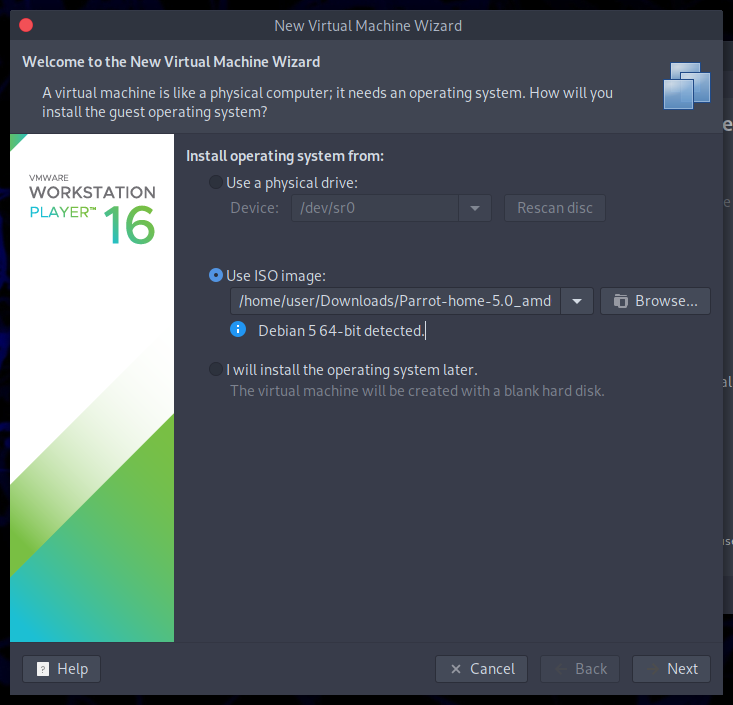
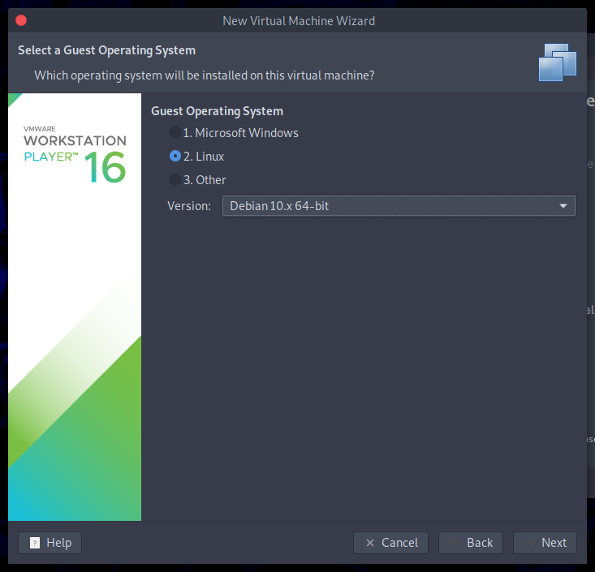
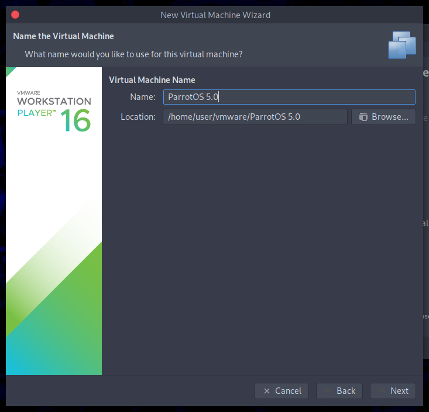
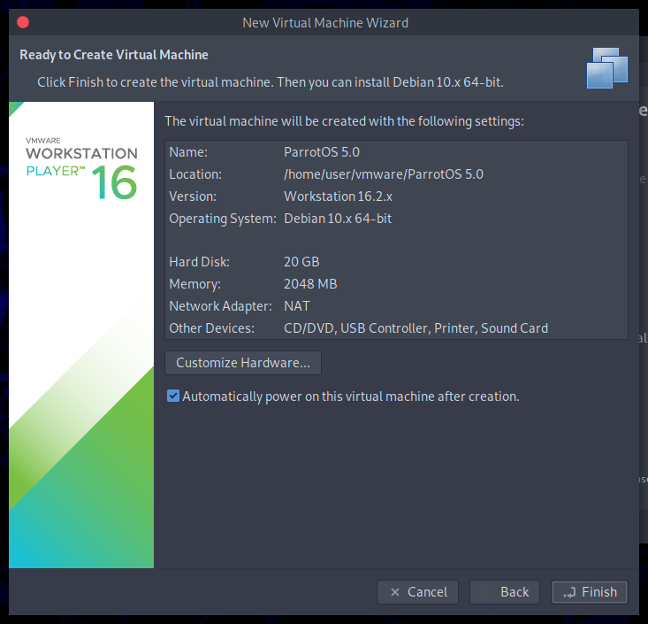
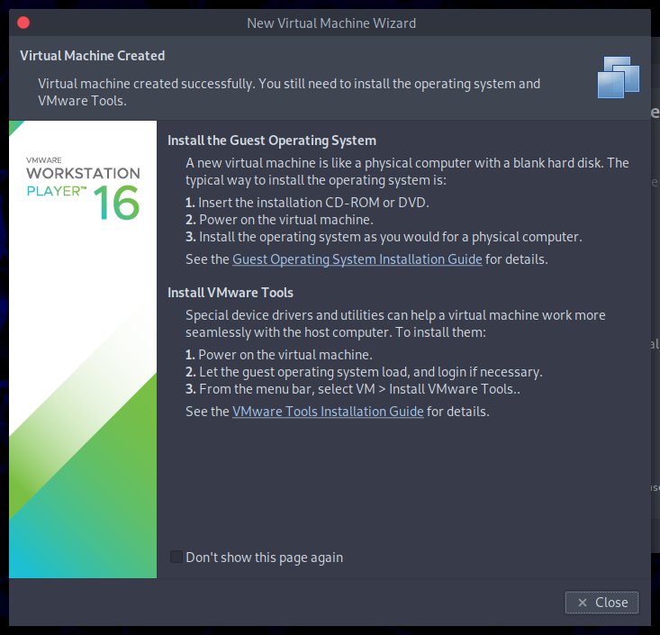
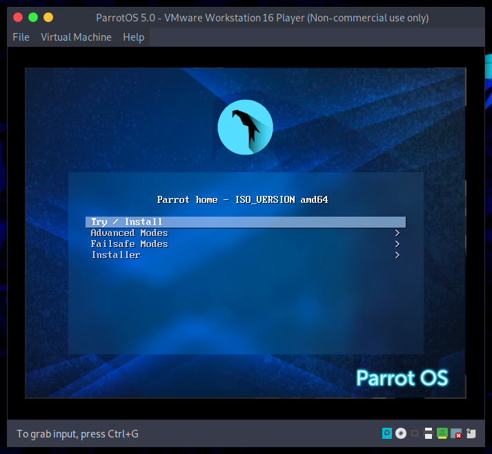
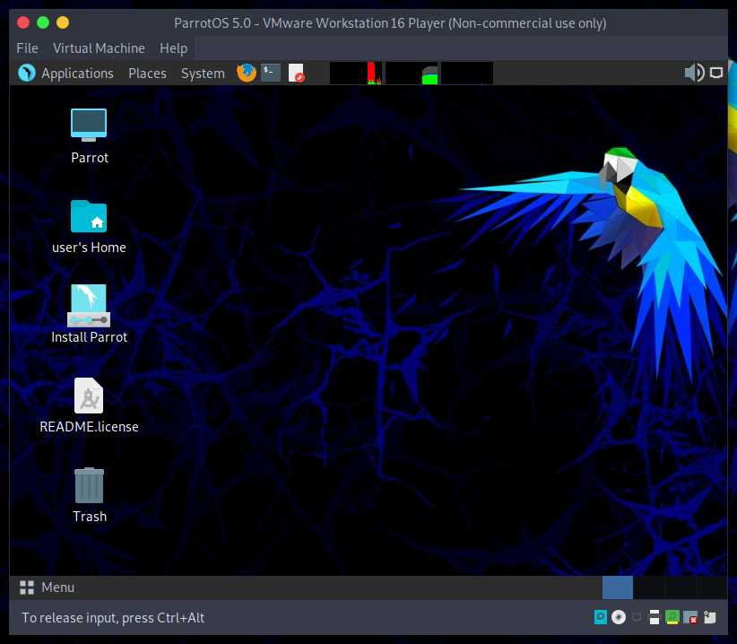

# How to install ParrotOS on VMware

From version 4.11 of ParrotOS up to the latest release, it is possible to use the OS on VMware in all its editions (Workstation Player, Workstation Pro and also on MacOS, Fusion Player and Fusion Pro). 

This guide will allow the user to create a Virtual Machine on VMware Workstation Player. Since the other editions are extensions of the free version of Workstation Player, in the setup and installation procedure, not much will change.

Follow this step by step guide, it will go from installing VMware to creating the Virtual Machine. 

### Step 1 - Download & install VMware Workstation

Once you have downloaded VMware from the [official website](https://www.vmware.com), go to the folder where you downloaded it, and open a terminal. Give execution permissions with

    sudo chmod +x ./VMware-Workstation-$edition-$architecture.bundle

and then, again from the terminal, start it:

    sudo ./VMware-Workstation-$edition-$architecture.bundle

the installer will complete the installation operation and in the Parrot menu you will find your VMware edition ready for use.

### Step 2 - Create a new Virtual Machine

Go to the File tab, and click on **Create a New Virtual Machine**

A new "Virtual Machine Wizard" window will open which will guide you to create the VM, select **Use ISO image** and enter the path of the Parrot iso you downloaded in our website, then click on *Next* button:

:::danger Note
  VMware's automatic recognizer will recognize the system as Debian 5 64-bit, this is incorrect and not a problem, it can be changed very easily in the next steps.
:::

Select the type of operating system you are installing on your VM (then Linux, Debian 10 64-bit), so give the Virtual Machine a name: 

and click on *Next*. 

Based on the Parrot edition downloaded, it is advisable to consult the minimum system requirements, generally 20 gb for a Virtual Machine may be fine for the Home Edition, but for a more complete edition such as the Security Edition, at least 40 gb of dedicated space are recommended.

The next screen will make a summary of the technical specifications of the newly created Virtual Machine. At least *4 GB of RAM* is recommended. It is possible to customize other aspects of the VM by clicking on **Customize Hardware**.

### Step 3 - Install Parrot on your Virtual Machine

The Virtual Machine is ready to use, just start it and grub will start with the various modes to run Parrot. 

From here on, follow the usual installation procedure to install Parrot on your VM.