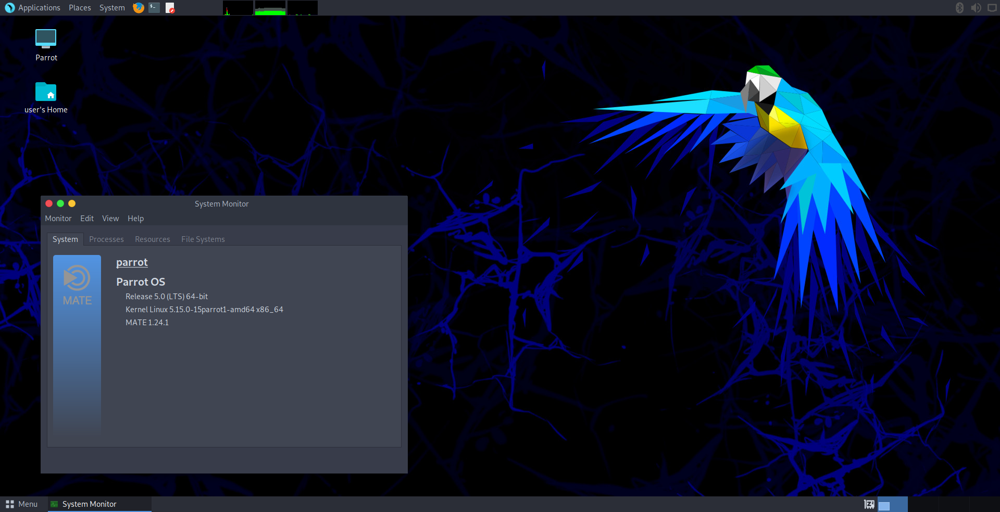

## What is Parrot OS? ##

Parrot OS is a GNU/Linux distribution based on Debian and focused on Penetration Testing, Digital Forensics, Programming and Privacy protection.

Got a Home version? Yes! There is a Home version too. All the Parrot OS Security power for your daily use.

##

<h5 align="center">Parrot Security 4.11</h5>