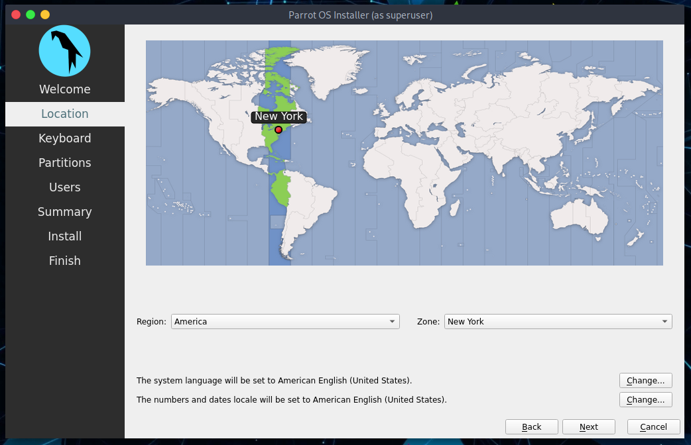
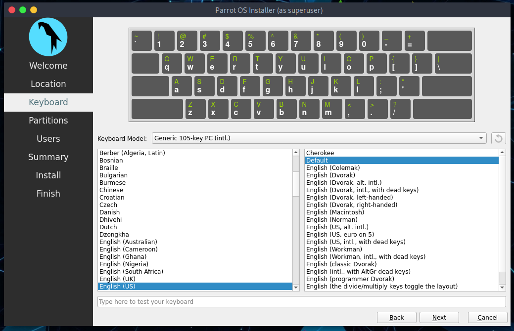
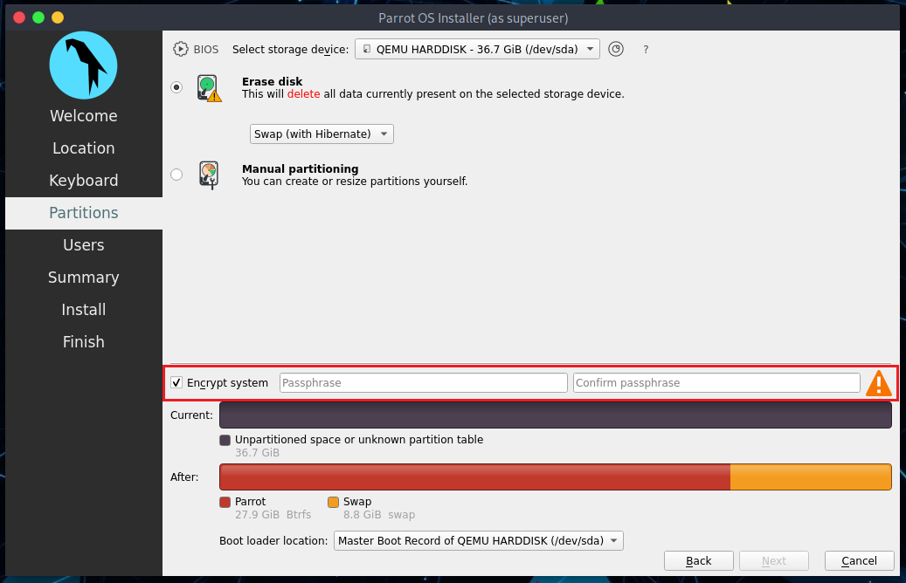
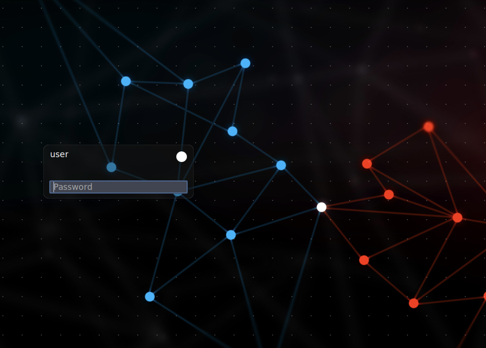

# How to install Parrot Security #

### choose Install ###

From VirtualBox Main Screen, it will boot Parrot Security, click in the Virtual Machine, select *Install* and then click Enter.

### Choose the default Installer (Calamares) ###

Here you can test the OS in its entirety, then you can proceed with the installation.
\
Click on **Install Parrot**:

and the default installer, Calamares, will start.

### Select location ###

In my case I’ve chosen English. Click on *Next*.

### Select language ###

In my case I’ve chosen United States. Click on *Next*.

### Select keyboard layout ###

I’ve selected American English. Click on *Next*.

###  Parrot Security disk partitioning ###

As this is all Virtualized, you can choose anything you want to.
\

I personally think guided partitioning for less experienced users is recommended, 40 GB or more are enough, unless your going to want to install alot more programs or keep larger file on your hard drive.

Here you can decide whether to enable swap or not. For more information about swap, \
[https://wiki.debian.org/Swap](https://wiki.debian.org/Swap) \
[https://www.kernel.org/doc/html/latest/power/swsusp.html](https://www.kernel.org/doc/html/latest/power/swsusp.html)

*If you want*, you can also encrypt the system by adding a passphrase:

### Creating a new user account ### 

You will be asked to create a new user, for simplicity I have chosen a **user**.
You can enter any name in here. 

Then, click on *Next*

### Completing the installation process ###

Finally, a summary of the choices made during the procedure:

You can decide whether to change the chosen settings, and then go back, or proceed with the installation of the system. Click on **Install**.

Confirm by clicking **Install now**

And wait for the installation to complete!
\
With an SSD (Sata), it takes a few minutes.

**Well done! You have successfully installed ParrotOS on your computer!**

### Login to Parrot Security for the first time ###

Enter your Password:

**You just installed Parrot Security! Congrats!**

