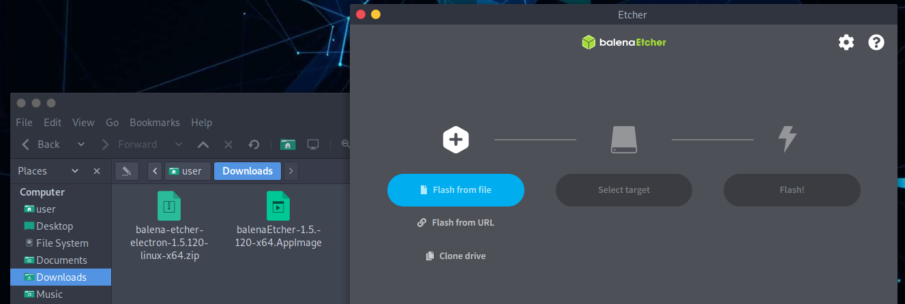
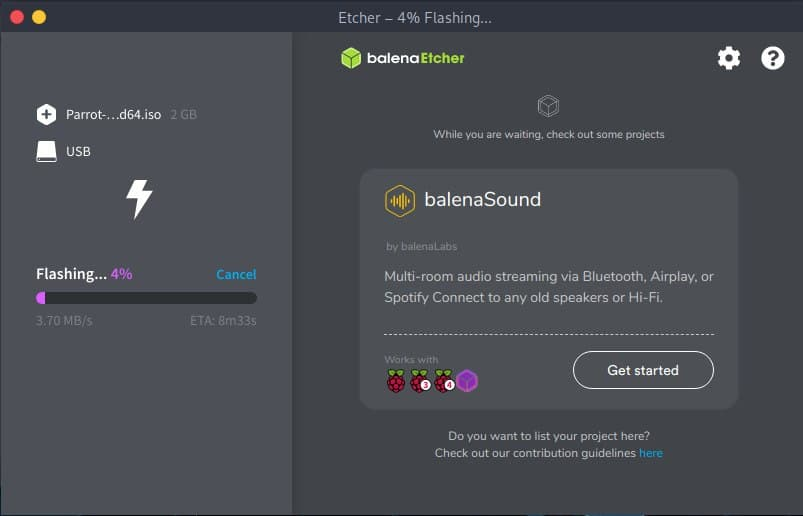

# How to create a Parrot USB drive #

## How to create a Bootable Device ##

First of all, you need to download the latest ISO file from our [website](https://parrotsec.org/download/).

Then you can burn it using [Balena Etcher](https:https://www.balena.io/etcher/) or [ROSA ImageWriter](http://wiki.rosalab.ru/en/index.php/ROSA_ImageWriter). They both work on GNU/Linux, Mac OS and Windows.

You need a USB drive of at least 8 GB for Security Edition and 4 GB for Home Edition.

### Parrot USB installation procedure using Balena Etcher ###

Plug your USB stick into your USB port and launch **Balena Etcher**. Download and unzip it.
\
Click on *.AppImage file*.

Click on **Flash from file**. Select the Parrot ISO and verify that the USB drive you are going to overwrite is the right one.

**Flash!**

Once the burning is complete, you can use the USB stick as the boot device for your computer and boot Parrot OS.

\

## How to boot ##

If you don't know how to boot with your new bootable device follow [this guide](<./06.- How to boot.html>).

## USB Persistence ##

You can find some guidelines about how to create a live device with Persistence [here](<./07.- Parrot USB Live Persistence.html>).
