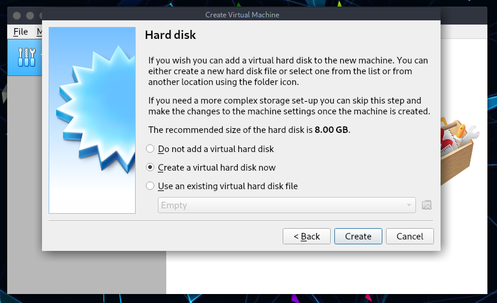
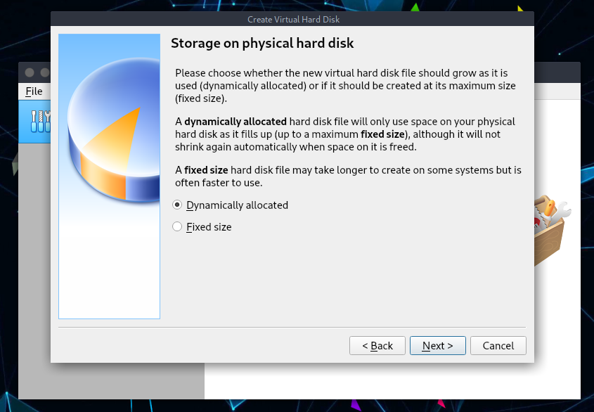
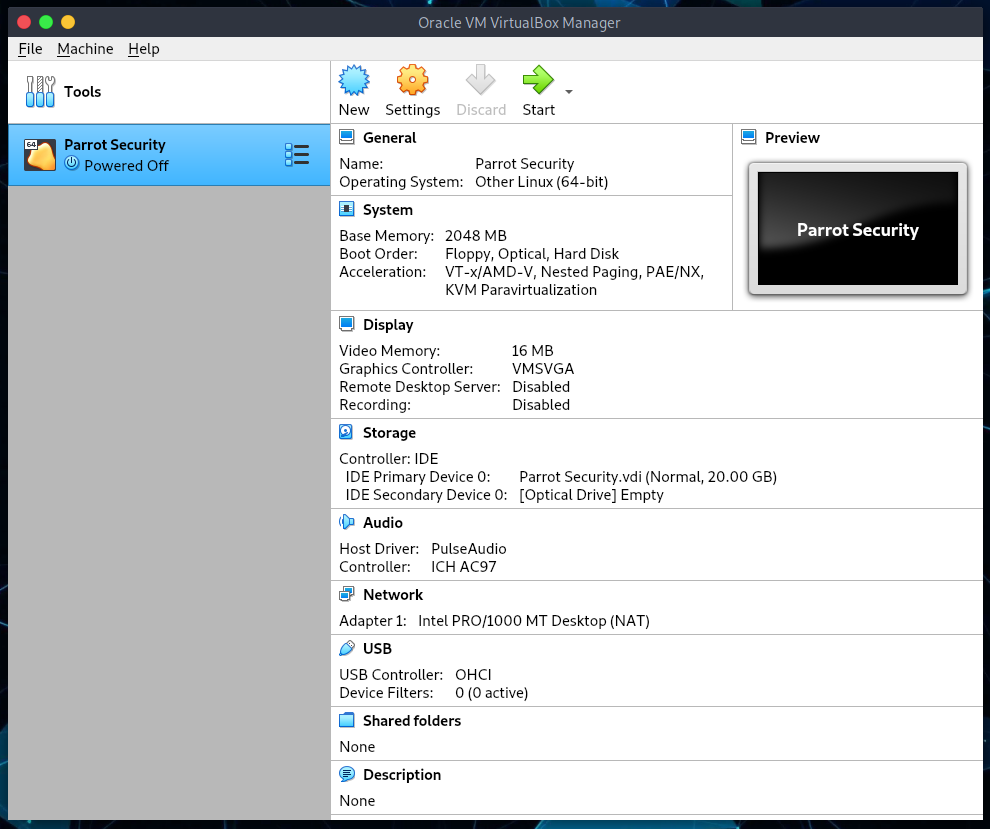
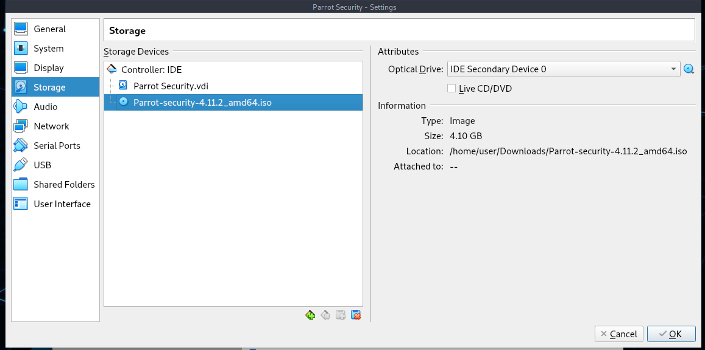
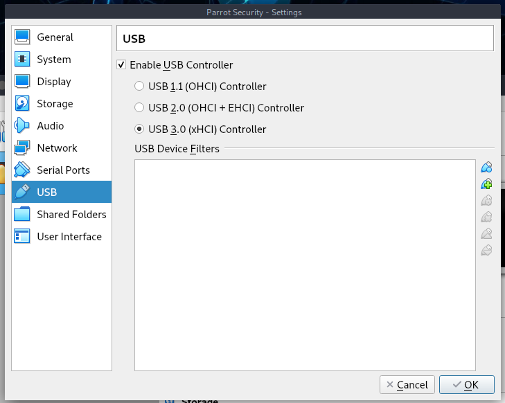
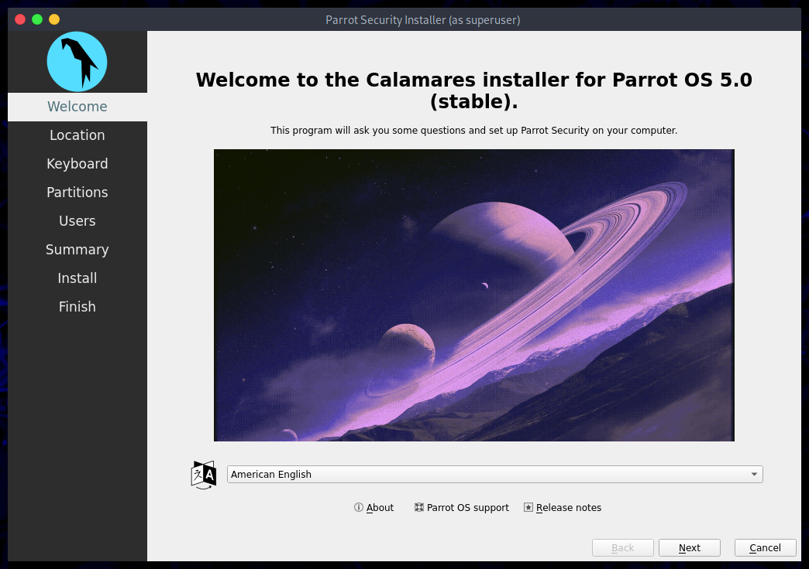
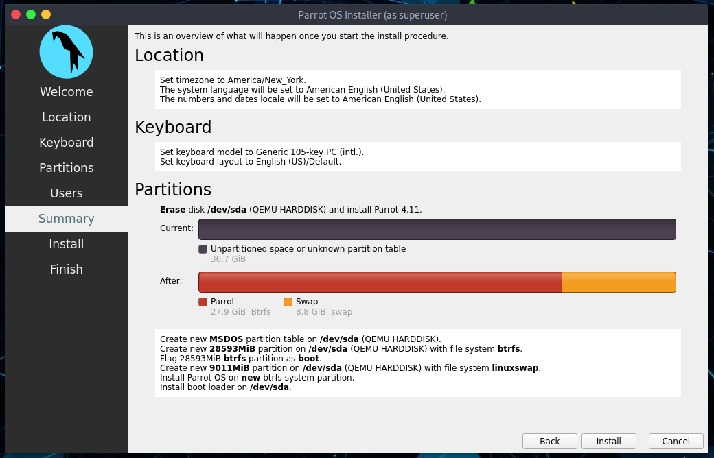
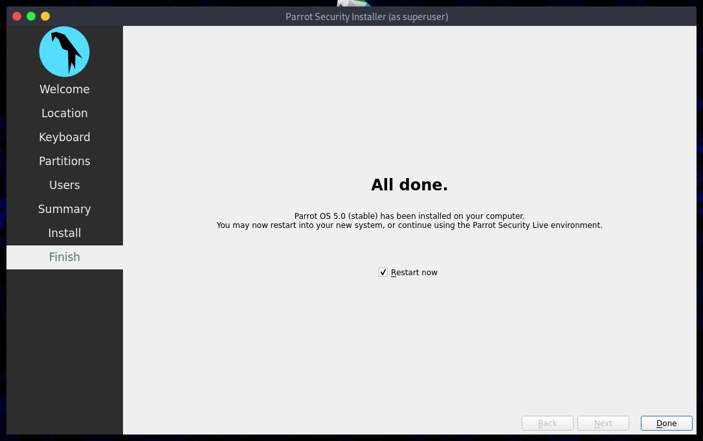
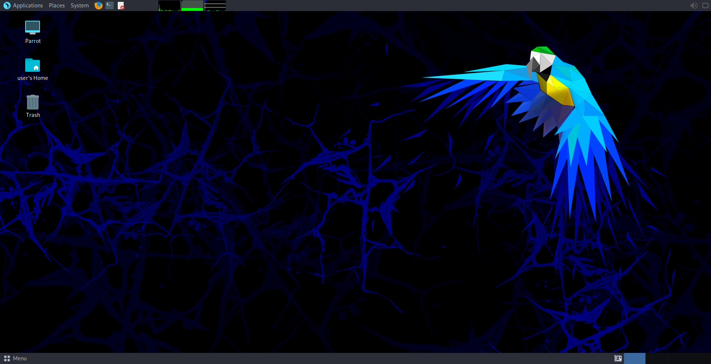

# Installing Parrot Security On VirtualBox #

## This guide will cover the following steps: ##

  * Create a new Virtual Machine

  * Create a new Virtual disk (VDI, dynamic allocation etc...)

  * Modifying some VirtualBox settings (allocating physical and Video memory, selecting OS Type, CPU acceleration etc.)

  * Loading Parrot Security ISO

  * Booting Parrot Security ISO (initial info, location, timezone etc.)

  * Parrot Security disk partitioning (you should try other ways than I’ve showed here to learn)

  * Finalizing installation and running Parrot Security on VirtualBox.

<!-- 
## You have two options here to follow this guide: ##

  - You can just use the slideshow in this page and pretty much follow that...

  - You can read this really long informative guide to get a better understanding of *what to do*
-->

## Things You Need To Install ##

I am going to show this in Windows, here’s the link to the Windows installer [Virtual Box](https://www.virtualbox.org/wiki/Downloads)
\

You can download MacOS or Linux installer (or `sudo apt install virtualbox`) and follow **EXACTLY** the same steps to install and run VirtualBox in your machine.

### Step 1: Create a New Virtual Machine ###
I’ve already given instructions and provided links on how to get VirtualBox and install that above. If you’ve missed it, go back and install VirtualBox.

Once you’ve installed VirtualBox:

  - Open it.
  - Click on New to create a New Virtual Machine.

### Step 1.a: Enter a name for your Virtual Machine ###

Enter Parrot Security as the name. You’ll see Type and set this to Linux, and then the Version to Other Linux (64-bit) and if your using (32-bit) choose it.

### Step 1.b: Allocate Memory/RAM ###

Default memory and recommended size will say 512 even though RAM: minimum 256Mb - 2048Mb is suggested for Parrot Security (64-bit) version.
\

While the (32-bit) installation version of the system can run with 256mb, so I choose 4096 Mb because i have 8 gigs of ram on my system. 
\

Choose the setting best for your machine and click next.

### Step 2: Create a Virtual Hard Drive ###
In this screen select **Create a virtual hard disk now** – *2nd option* and click Create.

### Step 2.a: Select Virtual Drive File type ###

On the next screen select **VDI** – **VirtualBox Disk Image** as your Hard Drive File Type.
\
Click Next.

### Step 2.b: Select Physical hard drive allocation type ###

Select **Dynamically Allocated** and click Next on Storage on Physical hard drive screen.

### Step 2.c: Allocate disk size ###

On **File location and size** screen, it will come up as 8.00 GB as default size and Parrot Security 4.11 (which we’ve set on step 1.a).
\
Choose which fits your needs and click Next. 

### Step 3: Modify VirtualBox settings ###
So far, we’ve done the followings, checklist for you:

  * Created a New Virtual Machine
  * Created Virtual Hard disk
  * Fiddled with disk properties, type and size.
 
At this point you should be in the following screen. 
\
*Note that I am using Parrot Security x64 bit*, 
\
in case you’re using 32-bit you can change those options here:
  

  
### Step 3.a: Select type of OS ###

Depending on which ISO you downloaded you should select the correct Version here.

As Parrot Security is derived from Debian, I’ve selected Other Linux (64-bit) on *General > Basic*.
\

If you’re using a 32-bit ISO, select Other Linux (32-bit) as your version.

### Step 3.b: Enable shared Clipboard and Drag’n’Drop feature ###

Select *General > Advanced TAB* and change Shared Clipboard and Drag n’Drop to Bidirectional. This will allow you to copy paste files from your HOST machine on the fly.

### Step 3.c: Update Virtual Motherboard options ###

Select *System > Motherboard*, un-check Floppy (Do you even have a floppy disk drive anymore?) and check the box for **Enable I/O APIC**.
\

Note that you can change base memory allocation in the same screen. We’ve set it to 1024 MB previously. My PC got 8.00 GB RAM, which means I can actually allocate a lot more to make Parrot Security respond faster on my Virtual Machine.
\

If you feel your Virtualized Parrot Security is slow, you should increase this Base Memory allocation.

The calculations are as follows: 

  * 1.00 GB = 1024 MB
  * 2.00 GB = 2048 MB
  * 3.00 GB = 3072 MB

You get the idea, just multiply 1024 with the amount of Memory/RAM you want and put the value in here.

### Step 3.d: Select number of Processors and enable PAE/NX ###

I’ve changed Processor to 2 (I got 8 CPU’s in my machine, this screen will show how many you have). Try sticking with EVEN numbers here.

Check the box for **Enable PAE/NX**.

### Step 3.e: Allocate Video memory and 3D acceleration ###

Select **Display > Video and set Video Memory to 128 MB**. This allows you have a good responsive desktop environment.

Also check the box for *Enable 3D Acceleration*.

If you got more than 1 Monitor, you can change your settings here too.

### Step 4: Loading Parrot Security ISO ###

Select **Storage > Controller: IDE** and highlight Empty CD icon. Now on your right, you should be able to use the little CD icon (it should be CD/DVD Drive: IDE Secondary Master already, if not change it) and select your downloaded ISO.
\

Once you select your downloaded ISO (in my case, it’s Parrot Security 4.11 ISO). See the properties and information’s changes accordingly.
\

**Important**: if your disk size mismatched, you might have a corrupt disk. Refer to Parrot Security webpage and ISO image Download webpage for size related info. You can also do a SHA1 check to ensure your disk is not corrupted.

**Note**: if you want to test Parrot in live mode, check the *"Live CD/DVD"* box

### Step 4.a: Select Network connection type ###

If your computer is connection to internet, select NAT on *Network > Adapter 1*. You can enable more network adapters if you feel you want to do so. 

### Step 4.b: Enable USB 2.0 and 3.0 Controllers ###

Firstly, make sure you have installed the *extension pack*, or you will not be able to enable USB 2.0 and 3.0 controllers.

If you have not installed it, you can download it [here](https://download.virtualbox.org/virtualbox/6.1.22/Oracle_VM_VirtualBox_Extension_Pack-6.1.22.vbox-extpack)

Then go to **files > preferences > extensions**, on the right there will be a `+` button where you can install the extension.

You could also install it from the terminal `sudo apt install virtualbox-ext-pack`

Once installed, it will also enable VirtualBox Remote Desktop Protocol (VRDP) support, Host webcam passthrough support.

### Step 4.c: Compare settings with mine ###

At this point your screen should be somewhat similar to mine. I’ve mentioned the important parts, if something didn’t match you can go back and enable disable those settings.
Note that, for 32-bit users, it will be slightly different.

### Step 5: Booting Parrot Security ISO ###

From VirtualBox Main Screen, click on Start and boot Parrot Security.

### Step 5.a: choose Install ###

From VirtualBox Main Screen, it will boot Parrot Security, click in the Virtual Machine, select *Install* and then click Enter.

### Step 5.b: Choose the default Installer (Calamares) ###

Here you can test the OS in its entirety, then you can proceed with the installation.
\
Click on **Install Parrot**:

and the default installer, Calamares, will start.

### Step 5.c: Select location ###

In my case I’ve chosen English. Click on *Next*.

### Step 5.d: Select language ###

In my case I’ve chosen United States. Click on *Next*.

### Step 5.e: Select keyboard layout ###

I’ve selected American English. Click on *Next*.

### Step 5.f: Parrot Security disk partitioning ###

As this is all Virtualized, you can choose anything you want to.
\

I personally think guided partitioning for less experienced users is recommended, 40 GB or more are enough, unless your going to want to install alot more programs or keep larger file on your hard drive.

Here you can decide whether to enable swap or not. For more information about swap, \
[https://wiki.debian.org/Swap](https://wiki.debian.org/Swap) \
[https://www.kernel.org/doc/html/latest/power/swsusp.html](https://www.kernel.org/doc/html/latest/power/swsusp.html)

*If you want*, you can also encrypt the system by adding a passphrase:

### Step 5.g: Creating a new user account ### 

You will be asked to create a new user, for simplicity I have chosen a **user**.
You can enter any name in here. 

Then, click on *Next*

### Step 6 Completing the installation process ###

Finally, a summary of the choices made during the procedure:

You can decide whether to change the chosen settings, and then go back, or proceed with the installation of the system. Click on **Install**.

Confirm by clicking **Install now**

And wait for the installation to complete!
\
With an SSD (Sata), it takes a few minutes.

**Well done! You have successfully installed ParrotOS on your computer!**

### Step 7: Login to Parrot Security for the first time ###

Enter your Password:

**You just installed Parrot Security! Congrats!**

