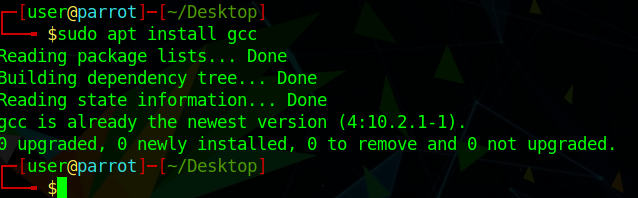
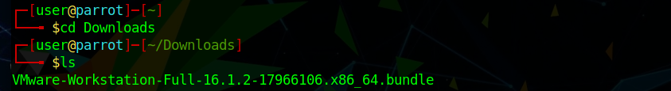
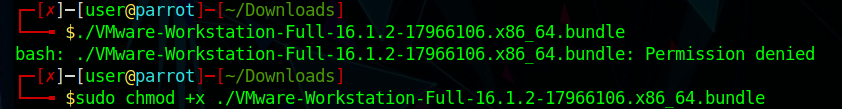
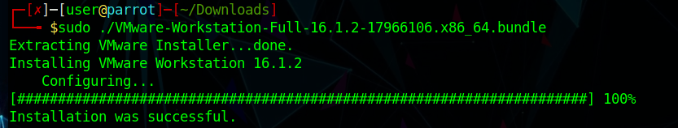
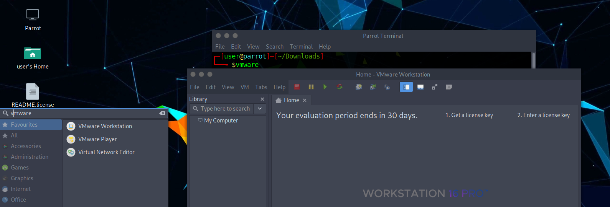

# Installing VMware Workstation on Parrot Security #

Here is a short tutorial on how to install VMware Workstation Pro on Parrot Security. 
If your wondering what VMware Workstation Pro is and it's function you can visit the site [VMware](https://www.vmware.com) and research it.

**Step 1**

[Download VMware Workstation Pro](https://www.vmware.com/go/getworkstation-linux)

**Step 2**

While your downloading VMware Workstation Pro open a terminal and make sure you install the latest version of GCC with 
`sudo apt install gcc` and you should see the info on the terminal below read like so. 

**Step 3**

Next open a terminal and `cd` in to the folder where you downloaded your new copy of Vmware Workstation Pro. After doing so we need to make the file executable to install, so make sure your root in your terminal.

**Step 4**

Type `sudo chmod +x VMware-(file version and extension)` and click enter. It should like the image below.

**Step 6**

Now, in the image below, you can see that you must type `./VMware-(file version).bundle` to install VMware, then press enter and the instalation process will begin.
It will ask you for a serial number. There are sites that have serials available that you can use and they are easy to find.

*Important*: you will need to add the license key, otherwise you will only be able to use the Pro version for 30 days.

**Step 7**

Finally, at the end of installation click on the Parrot Security application menu navigate to system tools and you should see **VMware Workstation Pro** in your menu (or open a terminal and write `vmware`).

