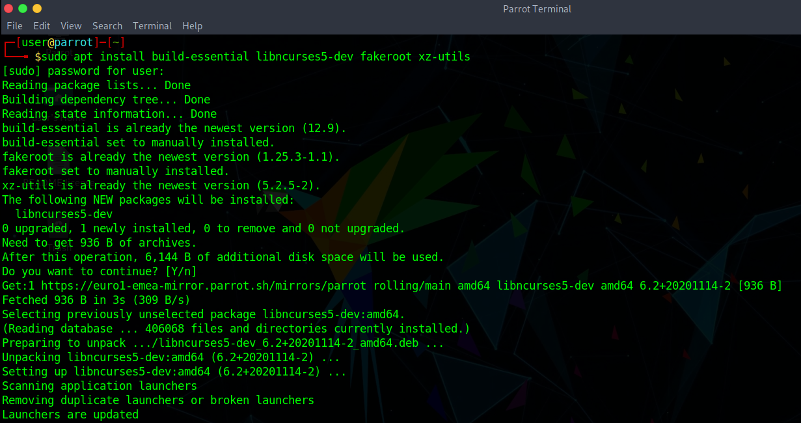
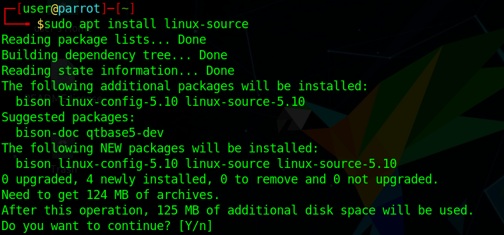
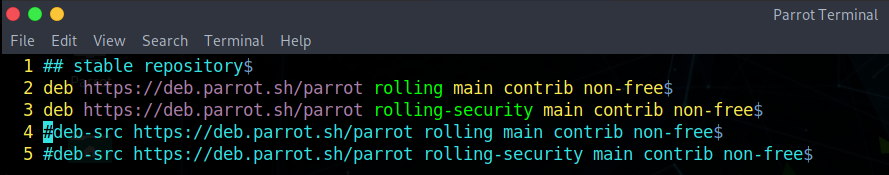
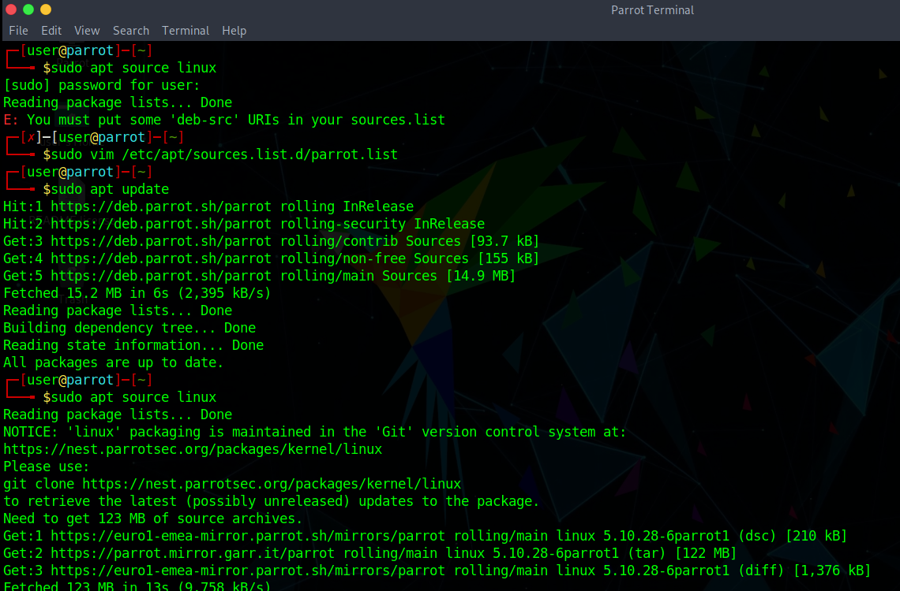
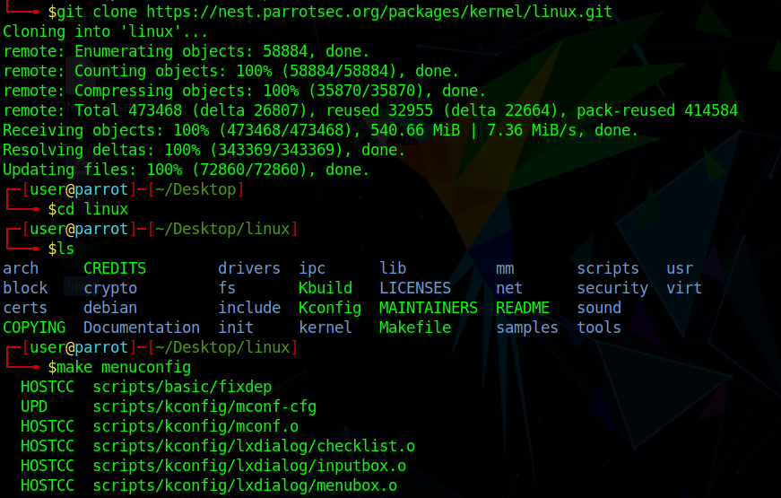
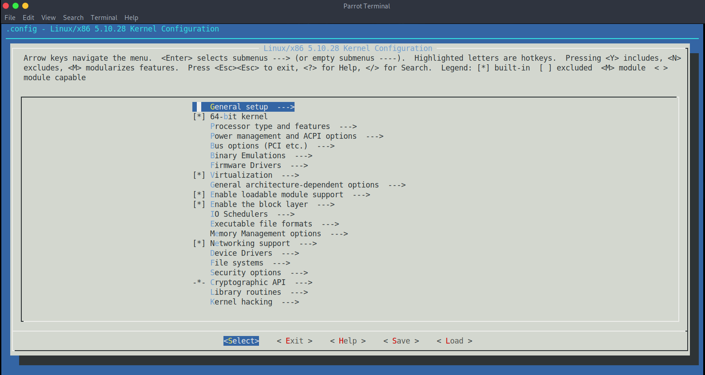

# Compile a custom Parrot kernel #

## Install build dependencies ##

To work with the Linux debianized kernel, you need to have some development packages, install them with the following command:

    sudo apt install build-essential libncurses5-dev fakeroot xz-utils

## Download the kernel source code ##

You can get the source code of the parrot kernel from different places:

- [apt install](../en/19.-%20Compile%20a%20custom%20kernel.html#apt-install)
- [apt source](../en/19.-%20Compile%20a%20custom%20kernel.html#apt-source)
- [git](../en/19.-%20Compile%20a%20custom%20kernel.html#git)

If you already have the Linux source, [start here](../en/19.-%20Compile%20a%20custom%20kernel.html#configure-the-source-code)

\
\

### apt install ###

run 

    `sudo apt update` 

to refresh the sources list, then launch 

    sudo apt install linux-source

to download the kernel source code in `/usr/src`.

\
\

### apt source ###

edit `/etc/apt/sources.list.d/parrot.list` and make sure that the **deb-src** directive is *not* commented (remove the `#` character if present).

run `sudo apt update` to refresh the sources list and launch

    sudo apt source linux

to download the source code of the Linux kernel from our repository.

\

  

    <i class="fa fa-info-circle badge" aria-hidden="true"></i>

**Note**

  

  

there is no need to uncomment the <code class="hljs">rolling-security</code> deb-src, just uncomment the <strong>main</strong> deb-src. 
  

\

### git ###

make sure you have git installed with 

    sudo apt install git

then launch 
    
    git clone https://nest.parrotsec.org/packages/kernel/linux.git

to download the Parrot kernel source in the current folder.

## Configure the source code ##

Open a terminal window and `cd` into the folder where is stored the kernel source, then run

    make menuconfig

This command will open the kernel configuration editor where you can take a look at the modules available, select or deselect them, decide if to include them as hard-coded in the base image or as a dynamically loadable module, and you can change the settings of most of them.

## Install some useful utilities ##

An utility that can help you to configure your kernel is hwinfo, install it by running:
    
    sudo apt install hwinfo

so that you can safely remove support for hardware you're not going to use on your machine.
This will make your kernel lighter and faster.

Once it is done you can save the configuration and proceed with the next step.

(Another program that can help you is inxi, install it with `sudo apt install inxi` and use from terminal `inxi -F` to display a summary about your installed hardware and software)

## Compile the .deb package ##

Compile the kernel with the following commands:

    make clean && make deb-pkg

## Install the new kernel packages ##

Once it's done, install the resulting packages with the following command:

    sudo dpkg -i ../linux-{image,headers}-*.deb

then reboot the system

    sudo reboot

For more information, check [The Debian Administrator's Handbook](https://debian-handbook.info/browse/stable/sect.kernel-compilation.html)
