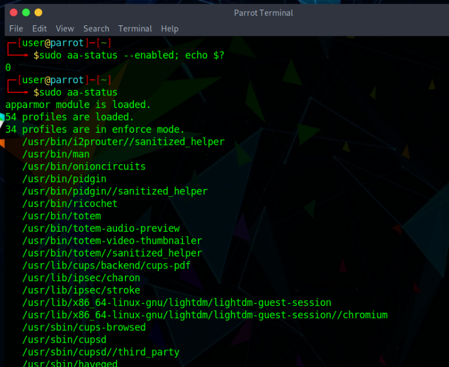

# AppArmor #

AppArmor is an effective and easy-to-use Linux application security system. AppArmor proactively protects the operating system and applications from external or internal threats, even zero-day attacks, by enforcing good behavior and preventing even unknown application flaws from being exploited. 

AppArmor security policies completely define what system resources individual applications can access, and with what privileges. A number of default policies are included with AppArmor, and using a combination of advanced static analysis and learning-based tools, AppArmor policies for even very complex applications can be deployed successfully in a matter of hours.

## Check if AppArmor is installed ##

AppArmor and it's profiles should already be enabled and running on Parrot OS. To check if AppArmor is active do:

    sudo aa-status --enabled; echo $?

The output should return 0. Alternatively run the following command to see the loaded AppArmor profiles:

    sudo aa-status

If for any reason AppArmor is not pre-installed, continue reading below.

## Install AppArmor ##

    sudo apt install apparmor apparmor-utils auditd

**apparmor** = main package \
**apparmor-utils** = utilities for controlling apparmor profiles \
**auditd** = automatic profile generation tools 

\

To enable AppArmor run the followng commands:

    sudo mkdir -p /etc/default/grub.d

\

    echo 'GRUB_CMDLINE_LINUX_DEFAULT="$GRUB_CMDLINE_LINUX_DEFAULT apparmor=1 security=apparmor"' | sudo tee /etc/default/grub.d/apparmor.cfg

\

    sudo update-grub

\

    sudo reboot

Then run the following command to inspect the current state:

    sudo aa-status

