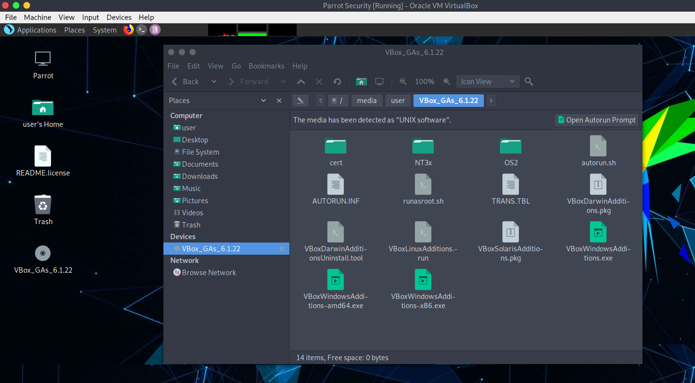

# Introducción a las adiciones de invitados de Virtualbox #
Las Adiciones de Invitados (Guest Additions) están diseñadas para instalarse dentro de una máquina virtual después de que se haya instalado el sistema operativo invitado. Consisten en controladores de dispositivos y aplicaciones del sistema que optimizan el sistema operativo invitado para un mejor rendimiento y usabilidad.

## Características de las adiciones de invitados de Virtualbox ##

  * **Integración del puntero del mouse**
    * Ya no es necesario presionar la tecla Host para "liberar" el mouse de ser capturado por el sistema operativo invitado.

  * **Carpetas compartidas**
    * Carpetas compartidas entre el Host y Parrot.

  * **Mejor soporte para video**
    * Mientras que la tarjeta gráfica virtual que VirtualBox emula para cualquier sistema operativo invitado proporciona todas las funciones básicas, los controladores de video personalizados que se instalan con Guest Additions le brindan modos de video extra altos y no estándar, así como un rendimiento de video acelerado. 
    \
    **(Generalmente se usa para cambiar la resolución del monitor)**

  * **Ventanas sin problemas**
    * Con esta función, las ventanas individuales que se muestran en el escritorio de la máquina virtual se pueden mapear en el escritorio del host, como si la aplicación subyacente se estuviera ejecutando realmente en el host.

  * **Canales de comunicación genéricos de anfitrión/invitado**
    * Guest Additions te permite controlar y monitorear la ejecución de invitados de formas distintas a las mencionadas anteriormente. Las llamadas "propiedades de invitado" proporcionan un mecanismo genérico basado en cadenas para intercambiar bits de datos entre un invitado y un host, algunos de los cuales tienen significados especiales para controlar y monitorear al invitado.

  * **Sincronización horaria**
    * Sincroniza la fecha y la hora del host a Parrot.

  * **Portapapeles compartido**
    * Portapapeles compartido del anfitrión a Parrot.

Para más información, visita el [manuel de VirtualBox](https://www.virtualbox.org/manual/ch04.html).

\
\
# Instalación(es) de Guest Additions #

## Método 1 (más fácil) ##

**1.** Abre una terminal y actualiza tu lista de paquetes desde el repositorio con
 
    sudo apt update

\

**2.** Instala Guest Additions desde el repositorio de Parrot OS con 

    sudo apt install virtualbox-guest-utils

\

**3.** E instala el último paquete con 
    
    sudo apt install virtualbox-guest-x11

\

**4.** Cuando se complete la instalación, puedes reiniciar tu máquina con 

    sudo reboot

\

**5.** Comprueba si Guest Additions está instalado correctamente ejecutando 

    sudo /usr/sbin/VBoxService -V 

## Método 2 (desde la ISO) ##

**1.** En la barra de menú de la máquina virtual, seleccione `Devices > Insert Guest Additions CD image...`.

 

\

**2.** VirtualBox no encontrará los Guest Additions y para ello te pedirá que los descargues, haz clic en *Descargar*. Recomendamos agregar una unidad óptica secundaria adicional, porque una vez que se descargan las adiciones de invitados, se montarán en una segunda unidad.

 

\

 

\

 

\

Click en "**insert**". Si devuelve un error (tal vez no puedas montar la iso que acabas de descargar, apaga la máquina virtual y regresa a la pantalla principal de VirtualBox, ve a *Configuración > Almacenamiento*, aquí agrega otra unidad óptica (asegúrate de que sea secundaria para no dar problemas al arrancar la distro). 

 

**3.** Luego ve a la carpeta Guest Addition ISO, y abre aquí una terminal e ingresa 

    sudo chmod +x VBoxLinuxAdditions.run

Una vez hecho lo anterior, ejecuta

    sudo ./VBoxLinuxAdditions.run

**4.** Espera el proceso de instalación. Una vez completada la instalación, reinicia la máquina virtual con 

 

    sudo reboot