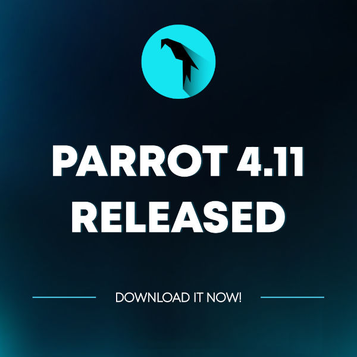

\

<h1 align="center">Bienvenido(a) a nuestra Documentación</h1>

Una parte importante de cualquier sistema operativo es la documentación, los manuales técnicos que describen la operación y uso de los programas. Como parte de sus esfuerzos por crear un sistema operativo gratuito de alta calidad, el Proyecto Parrot está haciendo todo lo posible para proporcionar a todos sus usuarios la documentación adecuada en un formato de fácil acceso.

La documentación es un contínuo Trabajo En Progreso (WIP, por sus siglas en inglés), y todos los usuarios de Parrot están invitados to contribuir al proceso de creación y traducción de este portal.

Por el momento, estará dividido en tres áreas principales:

- [Introducción](<./01.- What is Parrot.md>), la cual contiene toda la información básica del Proyecto Parrot.

- [Instalación](<./03.- Installation.md>), donde se muestra cómo instalar Parrot en tu máquina física o virtual, crear un dispositivo de arranque, contenedor, etc...

- [Configuración](<./23.- Parrot Software Management.md>), aquí encontrarás los aspectos más técnicos, algunos tips sobre cómo configurar algunos programas, administración de tu sistema, etc...

\
\

    

## ¿Por qué "Parrot"? ##

*Porque esto nació como un juego, y cada pirata de los siete mares necesita un loro (parrot, en inglés) sobre sus hombros si quiere abordar los galeones con su tripulación de filibusteros convictos*.

## Esta documentación ##

Esta documentación ha sido posible gracias al trabajo de miembros de la comunidad de Parrot OS.

Equipo de documentación en *Inglés* 
- Lorenzo "palinuro" Faletra
- Irene "tissy" Pirrotta
- Dario Camonita
- José Gatica (Responsable también de la versión en Español)
- Patrick Dunn

\

Colaboradores anteriores:
- Eloir Corona
- Adrian "Ghostar" Baldiviezo
- Josu Elgezabal (Líder de documentación)
- Romell Marín (Líder de documentación)
- Claudio Marcial (Web - SysAdmin)
- Alejandro Pineda (Arte ParrotOS-ES)
- Manuel Hernández (Arte ParrotOS-ES)
- Raúl Alderete (Material Audiovisual)

Si te quieres unir a nosotros y colaborar con este proyecto, te invitamos a ingresar a nuestro [grupo en Telegram](https://t.me/ParrotSpanishGroup). Además nos puedes encontrar en nuestro [grupo en Facebook](https://www.facebook.com/groups/parrotsec).

Además, si encuentras algún error (hey! somos humanos), puedes escribir un email a:
\
`team at parrotsec dot org`
