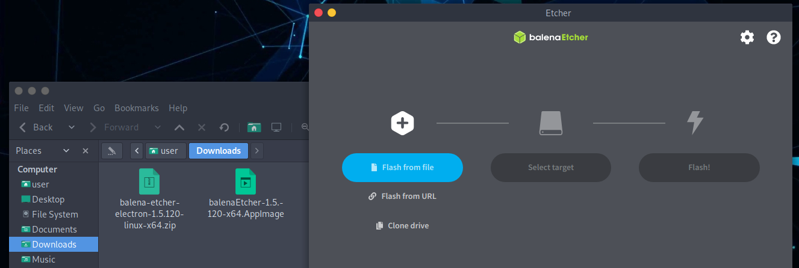
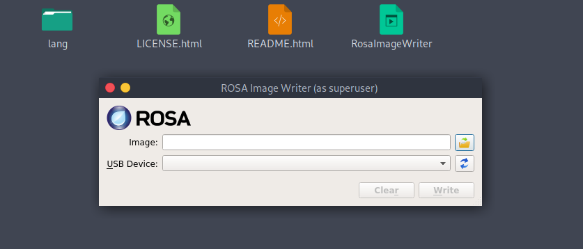

# Cómo crear una unidad USB Parrot#

## Cómo crear un dispositivo de arranque ##

En primer lugar, debe descargar el último archivo ISO de nuestra [website](https://parrotsec.org/download/).

Entonces podras quemarlo usando [Balena Etcher](https:https://www.balena.io/etcher/) o [ROSA ImageWriter](http://wiki.rosalab.ru/en/index.php/ROSA_ImageWriter). Ambos trabajan en GNU/Linux, Mac OS y Windows. Recomendamos usar Etcher, pero también puede usar el **DD command line tool** si es de su preferencia.

El Parrot ISO utiliza el formato iso9660 (también conocido como isohíbrido). Es un formato ISO especial que contiene no solo el contenido de la partición, sino también la tabla de particiones.

Algunos programas de escritura ISO no escriben el iso bit por bit en la unidad USB a un nivel bajo. Crean una tabla de particiones personalizada y simplemente copian el archivo en la unidad USB de una manera no oficial y no estándar. Este comportamiento va en contra de para qué se creó el isohíbrido y puede romper las funcionalidades principales del sistema y hacer que el sistema se vuelva no instalable de dichas unidades USB.

Es **muy recomendable NO** utilizar programas como *unetbootin*, o cualquier programa que no sea compatible con isohybrid.

Necesita una unidad USB de al menos 8 GB para Security Edition y 4 GB para Home Edition.

Un resumen rápido de las herramientas que puede utilizar para crear su Parrot USB:

- [Balena Etcher](<../en/how-to-create-a-parrot-usb-drive.html#parrot-usb-boot-procedure-using-balena-etcher>)
- [DD command line tool](<../en/how-to-create-a-parrot-usb-drive.html#parrot-usb-boot-procedure-using-dd-command-line-tool>)
- [ROSA image writer](<../en/how-to-create-a-parrot-usb-drive.html#parrot-usb-boot-procedure-using-rosa-image-writer>)

## Procedimiento de arranque USB de Parrot con Balena Etcher ##

Conecte su memoria USB a su puerto USB e inicie **Balena Etcher**. Descárgalo y descomprimirlo.
\
Haga clic en *.AppImage file*.

Haga clic en **Flash desde archivo/file**. Seleccione el Parrot ISO y verifique que la unidad USB que va a sobrescribir sea la correcta.

**Flash!**

Una vez que se completa la grabación, puede usar la memoria USB como dispositivo de arranque para su computadora y arrancar Parrot OS.

\

## Procedimiento de arranque USB de Parrot con la herramienta de línea de comandos DD## 

**dd** (y sus derivados) es una herramienta de línea de comandos integrada en cada unix y sistema similar a UNIX, y se puede utilizar para escribir el archivo ISO en un dispositivo de bloque bit por bit. Debido a la posibilidad de bloquear su sistema, si no está familiarizado con GNU/Linux, le recomendamos que utilice Etcher.

i.g.

    sudo dd status=progress if=Parrot-<edition>-<version>_amd64.iso of=/dev/sdX

## Procedimiento de arranque USB de Parrot con el escritor de imágenes ROSA ## 

Como se mencionó al principio de este capítulo, también puede usar el escritor de imágenes ROSA para crear su USB con Parrot. Descárguelo del sitio web y extraiga todos los archivos. Luego, haga clic en"*RosaImageWriter*":

Seleccione la ISO y el USB.

Haga click en *Write* y espere a que finalice el procedimiento de escritura.

