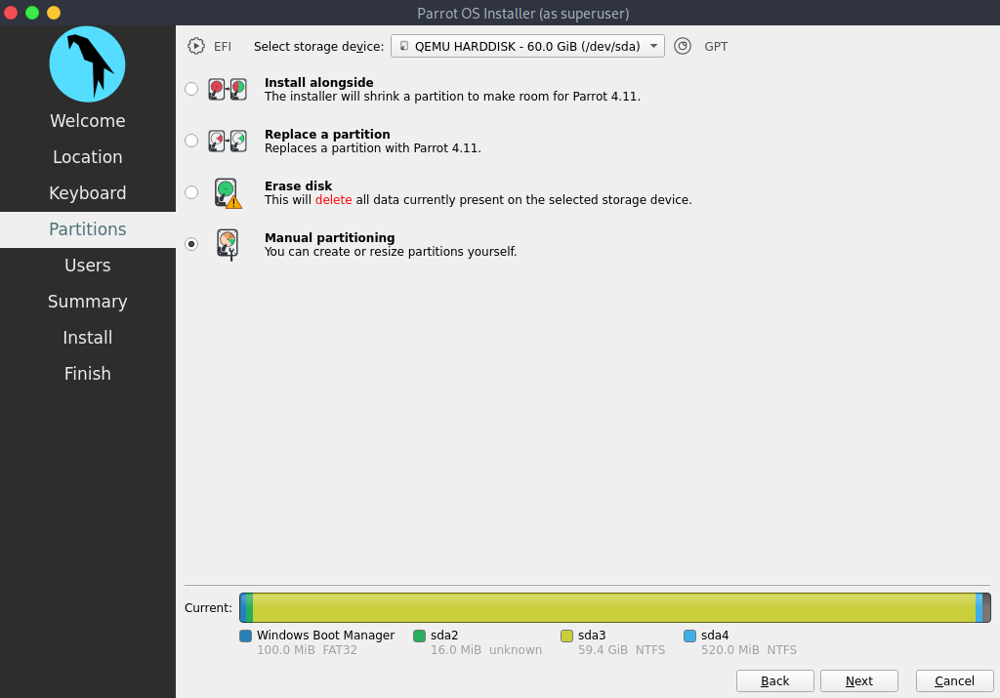
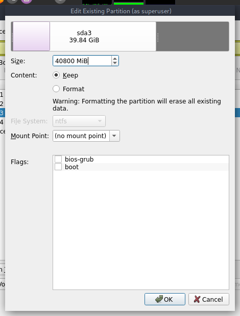
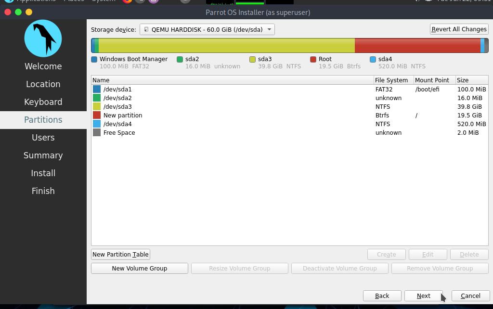

\
<h1 align="center"> Dualboot con Windows</h1>

Es posible instalar ParrotOS junto con Windows, gracias a GRUB y una correcta partición. 

**NOTA:** Deshabilita Secure Boot y CSM desde la configuración de UEFI en tu máquina.

Después de seguir los pasos para configurar la [Instalación de Parrot](./instalacion.md) antes de la partición, la situación será similar a esta:

Hay dos maneras de proceguir.

## Método 1: Particionado Manual

Este método da la libertad de elegir para ParrotOS la cantidad de espacio deseada y la cantidad de particiones deseadas.

**NOTA:** La edición **Security** necesita *al menos* 40GB de espacio, la edición **Home** necesita *al menos* 20GB de espacio (lo que ha sido usado para esta guía). No se ha configurado ninguna partición de intercambio (Swap) porque se ha utilizado en un SSD.

Selecciona **Particionado Manual** y luego click en *Siguiente*.

Verás algo similar a esto:

En detalle:

* **/dev/sda1** es la partición de arranque.
* **/dev/sda2** es MSR (partición reservada para Microsoft).
* **/dev/sda3** es donde Windows 10 existe.
* **/dev/sda4** es una partición oculta que contiene archivos de Windows para recuperación.

Esta es la partición estándar para Windows, que sigue este orden exacto.
Selecciona **/dev/sda3** y luego haz clic en *Editar*.

Se abrirá esta ventana:

Aquí es posible reducir/cambiar el tamaño de las particiones (arrastrando la barra o insertando el tamaño en MiB), establecer etiquetas y puntos de montaje.

Arrastra la barra o establece el valor para obtener el tamaño de partición deseado (en este caso, la cantidad total del tamaño de la partición es de 60 GB, y dedicamos 40 GB a Windows y, por lo tanto, los 20 GB restantes se han asignado a ParrotOS) y luego haz clic en *OK*.

Esta es la situación actualizada, después de reducir la partición de Windows, hay disponible un espacio no asignado de 20 GB. Selecciónalo, luego haz clic en *Crear*:

Estas son las configuraciones para la nueva partición, configura el sistema de archivos que desees (ParrotOS usa BTRFS por defecto), configura el punto de montaje en /(**raíz**), luego haz clic en *Aceptar*:

Ahora, el último paso: Configurar la partición de arranque.

Selecciona **/dev/sda1** y haz click en *Editar*:

Establece el punto de montaje en **/boot/efi** y luego haz clic en *Aceptar*:

Esta es la situación final, procede con la instalación haciendo clic en *Siguiente*:

## Método 2: Particionado Automático

Esto es mucho más fácil. Solo tienes que seleccionar **Instalar junto a**, luego seleccionar **/dev/sda** dentro de la barra, arrastrar la barra inferior para cambiar el tamaño de la partición y asignar la cantidad de espacio deseada para ParrotOS, luego hacer clic en *Siguiente* y proceder con la instalación.

