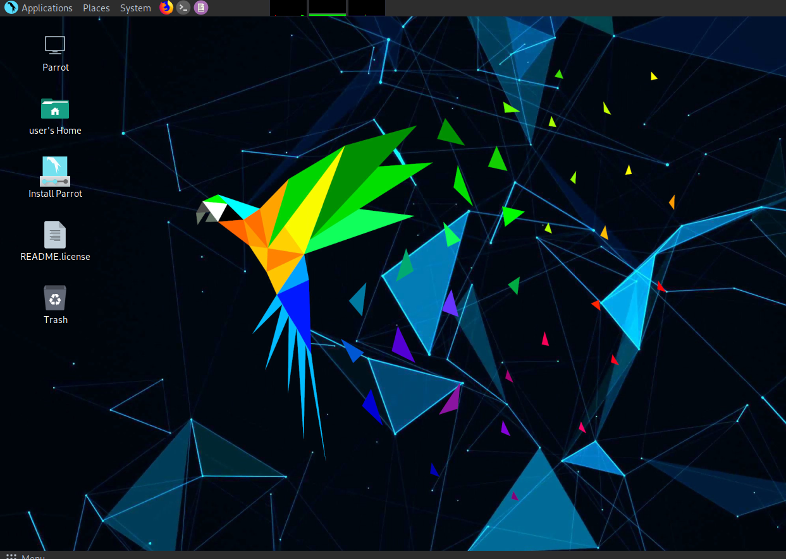
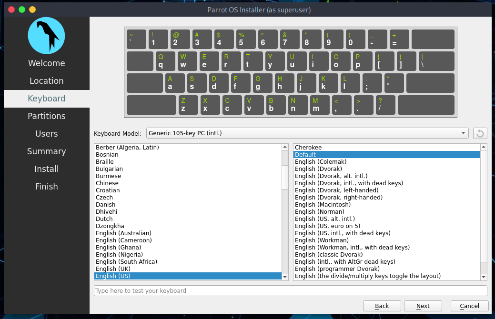
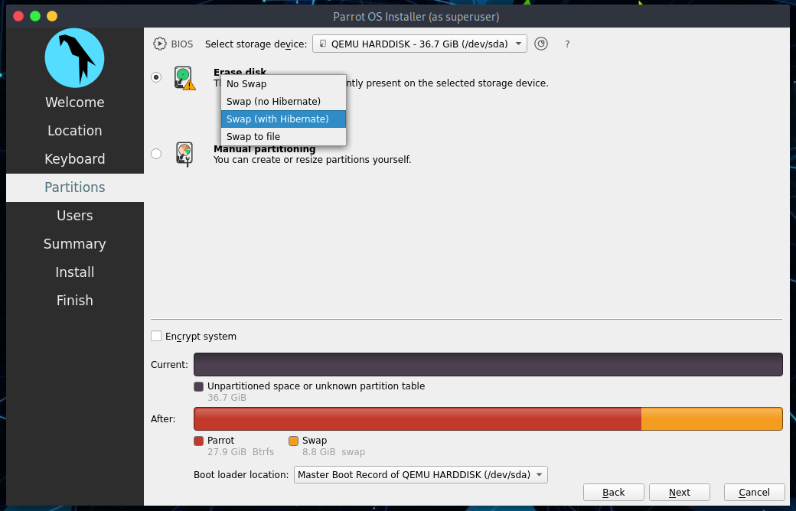
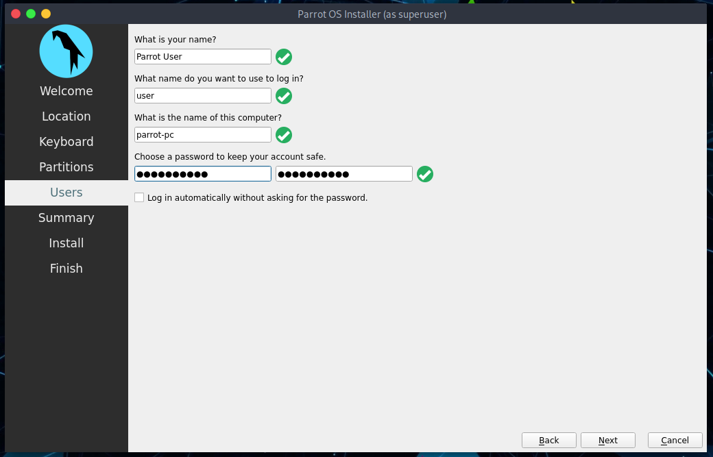
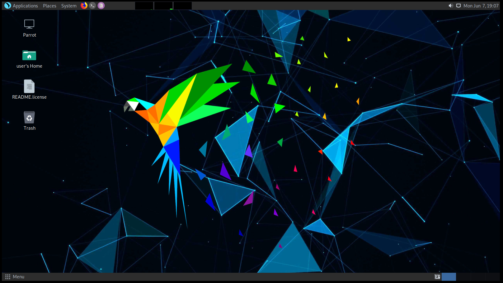

# Cómo instalar Parrot OS #

Esta es una guía que te ayudará a instalar Parrot (en su más reciente versión) en tu computador paso a paso a través del instalador oficial y que viene por defecto: *Calamares*.

Esta guía aplica para las ediciones [Security](https://parrotsec.org/security-edition) y [Home](https://parrotsec.org/home-edition).

Cualquier problema o algún detalle que se nos haya pasado, por favor repórtalo en nuestro [Foro oficial de Parrot](https://community.parrotsec.org).

Inserta tu medio de instalación en tu computador y a través de la configuración de tu BIOS arranca Parrot. Aparecerá una pantalla con algunas opciones, algunas más avanzadas que otras.

Selecciona **Try/Install** y presiona *Enter*.

Espera a que el sistema cargue (sólo unos segundos).

## Bienvenido a Parrot Live ##

Aquí puedes probar Parrot en todo su esplendor, y luego puedes proceder a la instalación.

Haz click en **Install Parrot**:

y el instalador, Calamares, se abrirá.

## ¡Comencemos! ##

El siguiente paso es seleccionar el iddioma para el sistema. 
\
Escoge tu idioma. 
\
Haz click en *Next*.

Then select your Region and Zone. Click on *Next*.

Now, you can select the keyboard layout. There are many variations available, and you can test them where its written *"Type here to test your keyboard"*.

Click on *Next*.

### Particionado de disco en Parrot Security ###

Pensamos que para usuarios menos experimentados el particionado guiado en lo recomendado, 40 gb o más es suficiente, a menos que quieras instalar muchos programas o mantener archivos inmensos en tu disco duro.

Aquí puedes decidir si disponer de swap o no. Para más información acerca de swap, \
[https://wiki.debian.org/Swap](https://wiki.debian.org/Swap) \
[https://www.kernel.org/doc/html/latest/power/swsusp.html](https://www.kernel.org/doc/html/latest/power/swsusp.html)

*Si quieres*, puedes encriptar el sistema añadiendo una contraseña:

Selecciona las opciones que creas más útiles para tí y haz click en *Siguiente*.

### Creando una nueva cuenta de usuario ### 

Se te pedirá crear un nuevo usuario, para no complicarnos por ahora hemos elegido **user**.
Puedes agregar cualquier nombre aquí.

Recuerda que esta es la contraseña para acceder a tu cuenta en el SO, recomendamos crear una que sea larga y compleja.

Ahora, haz click en *Siguiente*.

### Completando el proceso de instalación ###

Finalmente, un resumen de las opciones elegidas durante el proceso:

Puedes decidir entre cambiar las opciones elegidas, y luego continuar, o proceder con la instalación del sistema. Haz click en **Instalar**.

Confirma haciendo click en **Inatalar ahora**

¡Y espera a que se complete la instalación!
\
Con un SSD (Sata), debería tomar un par de minutos.

**¡Bien hecho! ¡Instalaste con éxito Parrot OS en tu computador!**

### Ingresando a Parrot por primera vez ###

Escribe tu contraseña:

**¡Bienvenido a Parrot! ¡Felicidades!**

