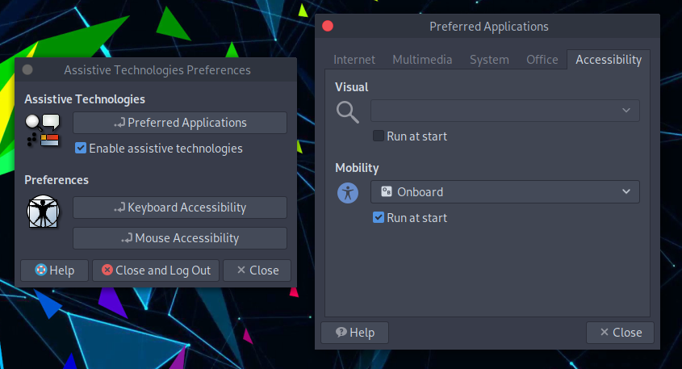

# Tecnologías de Asistencia #

## Teclado en pantalla ##

Para habilitar el teclado en pantalla, sigue estos pasos.

Desde el menú del panel superior: 

O desde la barra de búsqueda del panel inferior escribe `Tecnologías de asistencia`

Luego `Activar las tecnologías de asistencia -> click en Aplicaciones preferidas -> selecciona Onboard keyboard -> Ejecutar al inicio`. 

