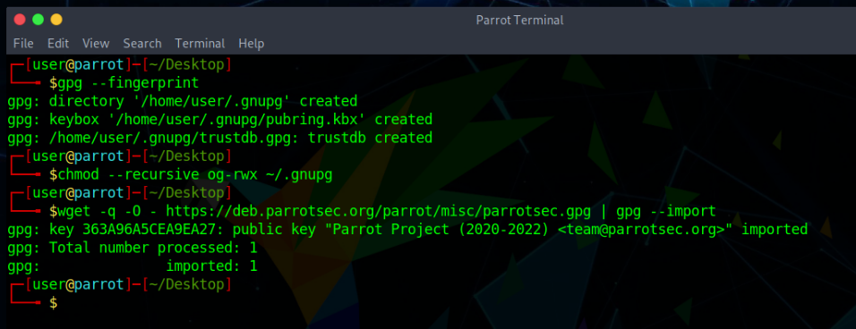
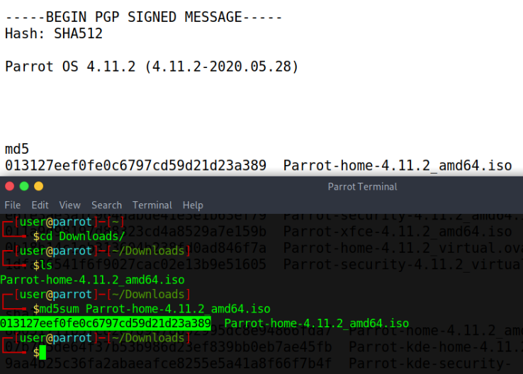
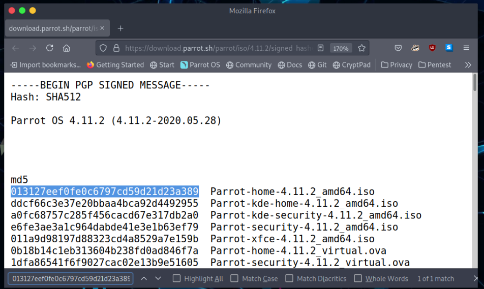

# Vérification des hachages et des clés #

### Pourquoi devrait-on vérifier les clés et les signatures ? ##

La plupart des gens - même les programmeurs - ne comprennent pas les concepts de base qui sous-tendent les signatures numériques. Par conséquent, la plupart des gens devraient lire cette section, même si elle semble triviale à première vue.

Les signatures numériques peuvent prouver à la fois l'authenticité et l'intégrité avec un degré raisonnable de certitude. L'authenticité garantit qu'un fichier donné a bien été créé par la personne qui l'a signé (c'est-à-dire qu'il n'a pas été falsifié par un tiers). L'intégrité garantit que le contenu du fichier n'a pas été altéré (c'est-à-dire qu'un tiers n'a pas modifié son contenu de manière indétectable en cours de route).

Les signatures numériques ne peuvent prouver aucune autre propriété (par exemple, que le fichier signé n'est pas malveillant). Rien ne peut empêcher quelqu'un de signer un programme malveillant (et cela arrive de temps en temps dans la réalité).

Le fait est que nous devons décider à qui nous allons faire confiance (par exemple, Linus Torvalds, Microsoft ou le projet Parrot) et supposer que si un fichier donné a été signé par une partie de confiance, alors il ne devrait pas être malveillant ou bogué par négligence. La décision de faire confiance à une partie donnée dépasse le cadre des signatures numériques. Il s'agit plutôt d'une décision sociologique et politique.

Une fois que nous avons décidé de faire confiance à certaines parties, les signatures numériques sont utiles, car elles nous permettent de limiter notre confiance aux quelques parties que nous avons choisies et de ne pas nous inquiéter de toutes les mauvaises choses qui peuvent se produire entre nous et elles, par exemple les compromissions de serveurs ([parrotsec.org](https://parrotsec.org) sera sûrement compromise un jour, alors ne faites pas aveuglément confiance à la version en ligne de ce site), le personnel informatique malhonnête de la société d'hébergement, le personnel malhonnête des fournisseurs d'accès, les attaques Wi-Fi, etc.

En vérifiant tous les fichiers que nous téléchargeons et qui sont censés avoir été créés par une partie à laquelle nous avons choisi de faire confiance, nous éliminons les risques liés aux problèmes mentionnés ci-dessus, puisque nous pouvons facilement détecter si des fichiers ont été altérés (et choisir ensuite de ne pas les exécuter, les installer ou les ouvrir).

Cependant, pour que les signatures numériques aient un sens, nous devons nous assurer que les clés publiques que nous utilisons pour la vérification des signatures sont bien les clés originales. N'importe qui peut générer une paire de clés GPG qui prétend appartenir au "Parrot OS", mais bien sûr, seule la paire de clés que nous (c'est-à-dire l'équipe Parrot) avons générée est *légitime*. La section suivante explique comment vérifier la validité des clés de signature de ParrotOS dans le processus de vérification d'un ISO Parrot OS. Cependant, les mêmes principes généraux s'appliquent à tous les cas dans lesquels vous souhaitez vérifier une signature PGP, comme la vérification des référentiels, et pas seulement des ISO.

## Récupérer la clé et vérifier les dépôts ##

Facultatif : Effectuez les étapes ci-dessous si vous n'êtes pas familier avec GnuPG ou si elles n'ont pas déjà été effectuées. Cela corrigera les éventuels *GPG : WARNING : unsafe ownership warnings*.

#### 1. Tout d'abord, assurez-vous que GnuPG a initialisé votre dossier de données utilisateur ####

#### 2. Définir des autorisations sans avertissement ####

    chmod --recursive og-rwx ~/.gnupg

#### 3. Obtenez la clé ParrotOS ####

    wget -q -O - https://deb.parrotsec.org/parrot/misc/parrotsec.gpg | gpg --import

**Attention** : Vérifier l'horodatage de la signature GPG a du sens. Par exemple, si vous avez vu précédemment une signature de 2018 et que vous voyez maintenant une signature de 2017, il peut s'agir d'une attaque ciblée de retour en arrière (downgrade) ou de gel indéfini.

### Vérification ISO ### 

### Vérification du hachage md5sum ###

Après avoir obtenu l'ISO de votre choix, allez [ici : https://download.parrot.sh/parrot/iso/4.11.2/signed-hashes.txt](https://download.parrot.sh/parrot/iso/4.11.2/signed-hashes.txt) pour voir les hachages signés.

Dans la première section où il est indiqué "MD5", trouvez le hachage qui correspond à votre ISO téléchargé.

Pour les besoins de ce tutoriel, nous utiliserons **Parrot-home-4.11.2_amd64.iso**.

Maintenant, ouvrez une fenêtre de terminal et exécutez la commande suivante :

    md5sum Parrot-home-4.11.2_amd64.iso

Comparez le **hash (la chaîne alphanumérique à gauche)** que votre machine a calculé avec le hash correspondant sur la page signed-hashes.txt liée ci-dessus.

Une façon simple de le faire est d'ouvrir la page "signed-hashes.txt" dans votre navigateur, puis de copier le hachage que votre machine a calculé depuis le terminal dans la boîte "Rechercher" de votre navigateur (dans Firefox, vous pouvez ouvrir la boîte "Rechercher" en appuyant sur CTRL + F).

Lorsque les deux hachages correspondent exactement, le fichier téléchargé est presque certainement intact. Si les hachages ne correspondent pas, il y a eu un problème avec le téléchargement ou un problème avec le serveur. Vous devez télécharger à nouveau le fichier à partir du même miroir ou d'un miroir différent si vous suspectez une erreur de serveur. Si vous recevez continuellement un fichier erroné d'un serveur, veuillez avoir la gentillesse d'en informer l'équipe Parrot de ce miroir afin que nous puissions examiner le problème.

### Autres hachages ###

La méthode pour les autres hachages tels que SHA256 ou SHA512 est exactement la même que celle des guides ci-dessus, mais au lieu de md5, vous devez utiliser le bon hachage que vous voulez. Faisons un exemple :

    sha512sum Parrot-home-4.11.2_amd64.iso

