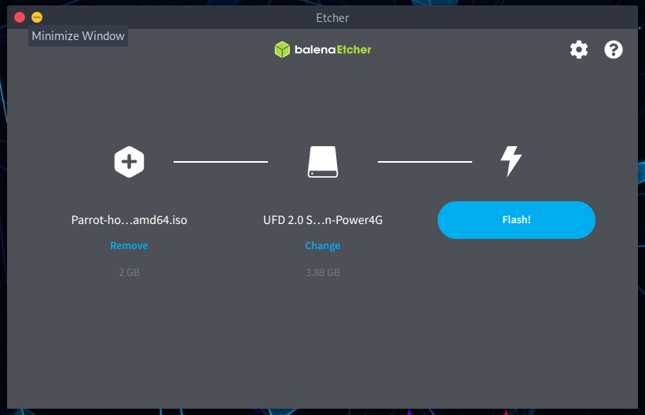
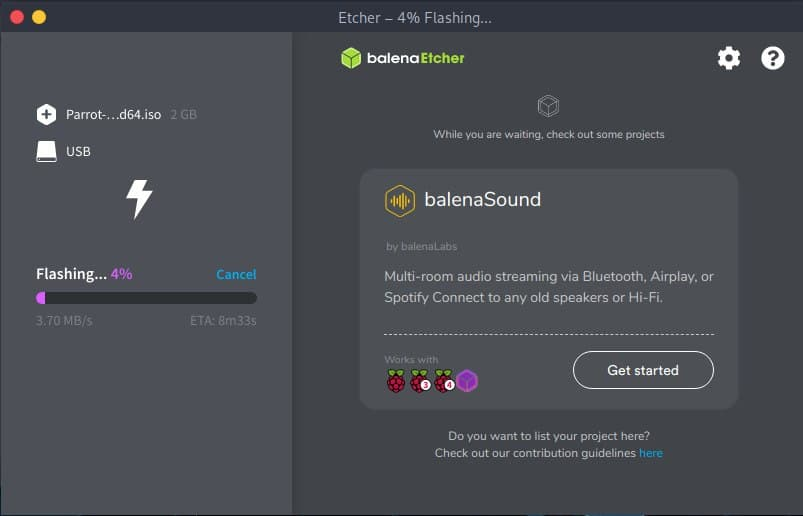
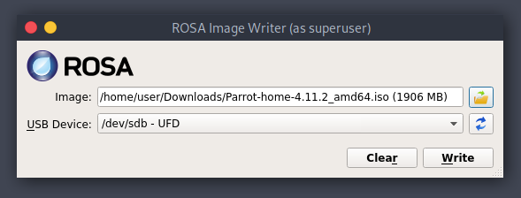

# Comment créer une clé USB Parrot #

 ## Comment créer un périphérique amorçable ##
 
  Tout d'abord, vous devez télécharger le dernier fichier ISO depuis notre [site Web](https://parrotsec.org/download/).
  
  Vous pouvez ensuite le graver à l'aide de [Balena Etcher](https://www.balena.io/etcher/) ou de [ROSA ImageWriter](http://wiki.rosalab.ru/en/index.php/ROSA_ImageWriter). Ces deux logiciels fonctionnent sous GNU/Linux, Mac OS et Windows. Nous vous recommandons vivement d'utiliser Etcher, mais vous pouvez également utiliser l'outil en ligne de commande **DD** si vous le préférez.
  
  L'ISO Parrot utilise le format iso9660 (également appelé isohybride). C'est un format ISO spécial qui contient non seulement le contenu de la partition, mais aussi la table de partition.
  
  Certains programmes d'écriture ISO n'écrivent pas l'iso bit par bit dans le lecteur usb. Ils créent une table de partition personnalisée et copient simplement le fichier dans le lecteur USB d'une manière non officielle et non standard. Ce comportement va à l'encontre de ce pour quoi l'isohybride a été créé, et peut casser les fonctionnalités de base du système et rendre le système in-installable à partir de telles clés USB.
  
  Il est **hautement recommandé de NE PAS** utiliser des programmes comme *unetbootin*, ou tout autre programme qui n'est pas conforme à l'isohybride.
  
  Vous avez besoin d'une clé USB d'au moins 8 Go pour Security Edition et 4 Go pour Home Edition.
  
  Un résumé rapide des outils que vous pouvez utiliser pour créer votre Parrot USB:
  
  - [Balena Etcher](&lt;.../fr/how-to-create-a-parrot-usb-drive.html#parrot-usb-boot-procedure-using-balena-etcher&gt;)
  - [DD command-line tool](&lt;../fr/how-to-create-a-parrot-usb-drive.html#parrot-usb-boot-procedure-using-dd-command-line-tool&gt;)
  - [ROSA image writer](&lt;../fr/how-to-create-a-parrot-usb-drive.html#parrot-usb-boot-procedure-using-rosa-image-writer&gt;)
  
  ## Procédure de démarrage USB Parrot utilisant Balena Etcher ##
  
  Branchez votre clé USB dans votre port USB et lancez **Balena Etcher**. Téléchargez-le et décompressez-le. 
  
  Puis cliquez sur fichier *.AppImage*.
  
  
  
  Cliquez sur **Flash from file**. Sélectionnez l'ISO Parrot et vérifiez que la clé USB que vous allez écraser est la bonne.
  
  
  
  **Flash!** 
  
  
  
  Une fois la gravure terminée, vous pouvez utiliser la clé USB comme périphérique de démarrage pour votre ordinateur et démarrer Parrot OS.
  
  \
  
  ## Procédure de démarrage USB Parrot à l'aide de l'outil de ligne de commande DD ##
  
  **dd** (et ses dérivés) est un outil de ligne de commande intégré à chaque système UNIX et de type UNIX, et il peut être utilisé pour écrire le fichier ISO dans un périphérique de bloc bit par bit. Si vous n'êtes pas familier avec GNU/Linux, nous vous recommandons fortement d'utiliser Etcher. 
  
  e.g. 

    sudo dd status=progress if=Parrot--_amd64<edition>-<version>.iso of=/dev/sdX
    

**Attention dd est parfois appelé avec humour "*disk destroyer*", ne l'utiliser que si vous comprenez bien ce que vous faites !**
  
  ## Procédure de démarrage de l'USB Parrot avec ROSA image writer ##
  
  Comme mentionné au début de ce chapitre, vous pouvez également utiliser ROSA image writer pour créer votre USB avec Parrot. Téléchargez-le depuis le site web et extrayez tous les fichiers. Ensuite, cliquez sur \"*RosaImageWriter*\" :
  
  
  
  Sélectionnez l'ISO et l'USB.
  
  
  
  Cliquez sur *Write* et attendez que la procédure d'écriture se termine.
  

