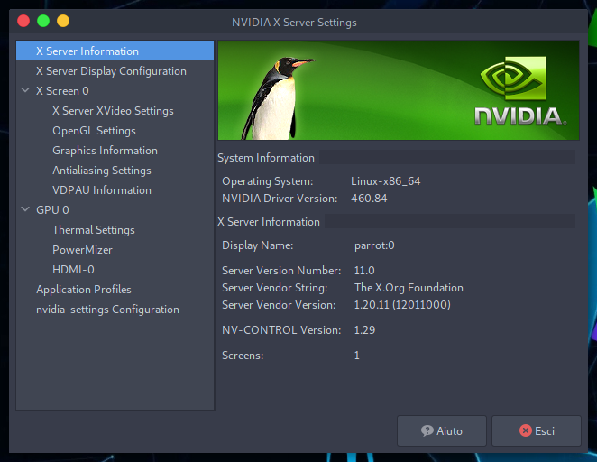
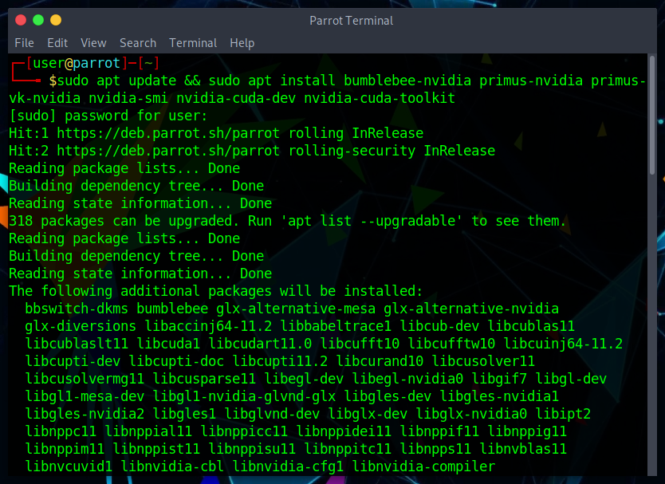
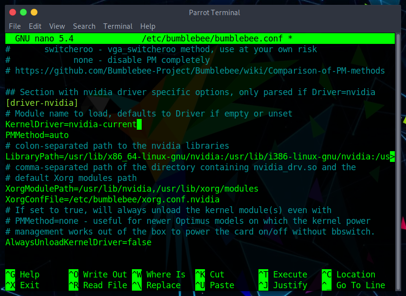
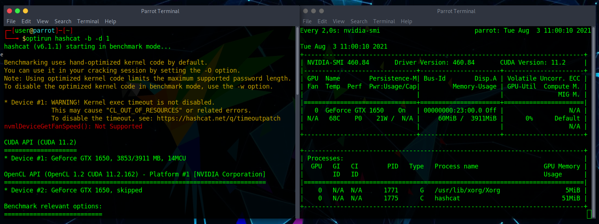
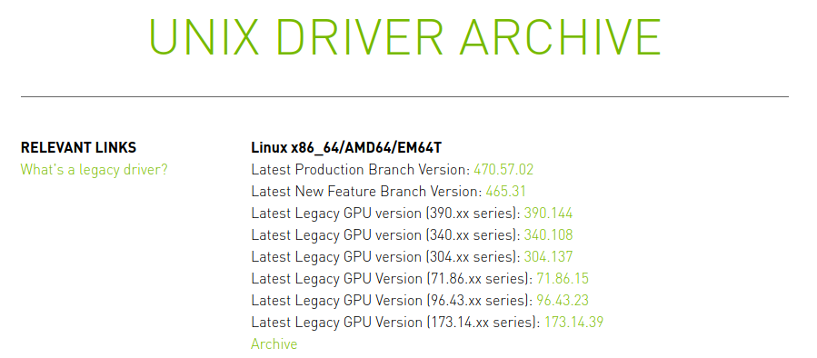
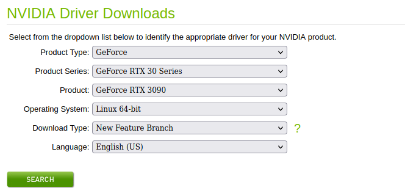
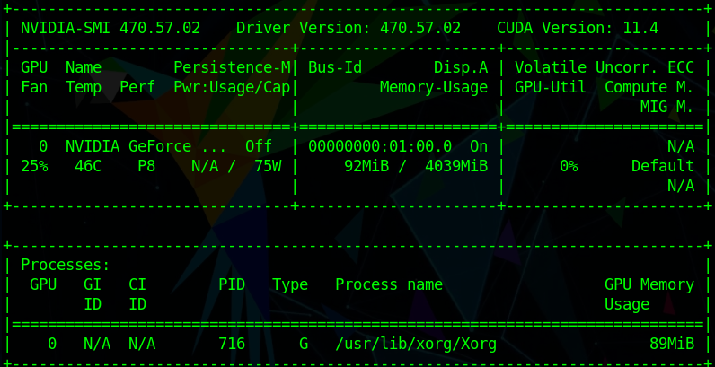

# Installer le pilote GPU Nvidia #

Initialement, Parrot utilise les **pilotes open source** Nvidia sous la dénomination **nouveau**, car ils supportent la plupart des cartes Nvidia. Ceux-ci garantissent une bonne stabilité et vous permettent d'utiliser votre gpu sans problème pour un usage quotidien.

Cependant, il peut être nécessaire d'utiliser d'autres pilotes qui offrent une plus grande compatibilité avec différents logiciels et tirent le meilleur parti de votre GPU. Pour cette raison, vous pouvez installer **les pilotes officiels (source fermée) de Nvidia**.

Vous avez deux façons d'installer, soit via [le repo Parrot](./nvidia-drivers.html#install-the-driver-via-the-parrot-repository) or [à partir du site web officiel](./nvidia-drivers.html#install-the-driver-from-the-official-nvidia-website).

  

    <i class="fa fa-info-circle badge" aria-hidden="true"></i>

**Note 1**

  

  

  Veuillez noter que l'installation et la configuration du pilote peuvent être différentes pour les ordinateurs portables ou de bureau. Par exemple, l'utilisateur pourrait avoir un CPU avec un iGPU (GPU intégré) et un dGPU (GPU dédié). L'utilisateur doit choisir lequel utiliser en fonction du contexte.

  [Les différences sont mises en évidences dans ce document](./driver-nvidia.html#pilote-nvidia-sur-un-ordinateur-avec-igpu-et-dgpu).
  

  

    <i class="fa fa-info-circle badge" aria-hidden="true"></i>

**Note 2**

  

  

  Chaque étape décrite ici a été testée, il est donc fortement recommandé de lire très attentivement tout ce qui se trouve dans ce document.
  

## Installer le pilote via le repo Parrot ##

Si vous ne connaissez pas votre modèle de GPU, ouvrez le terminal et tapez cette commande :

    lspci | grep VGA

Il montrera votre modèle de GPU et son architecture. Pour plus d'informations, utilisez :

    inxi -F

Cela affichera les informations de votre ordinateur, y compris le modèle de GPU et également le type de pilote utilisé.

Lorsque vous serez assuré d'utilisez le pilote nouveau et dans le cas où vous souhaitez utiliser le pilote propriétaire Nvidia à la place, pour des raisons de conflit de pilotes, vous devrez d'abord désactiver le pilote nouveau.

    sudo nano /etc/modprobe.d/blacklist-nouveau.conf

Ajoutez les lignes suivantes et enregistrez le fichier.
    
    blacklist nouveau
    options nouveau modeset=0
    alias nouveau off 

Une fois le fichier enregistré, procédez à l'installation du pilote Nvidia à l'aide de la commande suivante :

    sudo apt update && sudo apt install nvidia-driver

Ceci termine l'installation, mais nous vous recommandons de vérifier que tout s'est bien passé. Pour ce faire, vous pouvez utiliser l'utilitaire officiel de Nvidia appelé [nvidia-smi](https://developer.nvidia.com/nvidia-system-management-interface).

Installez-le en exécutant :

    sudo apt install nvidia-smi

Démarrez-le avec la commande suivante :

    nvidia-smi

De plus, le gestionnaire de paramètres sera automatiquement installé avec les pilotes. De là, vous pourrez modifier des paramètres tels que la résolution et le taux de rafraîchissement de votre moniteur.

### Pilote Nvidia sur un ordinateur avec iGPU et dGPU ### 

La plupart des ordinateurs modernes sont livrés avec une carte vidéo intégrée dans le processeur (iGPU, comme une carte graphique Intel ou AMD dans la plupart des cas) et une carte vidéo dédiée (dGPU, Nvidia).

Dans ce guide, nous traiterons des pilotes des deux cartes vidéo et montrerons comment basculer entre eux.

#### Étape 1 - Installez les pilotes NVIDIA et la boîte à outils CUDA ####

Ouvrez le terminal et tapez :

    sudo apt update 

\

    sudo apt install bumblebee-nvidia primus-nvidia primus-vk-nvidia nvidia-smi nvidia-cuda-dev nvidia-cuda-toolkit

Attendez que l'installation se poursuive. Lorsqu'un avertissement notifiant que le pilote **nouveau** entre en conflit avec le pilote **nvidia**, cliquez sur **ok** :

#### Étape 2 - Blacklister Nouveau ####

  

    <i class="fa fa-info-circle badge" aria-hidden="true"></i>

**Note**

  

  

  si vous avez déjà suivi <a href="./nvidia-drivers.html#install-the-driver-via-the-parrot-repository">l'installation de nvidia via le repo Parrot</a>  vous pouvez passer à l' <a href="./nvidia-drivers.html#step-3---configure-bumblebee">étape 3</a>.
  

Une fois l'installation terminée, il est temps de mettre le pilote **nouveau** sur liste noire afin de faire fonctionner le pilote nvidia.

Dans le terminal, tapez :

    sudo nano /etc/modprobe.d/blacklist-nouveau.conf

Et ajouter:

    blacklist nouveau
    options nouveau modeset=0
    alias nouveau off

Enregistrez le fichier et redémarrez.
 
#### Étape 3 - Configurer Bumblebee ####

Il est maintenant temps de dire à Bumblebee quel pilote doit être utilisé.

Dans le terminal ouvrez `bumblebee.conf`:

    sudo nano /etc/bumblebee/bumblebee.conf

Recherchez la chaîne de caractère `Driver=` et ajoutez `nvidia`, puis recherchez la chaîne de caractère `KernelDriver=` et ajoutez `nvidia-current`.

\

Enregistrez le fichier et redémarrez.

#### Étape 4 - Test des pilotes ####

Ouvrez un terminal et tapez :

    watch nvidia-smi

Dans un nouveau terminal, entrez la commande suivante :

    optirun hashcat -b -d 1

Le résultat devrait ressembler à ceci :

Dans l'`nvidia-smi`interface, `hashcat` devrait apparaître en cours d'exécution à l'aide de votre carte vidéo Nvidia.

  

    <i class="fa fa-info-circle badge" aria-hidden="true"></i>

**Note**

  

  

  Le lancement de l'application avec <strong>primusrun</strong> utilisera la technologie PRIMUS, tandis que l'utilisation d'<strong>optirun</strong> utilisera VirtualGL.
  

## Installez le pilote depuis le site officiel de Nvidia ##

Comme mentionné au début de ce document, les pilotes peuvent également être installés à partir du site Web de Nvidia.

Vous pouvez télécharger le dernier pilote directement à partir de ce [lien](https://www.nvidia.com/en-us/drivers/unix/), où il existe également des pilotes plus anciens pour les anciens GPU.

**OU**

Sélectionnez le modèle de votre GPU, le système d'exploitation (Linux 64 bits) et la branche  [ici](https://www.nvidia.com/Download/index.aspx?lang=en-us).

Depuis le site Nvidia : 

"*Production Branch*":  les pilotes de la branche "production" fournissent une certification ISV ainsi qu'une stabilité et des performances optimales pour les clients Unix. Ce pilote est le plus souvent déployé dans les entreprises, offrant une prise en charge de la correction de bogues soutenue et des mises à jour de sécurité couramment requises.

*New Feature Branch*: les pilotes de la branche "nouvelles fonctionnalités" permettent aux utilisateurs précoces et aux développeurs de pointe d'accéder aux dernières fonctionnalités des pilotes avant qu'ils ne soient intégrés aux branches production.

Cliquez sur **télécharger** , et un fichier portant ce nom sera téléchargé : \
`NVIDIA-Linux-x86_64-<driver version>.run` (environ 260 mo)

Pour éviter les conflits avec le serveur graphique X, nous devrons utiliser Parrot sans interface graphique (passer en Runlevel 3).

Nous pouvons le faire simplement via systemd, avec la commande systemctl :

    sudo systemctl set-default multi-user.target

  

    <i class="fa fa-info-circle badge" aria-hidden="true"></i>

**Note**

  

  

  Si par hasard vous souhaitez revenir en arrière et réutiliser Parrot avec MATE, utilisez les commandes suivantes :
        
    sudo systemctl set-default graphical.target 

\

    reboot

  

Pour éviter les conflits avec l'installation récente du pilote, pensez à blacklister le pilote **nouveau** :

    sudo nano /etc/modprobe.d/blacklist-nouveau.conf

Ajoutez ces lignes puis enregistrez le fichier :

    nouveau blacklist
    options nouveau modeset=0
    alias nouveau off

Exécutez la commande suivante pour régénérer l'image initramfs.

    sudo update-initramfs -u

La dernière étape consiste à désactiver les pilotes **nouveaux** en redémarrant la machine :

    reboot

Accédez maintenant au dossier dans lequel vous avez téléchargé le fichier **.run** et donnez-lui les autorisations d'exécution :

    sudo chmod +x NVIDIA-Linux-x86_64-<driver version>.run

  

    <i class="fa fa-info-circle badge" aria-hidden="true"></i>

**Note**

  

  

  Si vous ne vous souvenez pas de ce que fait chmod, il est recommandé de lire le document sur les [autorisations de fichier et de répertoires](./permissions-fichiers-dossiers.html).
  

Après cela, vous pouvez démarrer le fichier **.run** :

    sudo ./NVIDIA-Linux-x86_64-<driver version>.run

Le processus de l'assistant d'installation démarrera et les pilotes seront installés avec tous les utilitaires (y compris les paramètres Nvidia Driver X).

Retour à MATE via la commande 

    sudo systemctl set-default graphical.target 

Vous passerez du niveau d'exécution 3 au niveau d'exécution 5, et enfin vous pourrez utiliser le pilote nvidia.

Pour vérifier que tout s'est bien passé, démarrez nvidia-smi (déjà installé via le fichier .run ) :

    nvidia-smi

Notez que dans ce cas, le dernier pilote Nvidia (470.57.02) a été installé.

