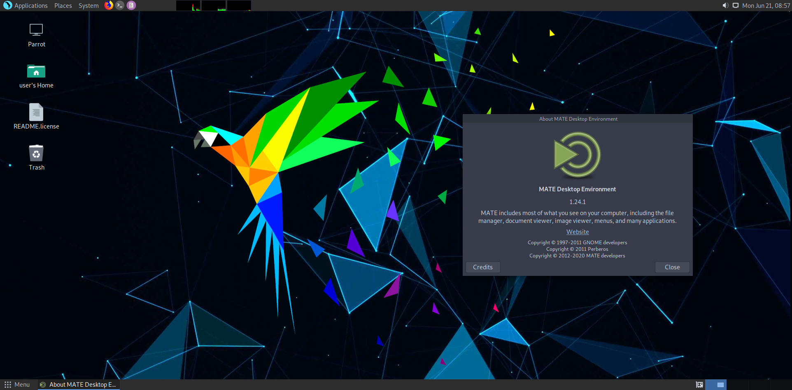
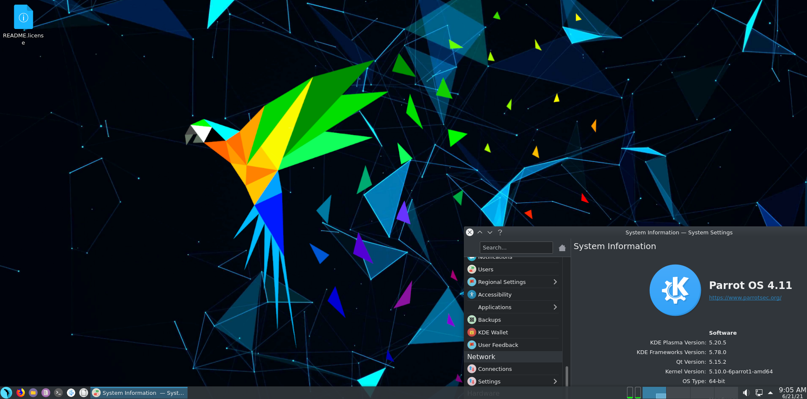

# Environnements de bureau #

Parrot OS, en plus d'être disponible dans les éditions Security et Home, utilise également différents **Desktop Enviroments (DE)**. Chaque DE a sa particularité, mais nous recommandons de les essayer avant de décider quoi installer (cependant, gardez à l'esprit que vous pouvez installer plusieurs DE sur un OS). 

Etant une interface graphique à travers laquelle l'utilisateur peut interagir avec le système d'exploitation, les possibilités de modifier les différents composants du DE sont nombreuses. Chacun des DE suivants offre la possibilité d'être personnalisé selon ses goûts.

La différence entre les trois DE officiellement supportés concerne principalement les aspects graphiques.

N'hésitez pas à [télécharger](https://parrotsec.org/download/) l'édition qui vous est utile et avec le DE que vous aimez le plus ! 

 
    
 
        <i class="fa fa-info-circle badge" aria-hidden="true"></i> 
        
**Note**

 

Il peut être utile de savoir que l'utilisateur peut installer plus de DE sur son Parrot, il suffit de taper dans un terminal: 
    
    sudo apt update && sudo apt install parrot-<desktop environment>

\
puis redémarrez votre ordinateur.
Dans la session de connexion, vous pouvez changer de DE en cliquant sur le point blanc ⚪️ (c'est la "session par défaut") et changer de DE. Vous pouvez maintenant utiliser le nouveau DE installé avec  tous les outils et configurations déjà présents précédemment.
 

## Bureau MATE ##

[Download Home Edition](https://download.parrot.sh/parrot/iso/4.11.2/Parrot-home-4.11.2_amd64.iso)
\
[Download Security Edition](https://download.parrot.sh/parrot/iso/4.11.2/Parrot-security-4.11.2_amd64.iso)

Si vous avez un autre DE, vous pouvez installer MATE par :
\
`sudo apt install parrot-mate`

## Bureau KDE ##

[Download Home Edition](https://download.parrot.sh/parrot/iso/4.11.2/Parrot-kde-home-4.11.2_amd64.iso)
\
[Download Security Edition](https://download.parrot.sh/parrot/iso/4.11.2/Parrot-kde-security-4.11.2_amd64.iso)

Si vous avez un autre DE, vous pouvez installer KDE par :
\
`sudo apt install parrot-kde`

## Bureau XFCE ##

[Download Home Edition](https://download.parrot.sh/parrot/iso/4.11.2/Parrot-xfce-4.11.2_amd64.iso)

Si vous avez un autre DE, vous pouvez installer XFCE par :
\
`sudo apt install parrot-xfce`

