# Comment installer Parrot OS #

Ce guide vous aidera à installer Parrot OS (dernière version) sur votre ordinateur, étape par étape, via l'installateur officiel et par défaut : *Calamares*. 

Ce guide s'applique à la fois aux éditions [Security](https://parrotsec.org/security-edition) et [Home](https://parrotsec.org/home-edition). 

En cas de problème ou de détails manquants, veuillez le signaler sur le [forum Parrot](https://community.parrotsec.org) officiel.

Insérez votre support d'installation dans votre ordinateur et, via vos paramètres BIOS ou UEFI, démarrez Parrot. Un écran apparaîtra avec plusieurs options, dont certaines plus avancées. 

Sélectionnez **Try/Install** et appuyez sur *Enter*.

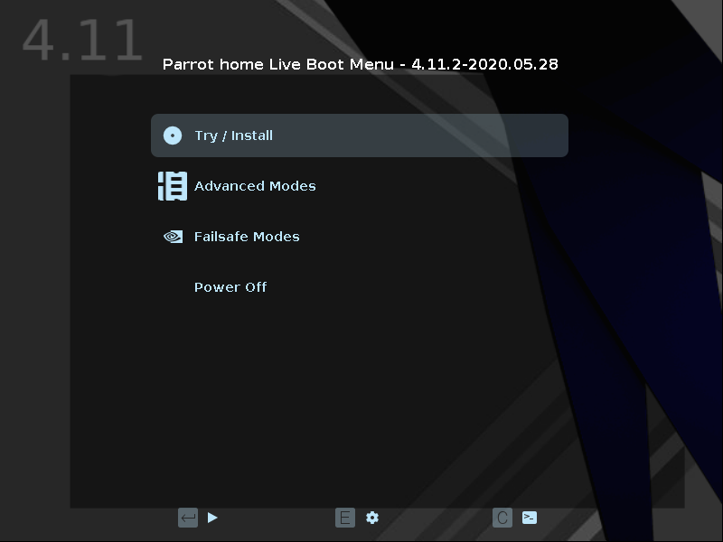

Attendez que le système d'exploitation se charge (quelques secondes).

## Bienvenue sur Parrot Live ##

Ici, vous pouvez essayer le système d'exploitation dans son intégralité, puis vous pouvez procéder à son installation.

Cliquez sur **Install Parrot**:

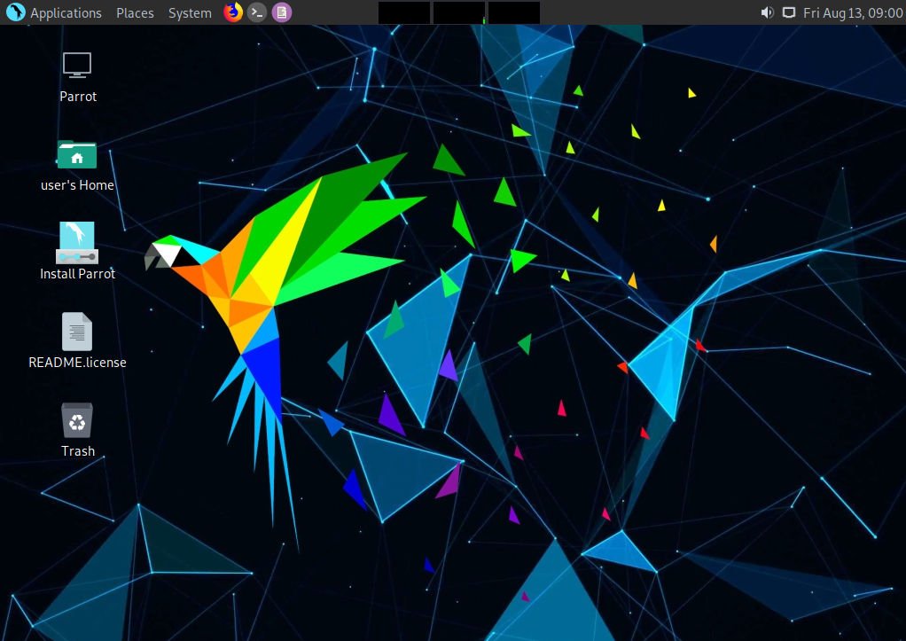

et l'installateur, Calamares, va démarrer.

## C'est parti ! ##

L'étape suivante consiste à sélectionner la langue du système. 
\
Choisissez votre langue. 
\
Cliquez sur *Suivant*.

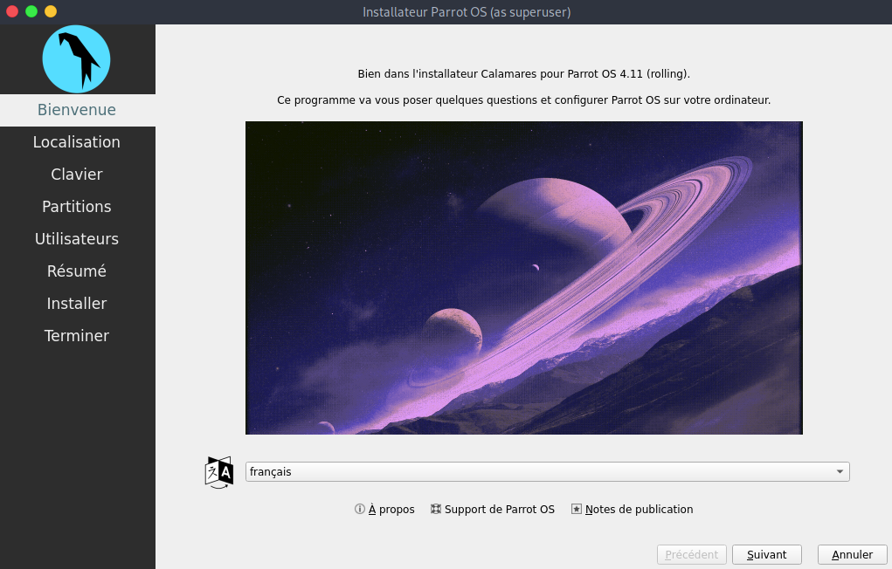

Sélectionnez ensuite votre région et votre zone. Cliquez sur *Suivant*.

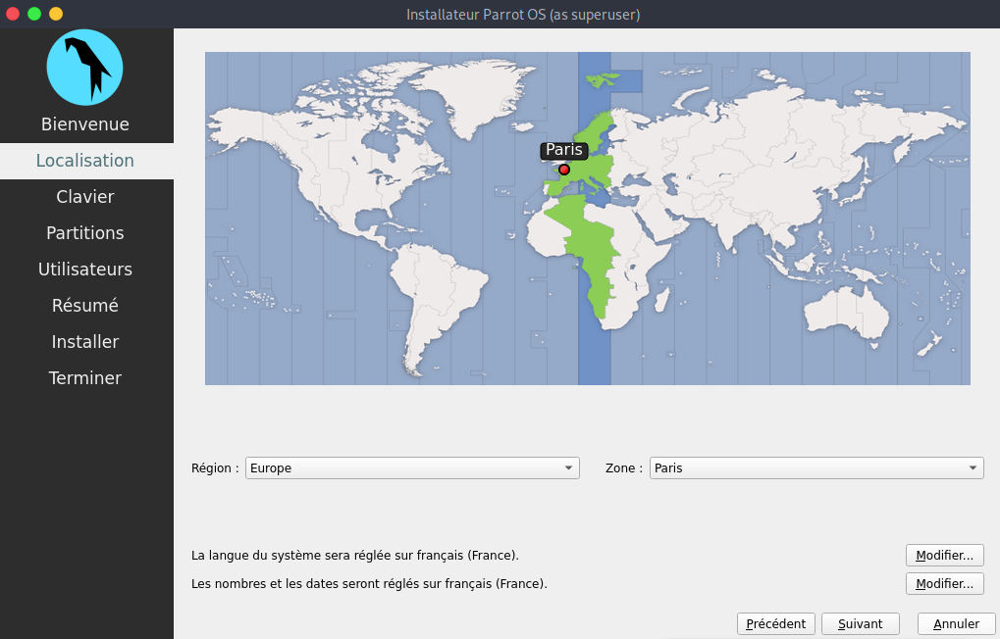

Maintenant, vous pouvez sélectionner la disposition du clavier. Il existe de nombreuses variantes disponibles, et vous pouvez les tester à l'endroit où il est écrit *"Tapez ici pour tester votre clavier "*.

Cliquez sur *Suivant*.

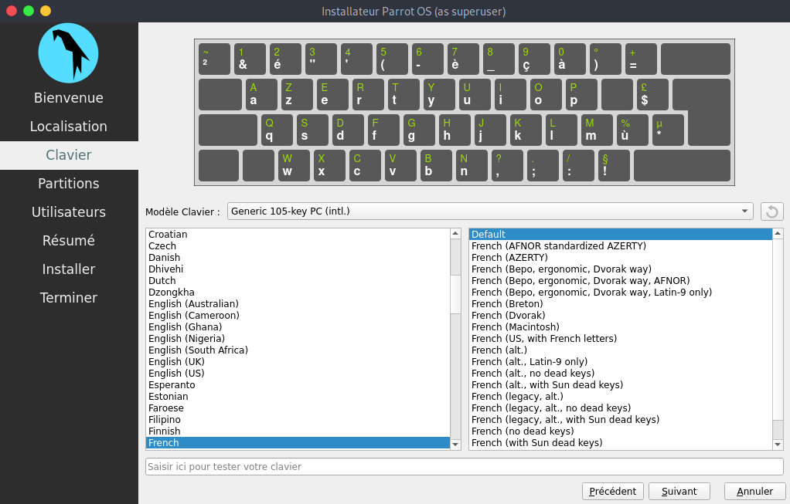

### Partitionnement de disque Parrot Security ###

Nous pensons qu'un partitionnement guidé pour les utilisateurs moins expérimentés est recommandé, 40 Go ou plus est suffisant, à moins que vous ne vouliez installer beaucoup de programmes ou conserver des fichiers plus importants sur votre disque dur.

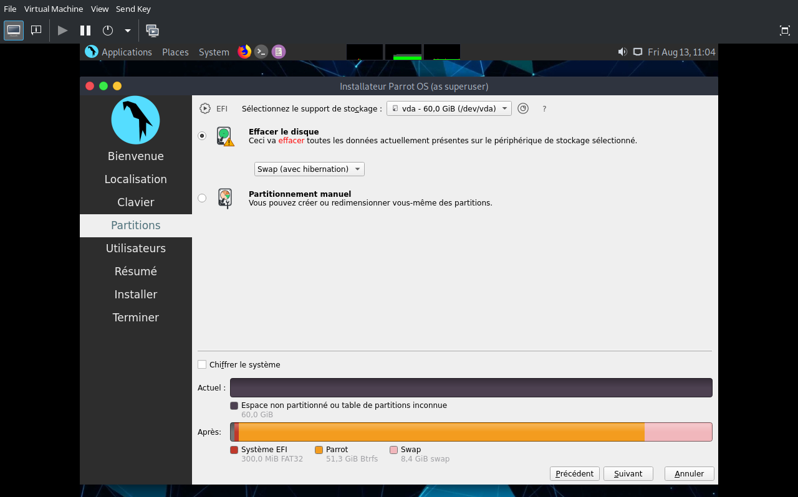

Ici, vous pouvez décider d'activer ou non le swap. Pour plus d'informations sur le swap, \
[https://wiki.debian.org/fr/Swap](https://wiki.debian.org/fr/Swap) \
[https://www.kernel.org/doc/html/latest/power/swsusp.html](https://www.kernel.org/doc/html/latest/power/swsusp.html)

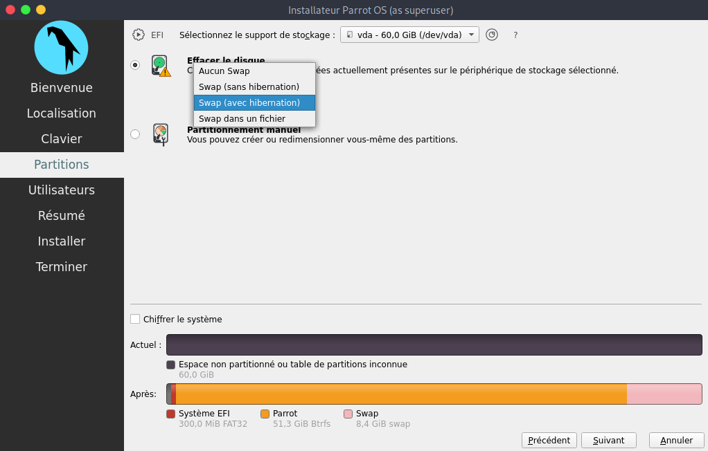

*Si vous le souhaitez*, vous pouvez également chiffrer le système en ajoutant un mot de passe :

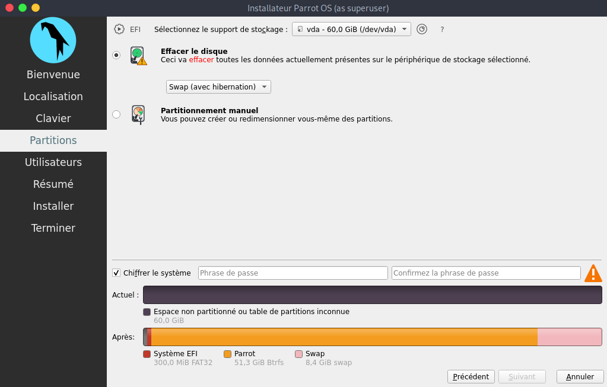

Sélectionnez les options qui vous semblent les plus utiles et cliquez sur *Suivant*.

### Création d'un nouveau compte utilisateur ### 

Il vous sera demandé de créer un nouvel utilisateur, nous avon choisi ici comme nom **Parrot user** et comme identifiant de connexion **user**.

N'oubliez pas qu'il s'agit du mot de passe pour accéder à votre compte OS, nous vous recommandons d'en créer un long et complexe.

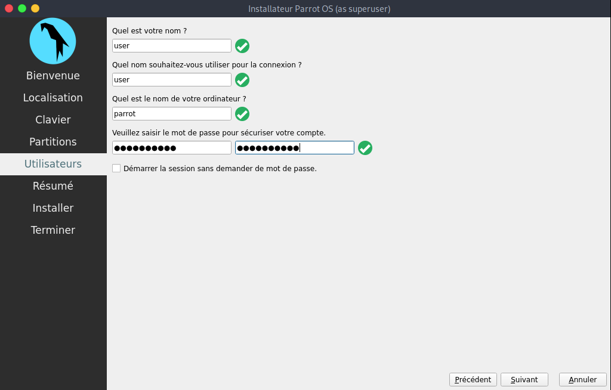

Puis, cliquez sur *Suivant*.

### Terminer le processus d'installation ###

Enfin, un résumé des choix effectués au cours de la procédure vous est présenté:

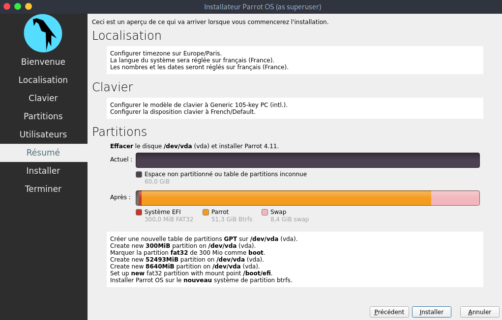

Vous pouvez décider de modifier les paramètres choisis, puis de revenir en arrière, ou de poursuivre l'installation du système. Cliquez sur **Installer**. Confirmez en cliquant sur **Installer maintenant**

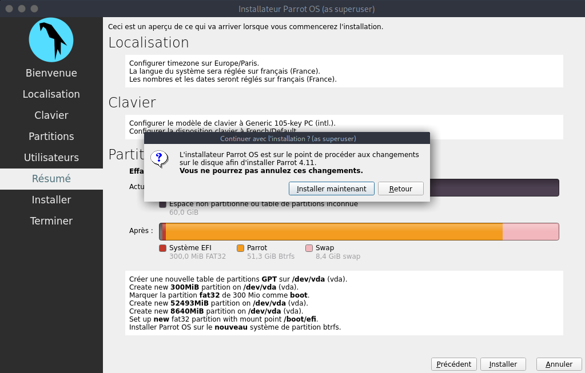

Et attendez que l'installation se termine ! Avec un SSD, cela prendra quelques minutes.

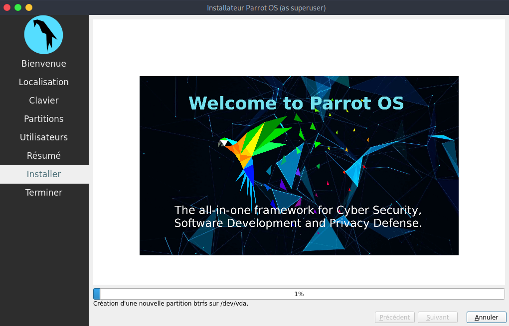

**Bien joué ! Vous avez installé avec succès Parrot OS sur votre ordinateur !**

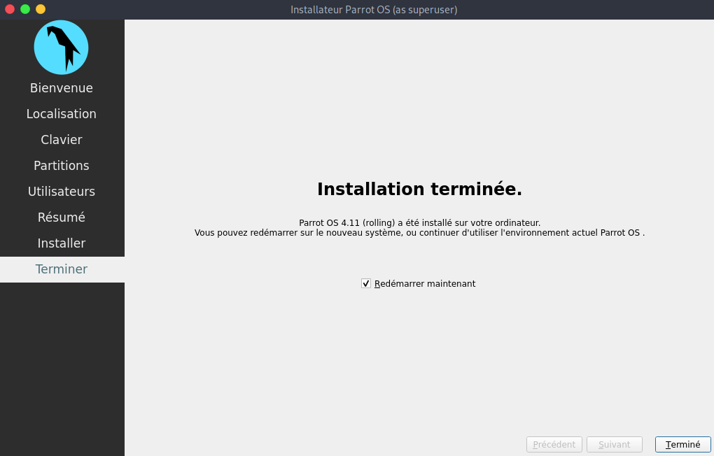

### Connectez-vous à Parrot pour la première fois ###

Entrez votre mot de passe :

**Bienvenue sur Parrot ! Félicitations !**

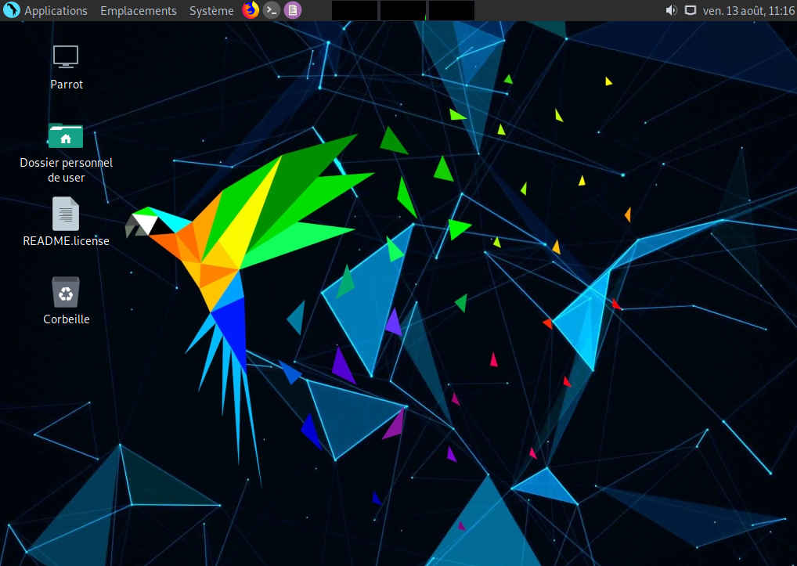
