# Installer Parrot Security sur VirtualBox #

## Ce guide couvrira les étapes suivantes : ##

 * Création d'une nouvelle machine virtuelle 
 
 * Création d'un nouveau disque virtuel (VDI, allocation dynamique etc...) 
 
 * Modification des paramètres de VirtualBox (allocation de la mémoire physique et vidéo, sélection du type d'OS, accélération du CPU etc...). 
 
 * Chargement de l'ISO de Parrot Security 
 
 * Démarrage de l'ISO de Parrot Security (informations initiales, emplacement, fuseau horaire, etc.) 
 
 * Partitionnement du disque Parrot Security 
 
 * Finalisation de l'installation et fonctionnement de Parrot Security sur VirtualBox 
 
 ### Ce que vous devez installer ##
 
Si l'OS que vous utilisez est Windows ou MacOS, voici le lien vers le programme d'installation de [VirtualBox](https://www.virtualbox.org/wiki/Downloads). 

Sous GNU/Linux, c'est la même chose, mais vous pouvez l'installer via CLI :
 
    sudo apt install virtualbox
  
Suivez les mêmes étapes **EXACTEMENT** pour installer et exécuter Parrot via VirtualBox sur votre machine.

### Étape 1 - Créer une nouvelle machine virtuelle ###

Avant de continuer, assurez-vous d'avoir installé VirtualBox avec succès. Sous GNU/Linux, vous pouvez le vérifier en ouvrant un terminal et en tapant `virtualbox` et/ou l'icône pour démarrer VirtualBox sera visible dans le menu. Pour les autres systèmes d'exploitation, il y aura une icône similaire pour le démarrer.

Une fois que vous avez installé VirtualBox :

 - Ouvrez-le. 
 - Cliquez sur Nouveau pour créer une nouvelle machine virtuelle.

### Étape 1.1 - Entrez un nom pour votre machine virtuelle ###

Entrez Parrot Security comme nom. Définissez le "Type" à **Linux**, et définissez la "Version" à **Autre Linux (64-bit)**. 

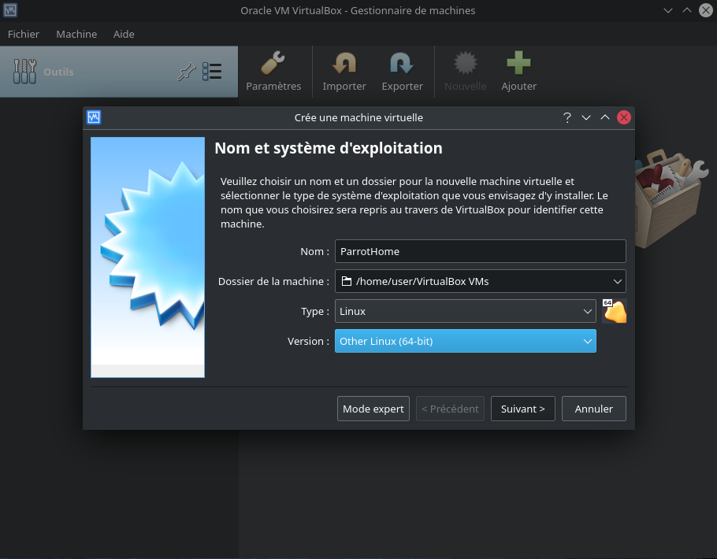

### Étape 1.2 - Allouer de la mémoire/de la RAM ###

Le système d'exploitation peut fonctionner sur des machines dotées de 512 Mo de RAM, mais il est fortement recommandé de disposer d'au moins **2 Go** pour les éditions Parrot Security et Home. 
\

Choisissez le paramètre le mieux adapté à votre machine et cliquez sur *Suivant*.

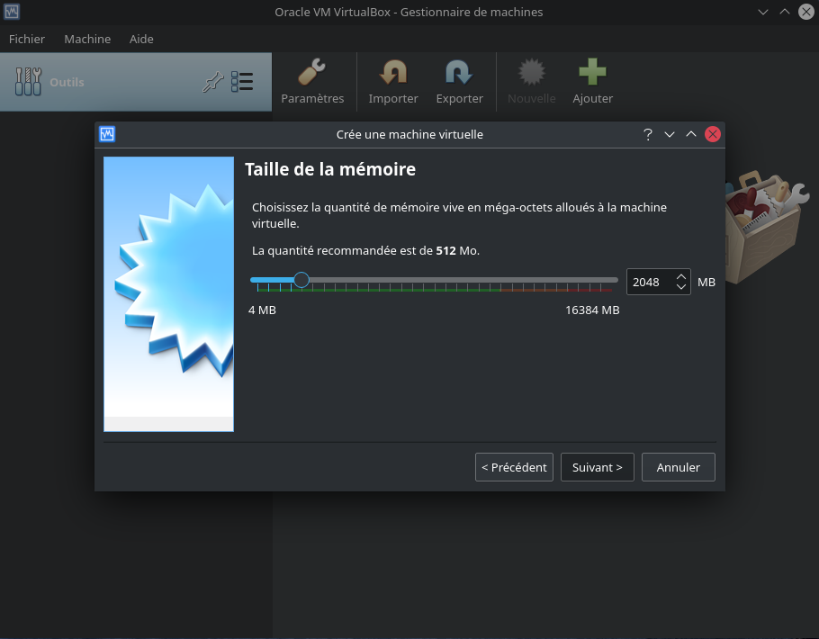

### Étape 2 - Créer un disque dur virtuel ###
Sur cet écran, sélectionnez **Créer un disque dur virtuel maintenant** (*2e option*) et cliquez sur *Créer*.

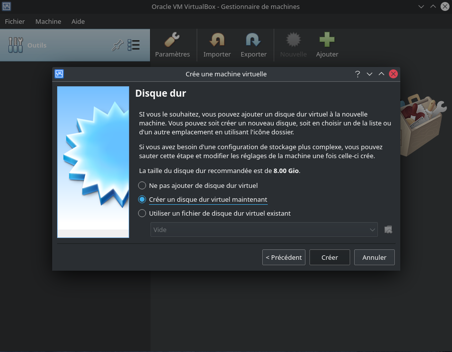

### Étape 2.1 - Sélectionnez le type de fichier du disque dur virtuel ###

Sur l'écran suivant, sélectionnez **VDI** - **VirtualBox Disk Image** comme *type de fichier du disque dur*.\

Cliquez sur *Suivant*.

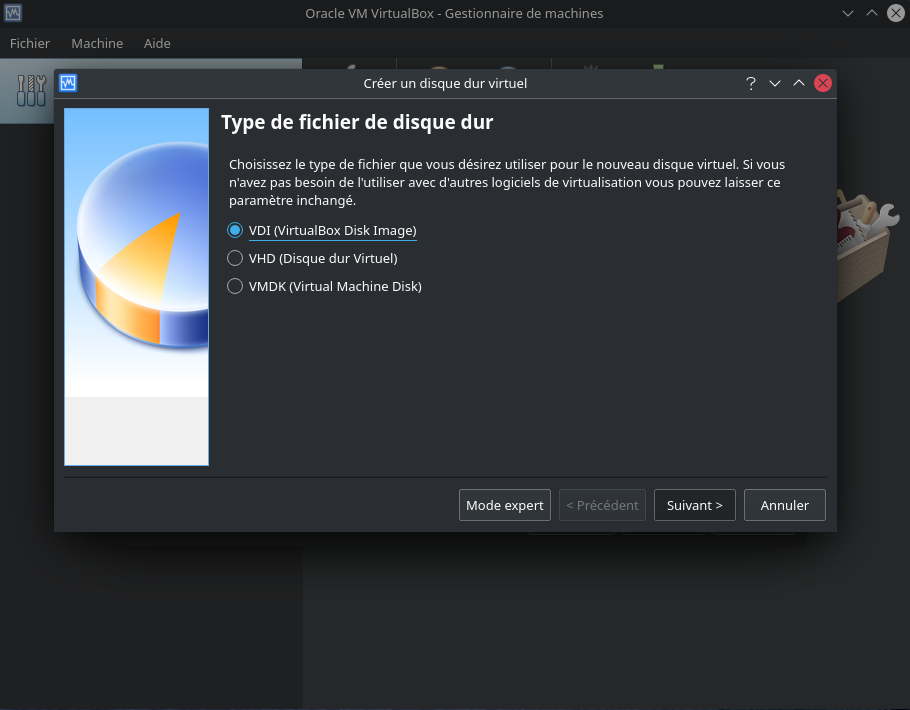

### Étape 2.2 - Sélectionnez le type d'allocation du disque dur physique ###

Sélectionnez **Alloué dynamiquement** et cliquez sur Suivant dans la fenêtre *Stockage sur le disque dur physique*.

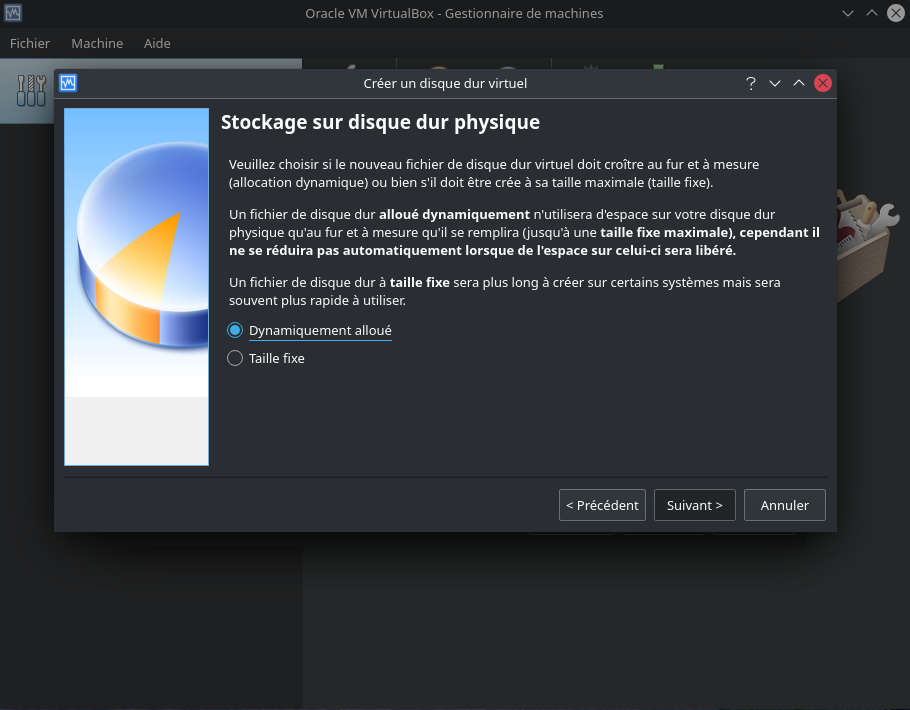

### Étape 2.3 - Allouez la taille du disque ###

Sur l'écran **Emplacement et taille du fichier**, 8,00 Go s'affichent comme taille par défaut (que nous avons définie à l'étape 1.1). Dans cet exemple, nous l'avons augmentée à 20 Go pour des raisons de stockage. Choisissez ce qui vous convient et cliquez sur *Suivant*. 

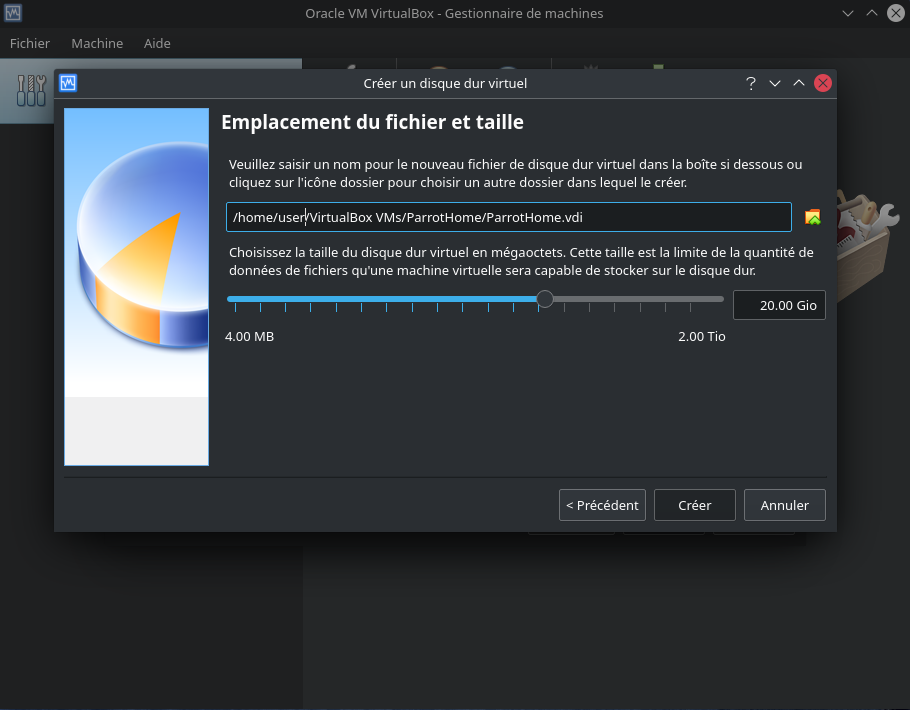

#### Étape 3 - Modifier les paramètres de VirtualBox ###

Jusqu'à présent, nous avons effectué les opérations suivantes pour vous : 

* Création d'une nouvelle machine virtuelle 

* Création d'un disque dur virtuel 

* Modification des propriétés, du type et de la taille du disque. 

A ce stade, vous devriez voir l'écran suivant : 

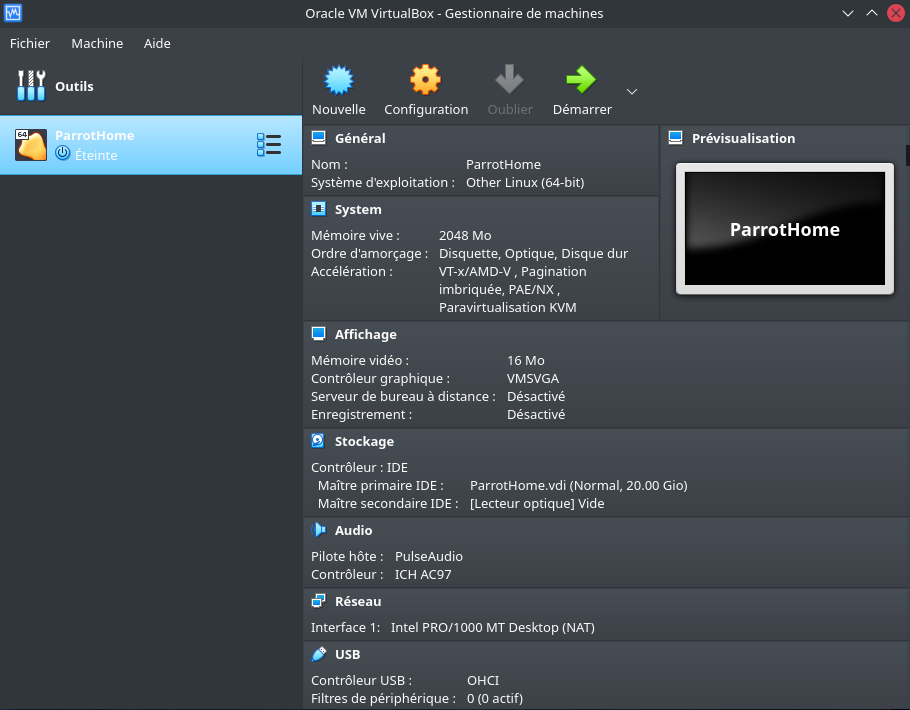 

#### Etape 3.1 - Sélectionner le type de système d'exploitation ###

Selon l'ISO que vous avez téléchargé, sélectionnez la bonne version ici. Comme Parrot Security est dérivé de Debian, nous avons ici sélectionné Other Linux (64-bit) sur *Général &gt; De base*.

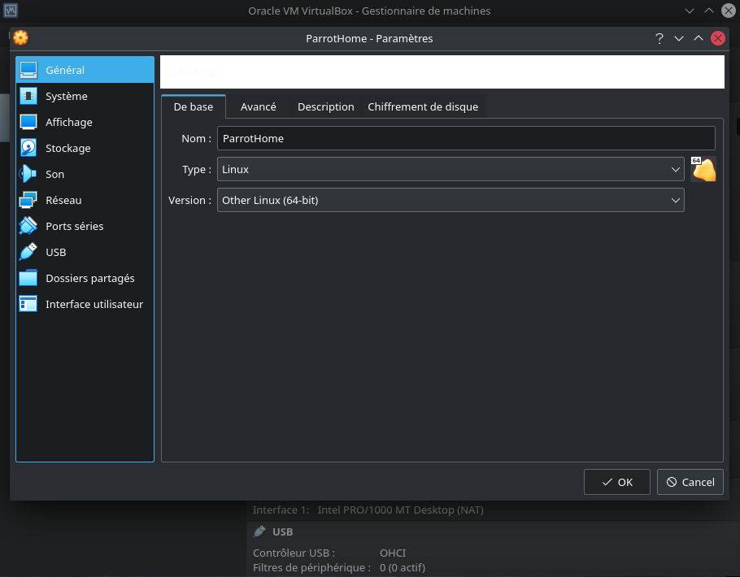

### Etape 3.2 - Activer le Presse-papiers partagé et la fonction Glisser-Déposer ###

Sélectionnez *Général &gt; Avancé* et changez **Presse-papier partagé** et **Glisser-Déposer** en Bidirectional. Cela vous permettra de copier-coller des fichiers de votre machine HOST à la volée. Confirmez en cliquant sur *OK*.

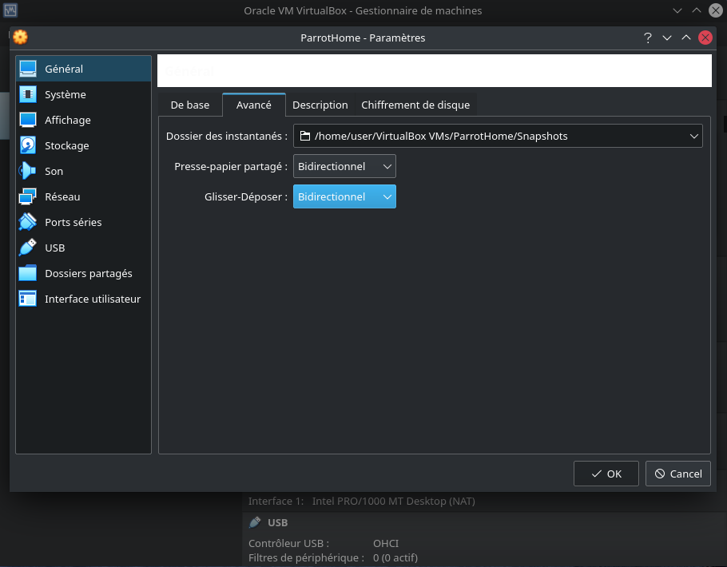

### Étape 3.3 - Mise à jour des options de la carte mère virtuelle ###

Sélectionnez *Système &gt; Carte mère*, décochez Disquette (qui a encore une disquette ?) et cochez la case [**Activer IO-APIC**](https://www.virtualbox.org/manual/ch03.html#settings-motherboard). Notez que vous pouvez modifier l'allocation de la mémoire de base dans le même écran. Nous l'avons fixé à 2048 Mo précédemment. Si votre machine dispose de 8,00 Go de RAM, cela signifie que vous pouvez allouer beaucoup plus de mémoire pour que Parrot Security réponde plus rapidement en tant que machine virtuelle. Si vous pensez que votre Parrot Security virtualisé est lent, vous devez augmenter l'allocation de mémoire de base : * 1,00 Go = 1024 Mo * 2,00 Go = 2048 Mo * 3,00 Go = 3072 Mo * 4,00 Go = 4096 Mo * et ainsi de suite. Multipliez 1024 par la quantité de mémoire/RAM que vous souhaitez et indiquez la valeur ici.

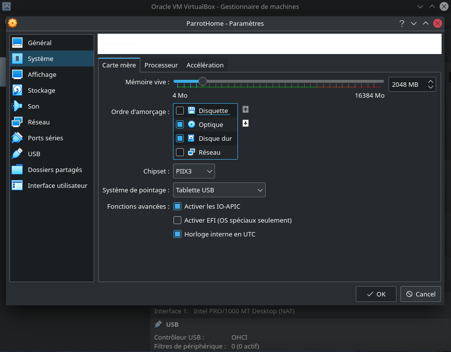

### Étape 3.4 - Sélectionnez le nombre de processeurs et activez PAE/NX ###

Définit le nombre de cœurs de CPU virtuels que le système d'exploitation invité peut voir. 2 cœurs virtuels fonctionne bien. Avec 4, 6, et ainsi de suite, les performances seront bien meilleures. Vous ne devez pas configurer les machines virtuelles pour qu'elles utilisent plus de cœurs de CPU que ceux qui sont disponibles physiquement. Cela inclut les cœurs réels, sans hyperthreads. Voir [onglet Processeur](https://www.virtualbox.org/manual/ch03.html#settings-processor) sur le site Web de VirtualBox. Cochez la case pour **Activer PAE/NX**. 

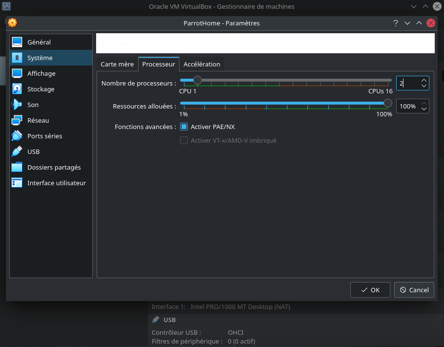 

#### Étape 3.5 - Attribution de la mémoire vidéo et de l'accélération 3D ###

Sélectionnez **Affichage &gt; Écran &gt; définissez la mémoire vidéo à 128 Mo**. Si vous avez plus d'un moniteur, vous pouvez également modifier vos paramètres ici.

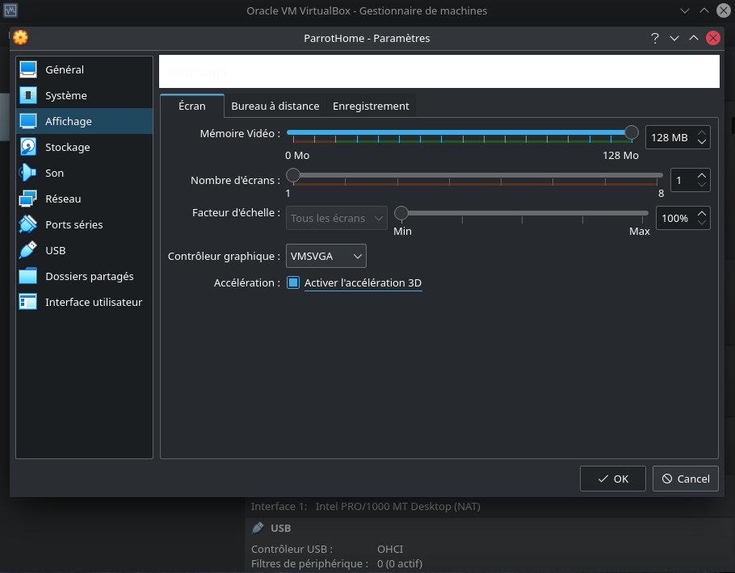

### Étape 4 - Chargement de Parrot Security ISO ###

Sélectionnez **Stockage &gt; Contrôleur : IDE** et mettez en évidence l'icône du CD vide. Maintenant, sur votre droite, vous devriez pouvoir cliquer sur la petite icône CD (elle devrait déjà être CD/DVD Drive : Maître secondaire IDE, sinon changez-la) et sélectionner votre ISO téléchargé.

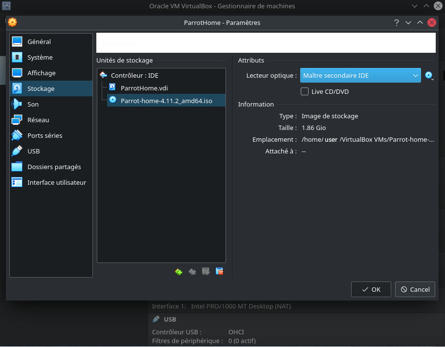

Une fois que vous avez sélectionné votre ISO téléchargé (dans ce cas, c'est l'ISO Parrot Security 4.11.2). Consultez les propriétés et les changements d'informations en conséquence.\**Important** : si la taille de votre disque ne correspond pas, il se peut que votre disque soit corrompu. Reportez-vous à Parrot Security [chapitre](../fr/download-parrot.html) dans cette documentation pour obtenir des informations sur la taille. Vous pouvez également effectuer une vérification SHA1 pour vous assurer que votre disque n'est pas corrompu. **Note** : si vous souhaitez tester Parrot en mode réel, cochez la case *\"Live CD/DVD \"*

### Étape 4.1 - Sélectionnez le type de connexion réseau ###

Si votre ordinateur est connecté à Internet, sélectionnez NAT dans *Réseau &gt; Adaptateur 1*. Vous pouvez activer d'autres adaptateurs réseau si vous le souhaitez. 

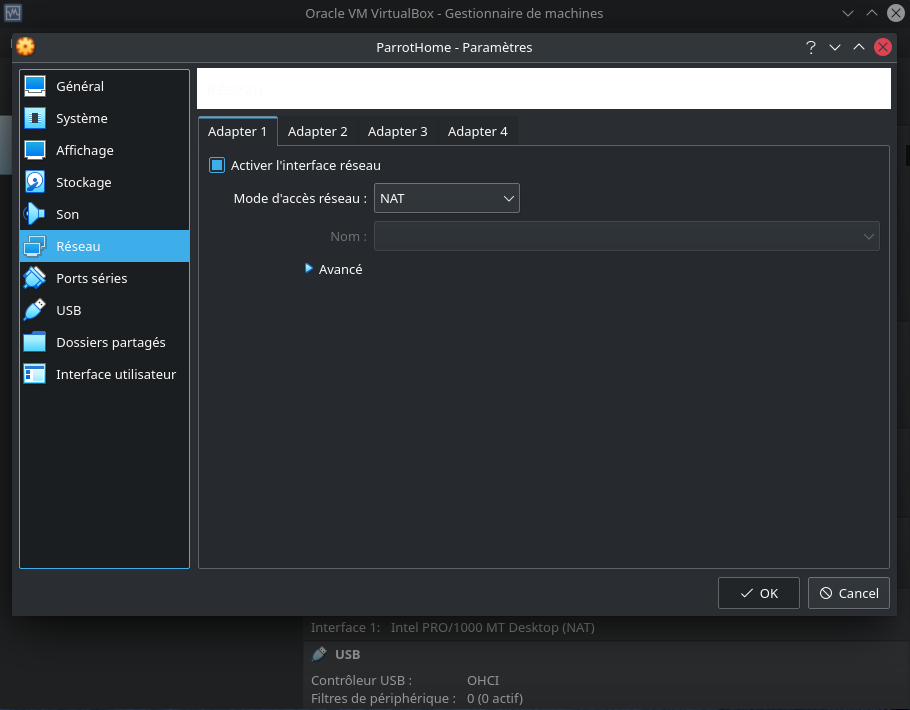

#### Étape 4.2 - Activer les contrôleurs USB 2.0 et 3.0 ###

En premier lieu, assurez-vous d'avoir installé le *pack d'extension*, sinon vous ne pourrez pas activer les contrôleurs USB 2.0 et 3.0. Si vous ne l'avez pas installé, vous pouvez le télécharger [ici](https://download.virtualbox.org/virtualbox/6.1.22/Oracle_VM_VirtualBox_Extension_Pack-6.1.22.vbox-extpack). Ensuite, allez dans **files &gt; preferences &gt; extensions**, sur la droite il y aura un bouton `` où vous pourrez installer l'extension.sous GNU/Linux, vous pouvez aussi l'installer à partir du terminal avec `sudo apt install virtualbox-ext-pack`Une fois installée, elle activera le support du protocole VRDP (Remote Desktop Protocol) de VirtualBox et le support du Host webcam passthrough.

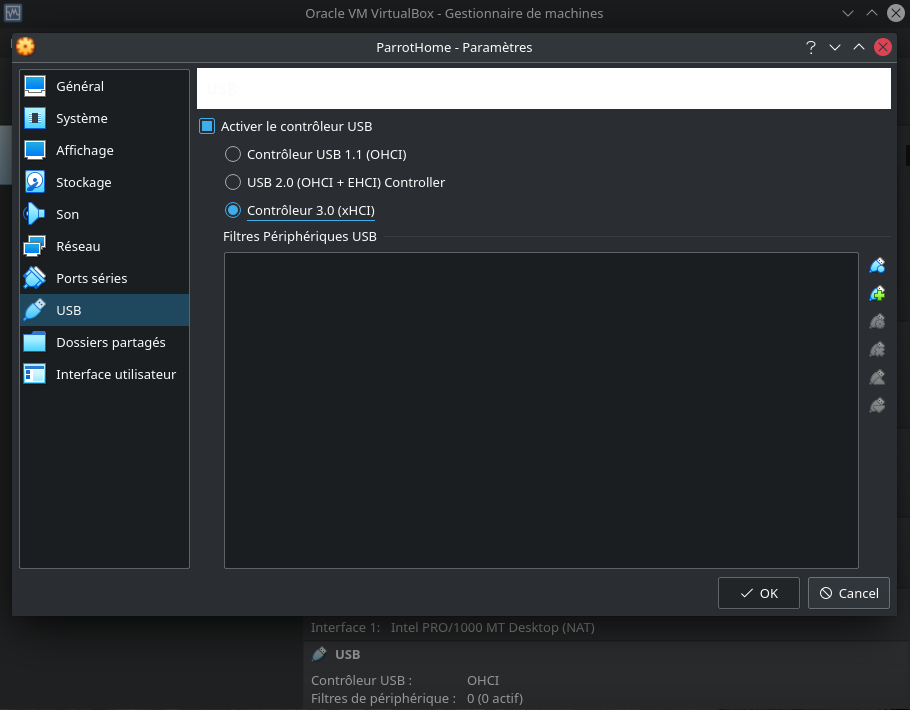

### Etape 4.3 - Tout est prêt ? ###

Finalement, en cliquant sur votre nouvelle machine virtuelle, voici ce que vous devriez voir :

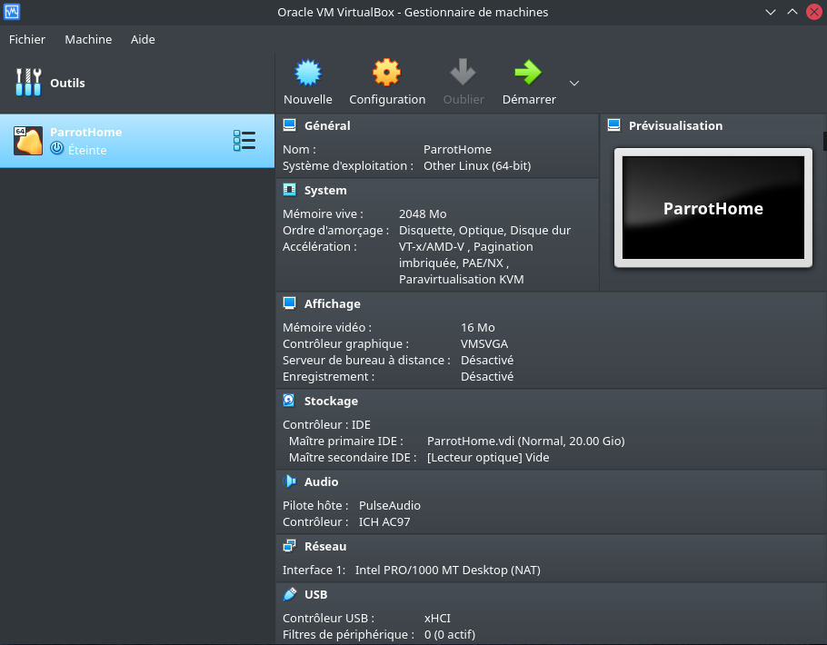

Vous pouvez toujours modifier la configuration comme vous le souhaitez.

### Étape 5 - Démarrage de Parrot Security ISO ###

À partir de l'écran principal de VirtualBox, cliquez sur Start et démarrez Parrot Security.

### Étape 5.1 - choisissez Installer ###

À partir de l'écran principal de VirtualBox, il démarrera Parrot Security, cliquez dans la machine virtuelle, sélectionnez *Try/Install* et cliquez ensuite sur Enter. 

 

### Etape 5.2 - choisir l'installateur par défaut (Calamares) ###

Vous pouvez ici tester le système d'exploitation dans son intégralité, puis vous pouvez procéder à l'installation.\Cliquez sur **Installer Parrot** :

et l'installateur par défaut, Calamares, démarrera.

### Etape 5.3 - choisir la langue ###

Dans cet exemple, nous avons choisi l'anglais américain. Cliquez sur *Suivant*.

### Etape 5.4 - Sélection du lieu ###

Nous avons choisi ici l'Amérique et la zone de New York. Cliquez sur *Suivant*.

### Étape 5.5 - Sélectionnez la disposition du clavier ###

Sélectionnez la disposition qui convient le mieux à votre clavier, vous pouvez également tester la touche du clavier où il est indiqué *Tapez ici pour tester votre clavier*. Cliquez sur *Suivant*.

### Étape 5.6 - Partitionnement du disque Parrot Security ###

Comme tout est virtualisé, vous pouvez choisir ce que vous voulez.\Nous pensons qu'un partitionnement guidé pour les utilisateurs moins expérimentés est recommandé, 40 Go ou plus sont suffisants, sauf si vous allez installer beaucoup plus de programmes ou conserver plus de fichiers sur votre disque dur.

Ici, vous pouvez décider d'activer ou non le swap. Pour plus d'informations sur le swap, \[https://wiki.debian.org/Swap](https://wiki.debian.org/Swap) \[https://www.kernel.org/doc/html/latest/power/swsusp.html](https://www.kernel.org/doc/html/latest/power/swsusp.html)

*Si vous le souhaitez*, vous pouvez également crypter le système en ajoutant une phrase de passe :

### Étape 5.7 - Création d'un nouveau compte utilisateur ### 

Il vous sera demandé de créer un nouvel utilisateur, pour simplifier nous avons choisi un **utilisateur**.Vous pouvez entrer n'importe quel nom ici. 

Ensuite, cliquez sur *Suivant*

### Etape 6 - Terminer le processus d'installation ###

Enfin, un résumé des choix effectués au cours de la procédure :

Vous pouvez décider de modifier les paramètres choisis, puis de revenir en arrière, ou de poursuivre l'installation du système. Cliquez sur **Installer** et confirmez en cliquant sur **Installer maintenant**

Et attendez que l'installation se termine ! Avec un SSD, cela prend quelques minutes.

**Bien joué ! Vous avez réussi à installer ParrotOS sur votre ordinateur**

### Étape 7 : Connectez-vous à Parrot Security pour la première fois ###

Entrez votre mot de passe :

**Vous venez d'installer Parrot Security ! Félicitations!**

