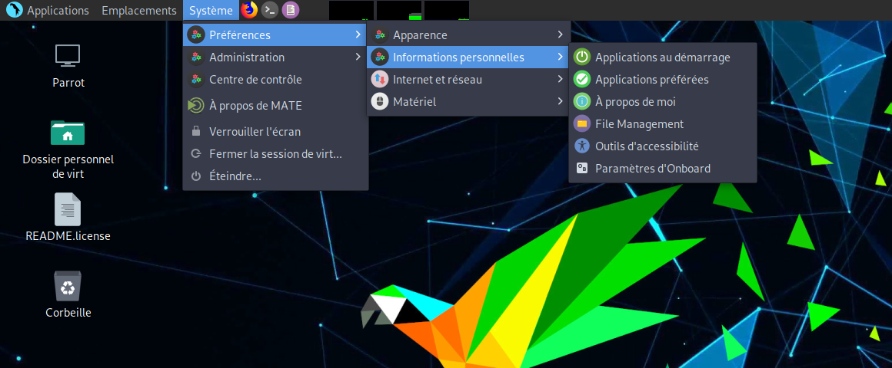
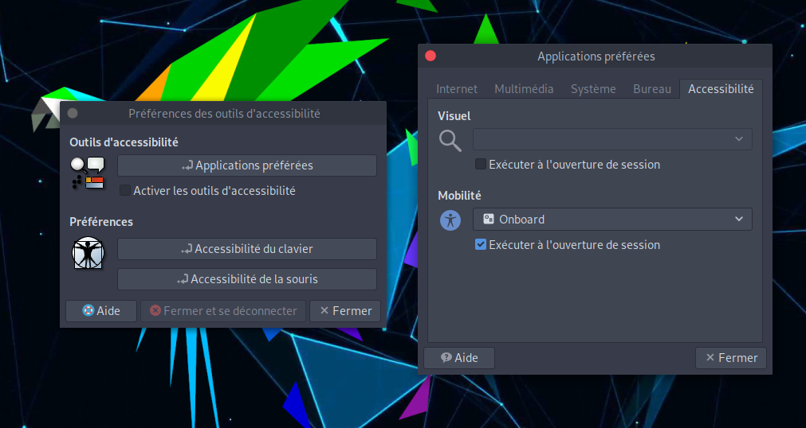

### Technologies d'aide #

## Clavier à l'écran ### 
Pour activer le clavier à l'écran, suivez les étapes suivantes : 

dans le menu du panneau supérieur : 

Ou dans la barre de recherche du panneau inférieur, cherchez "outils d'accessibilité" puis appuyer sur "entrer".

`Cliquer sur Applications préférées -> Sous mobilité, séléctionner "Onboard" -> Exécuter à l'ouverture de session`.

