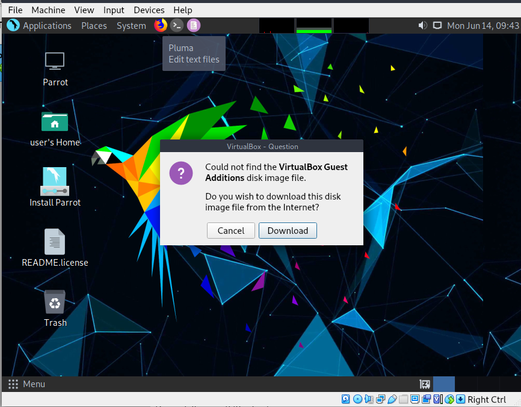
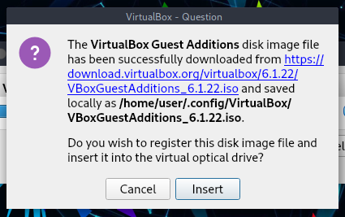

## Introduction aux ajouts invités de Virtualbox ## 
Les ajouts invités sont conçus pour être installés dans une machine virtuelle après l'installation du système d'exploitation invité. Elles se composent de pilotes de périphériques et d'applications système qui optimisent le système d'exploitation invité pour de meilleures performances et une plus grande convivialité.

## Fonctionnalités de Virtualbox Guest Additions ##

 * **Intégration du pointeur de la souris** 
    * Il n'est plus nécessaire d'appuyer sur la touche Host pour "libérer" la souris et éviter qu'elle ne soit capturée par l'OS invité. 
 
 * **Dossiers partagés** 
    * Dossiers partagés entre l'hôte et Parrot. 
    
* **Meilleure prise en charge vidéo** 
    * Alors que la carte graphique virtuelle que VirtualBox émule pour n'importe quel système d'exploitation invité fournit toutes les fonctionnalités de base, les pilotes vidéo personnalisés qui sont installés avec les ajouts invités vous offrent des modes vidéo supplémentaires élevés et non standard ainsi que des performances vidéo accélérées. 
    \
    **(Généralement utilisé pour changer la résolution du moniteur)** 
    
* **Fenêtres transparentes** 
    * Avec cette fonctionnalité, les fenêtres individuelles qui sont affichées sur le bureau de la machine virtuelle peuvent être mappées sur le bureau de l'hôte, comme si l'application sous-jacente fonctionnait réellement sur l'hôte. 

* **Canaux de communication génériques hôte/ invité** 
    * Les ajouts invités vous permettent de contrôler et de surveiller l'exécution de l'invité d'autres manières que celles mentionnées ci-dessus. Les "propriétés de l'invité" fournissent un mécanisme générique basé sur des chaînes de caractères pour échanger des bits de données entre un invité et un hôte, dont certains ont des significations spéciales pour contrôler et surveiller l'invité.  
    
* **Synchronisation de l'heure** 
    * Synchronise la date et l'heure de l'hôte à Parrot. 

Pour plus d'informations, consultez le [manuel de VirtualBox](https://www.virtualbox.org/manual/ch04.html). 

\
\    
### Guest Additions Installation(s) ###

## Méthode 1 (la plus simple) ##

**1.** Ouvrez un terminal et mettez à jour la liste des paquets du dépôt avec 

    sudo apt update.

\
**2.** Installez les Guest Additions du dépôt Parrot OS avec 
        
    sudo apt install virtualbox-guest-utils. 

\
3. Et installez le dernier paquet avec 

    sudo apt install virtualbox-guest-x11. 

\
4.Une fois l'installation terminée, vous pouvez redémarrer votre machine avec 

    sudo reboot

\
5. Vérifiez que les Guest Additions sont correctement installées en exécutant

    sudo /usr/sbin/VBoxService -V 

## Méthode 2 (à partir de l'ISO) ##

**1.** Dans la barre de menu de Virtual Machine, sélectionnez `Devices > Insert Guest Additions CD image...`.

 

\

**2.** VirtualBox ne trouvera pas les Guest Additions et vous demandera de les télécharger, cliquez sur *Download*. Nous vous recommandons d'ajouter un lecteur optique secondaire supplémentaire, car une fois les ajouts invités téléchargés, ils seront montés sur un second lecteur.

 

\

 

\

 

\

Cliquez sur "**insert**". S'il retourne une erreur (peut-être qu'il ne peut pas monter l'iso que vous venez de télécharger, alors éteignez la machine virtuelle, et retournez à l'écran principal de VirtualBox, allez dans *Setting &gt; Storage*, ici ajoutez un autre lecteur optique (assurez-vous qu'il est secondaire afin de ne pas donner de problèmes pour démarrer la distro). 

 

**3.** Puis allez dans le dossier Guest Addition ISO, et ici ouvrez un terminal et donnez 

    sudo chmod +x VBoxLinuxAdditions.run
        
Une fois fait, exécutez 

    sudo ./VBoxLinuxAdditions.run

**4.** Attendez le processus d'installation. Une fois l'installation terminée, redémarrez la machine virtuelle avec 

 

    reboot
