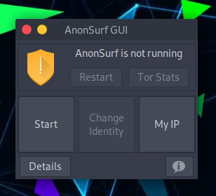
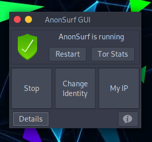
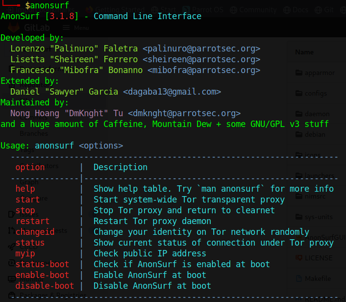

# AnonSurf क्या है? #

[AnonSurf](https://nest.parrotsec.org/packages/tools/anonsurf/-/tree/3.2.0) [Tor](https://www.torproject.org) के माध्यम से कनेक्शन को बाध्य करने के लिए पेरोट का anonymous mode wrapper है। यह Nim भाषा में लिखा गया है और GTK पुस्तकालयों का उपयोग करता है, इसलिए इसे ग्राफिकल इंटरफेस (जीयूआई) और कमांडलाइन इंटरफेस (सीएलआई) के माध्यम से इस्तेमाल किया जा सकता है।

इसका उपयोग पेरोट पर किया जा सकता है और यह दोनों मुख्य संस्करणों (गृह और सुरक्षा) पर पूर्व-स्थापित है। इसे तोता मेनू से शुरू किया जा सकता है, **एप्लिकेशन** और फिर **गोपनीयता** पर जाकर:

 

इसे शुरू करने के लिए, **Start** दबाएं, और यह सत्यापित करने के लिए कि सब कुछ काम कर रहा है, आप **My IP** और **Details** पर क्लिक कर सकते हैं।

**or Status** पर क्लिक करने पर टोर नेटवर्क के तहत किए जा रहे वर्तमान उपयोग के बारे में सभी विवरण दिखाई देंगे।

**Change Identity** के साथ आप दूसरे निर्गम नोड पर स्विच करेंगे:

### AnonSurf CLI ###

## तकनीकी जानकारी ##

AnonSurf *iptables* पर काम करता है जो अनुप्रयोगों को Tor नेटवर्क का उपयोग करने के लिए मजबूर करता है। **iptables** लिनक्स कर्नेल में एक एकीकृत फ़ायरवॉल है जो सभी पैकेजों के इनकमिंग और आउटगोइंग मार्ग की अनुमति देता है, फिर Tor का उपयोग उपयोगकर्ता के सभी ट्रैफ़िक की टनलिंग को गुमनाम तरीके से करने के लिए किया जाता है।

संस्करण 3.2.0 के बाद से, AnonSurf को एक नई कोड संरचना के साथ फिर से लिखा गया है। नए संस्करण उपलब्ध हैं [यहां](https://nest.parrotsec.org/packages/tools/anonsurf) और आप इस गाइड का पालन करके उन्हें आजमा सकते हैं:

सबसे पहले, Nim में लिखा जा रहा है, कुछ निर्भरताएँ स्थापित करने की आवश्यकता है:

    sudo apt install nim

\

    nimble install gintro

तब आप anonsurf source डाउनलोड कर सकते हैं:

    cd anonsurf/

\

    make build-parrot

\
    
    make install

## Tor के बारे में कुछ जानकारी ##

- Tor एक SOCKS4/SOCKS5 एन्क्रिप्शन प्रोटोकॉल है।
- Tor ने गुमनाम रूप से उपयोगकर्ताओं के नेटवर्क पर चलने वाले सभी ट्रैफ़िक को टनल कर दिया।
- Tor स्थानीय रूप से और दूरस्थ रूप से उपयोगकर्ता की निगरानी करने वाले किसी भी व्यक्ति से उपयोगकर्ता के स्थान और नेटवर्क डेटा को छुपाता है।

### Tor के कई उपयोग के मामले हैं ###

- ब्राउज़र के साथ प्रयोग किया जाता है (torbrowser)
- IRC clients (जैसे hexchat)
- Instant messanging (torchat, tormessanger)
- Hidden servers (.onion साइट बनाना)

### Tor तकनीकी विवरण ###

- Tor प्रोटोकॉल single node-to-node TLS कनेक्शन पर कई "circuits" को multiplexing [1] करके काम करता है।
- Tor ट्रैफ़िक को डिफ़ॉल्ट रूप से तीन नोड्स के माध्यम से रूट किया जाता है: Guard, relay, and exit.

[1] कई relay को रूट करने में सक्षम होने के लिए, tor में कुछ है जिसे *stream multiplexing capability* कहा जाता है:
- एक tor सर्किट पर कई tcp कनेक्शन ले जाया जा सकता है।
- प्रत्येक नोड एक सर्किट के लिए केवल सोर्स और डेस्टिनेशन कपलिंग जानता है। यह पूरा रास्ता नहीं जानता।
