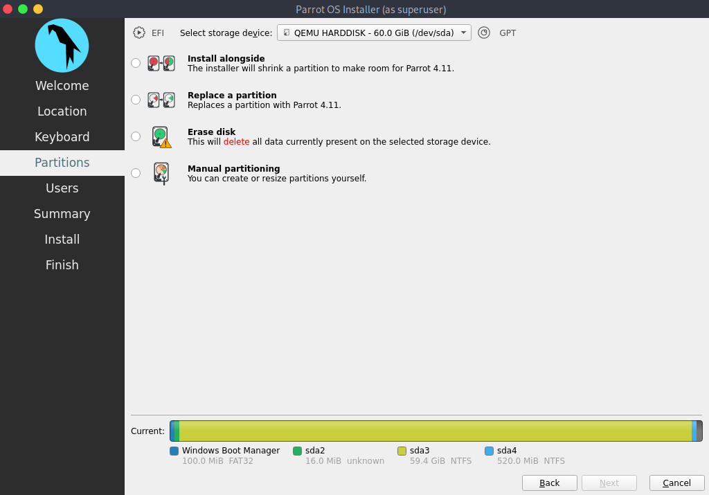
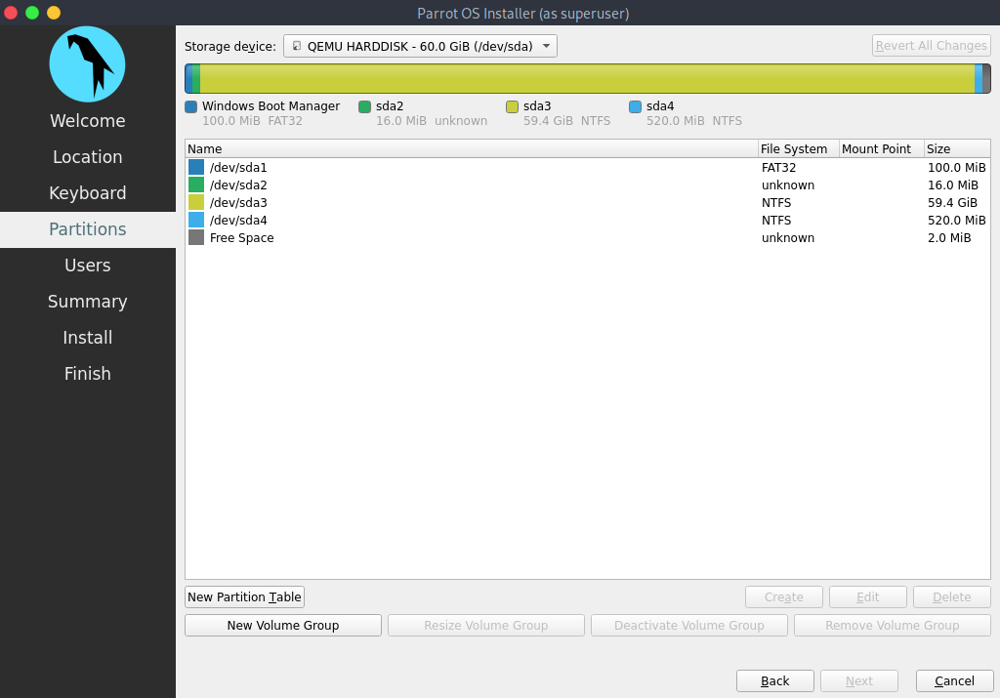
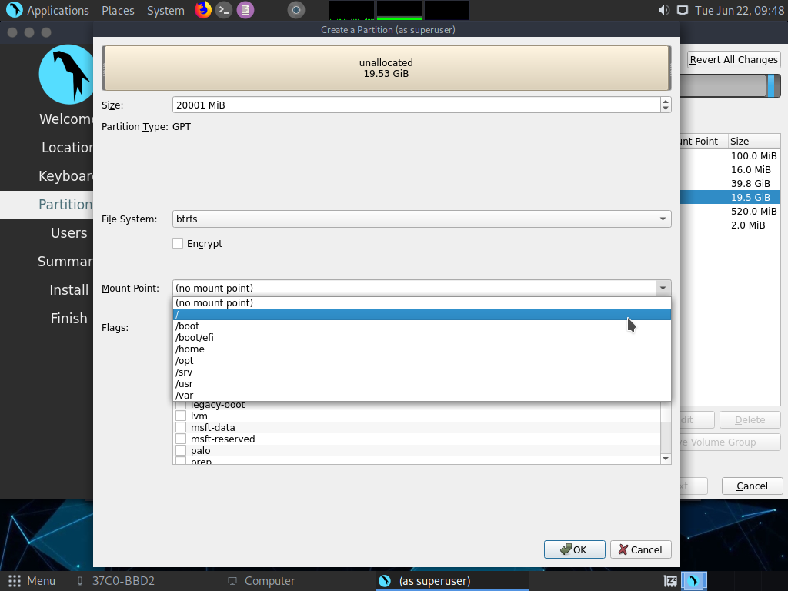
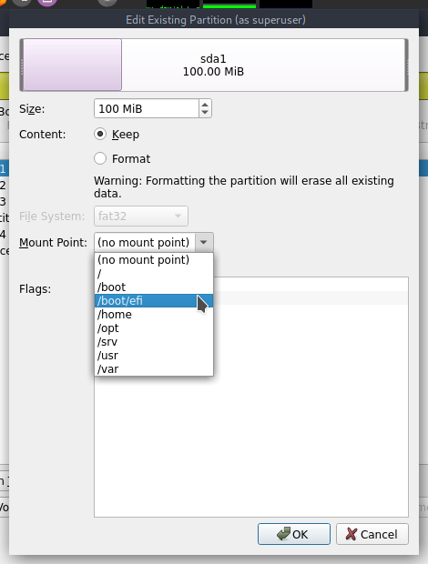

\
<h1 align="center"> Dualboot with Windows</h1>

Windows के साथ ParrotOS स्थापित करना संभव है।, GRUB और एक सही विभाजन के लिए धन्यवाद। 

**ध्यान दें:** अपनी मशीन में UEFI सेटिंग्स से सेक्यूर बूट और CSM अक्षम करें।

पार्टीशन से पहले [पेरोट इंस्टालेशन](./installation.md) सेट करने के लिए चरणों का पालन करने के बाद, स्थिति इस तरह होगी:

आगे बढ़ने के दो तरीके हैं: 

 - [Method 1: Automated Partitioning](<./dualboot-with-windows.html#method-1-automated-partitioning>) \
 - [Method 2: Manual Partitioning](<./dualboot-with-windows.html#method-2-manual-partitioning>)

## Method 1: Automated Partitioning

यह अधिक आसान है। आपको बस **साथ में स्थापित करें** का चयन करना है, फिर बार के भीतर **/dev/sda3** का चयन करें, ParrotOS के लिए वांछित मात्रा में स्थान आवंटित करने के लिए विभाजन का आकार बदलने के लिए नीचे की पट्टी को खींचें, फिर *अगला पर क्लिक करें * और इंस्टालेशन के साथ आगे बढ़ें।

## Method 2: Manual Partitioning

यह विधि ParrotOS के लिए वांछित मात्रा में स्थान और वांछित विभाजन की संख्या चुनने की स्वतंत्रता देती है।

**ध्यान दें:** **सुरक्षा** संस्करण को *कम से कम* 40GB स्थान की आवश्यकता है, **होम** संस्करण को *कम से कम* 20GB स्थान की आवश्यकता है (जिसका उपयोग इस मार्गदर्शिका के लिए किया गया है।) कोई स्वैप विभाजन सेट नहीं किया गया है क्योंकि इसका उपयोग SSD पर किया गया है।
\
\

**मैन्युअल पार्टिशनिंग** चुनें और फिर *Next* पर क्लिक करें।

आपको कुछ ऐसा ही दिखाई देगा:

In detail:

* **/dev/sda1** boot partition है।
* **/dev/sda2** MSR (Microsoft Reserved Partition) है।
* **/dev/sda3** वह जगह है जहां विंडोज 10 मौजूद है।
* **/dev/sda4** एक छिपा हुआ विभाजन है जिसमें recovery के लिए Windows फ़ाइलें शामिल हैं।

यह विंडोज के लिए स्टैण्डर्ड पार्टीशन है, जो इस सटीक क्रम का पालन करता है।
**/dev/sda3** चुनें और फिर *एडिट* पर क्लिक करें।

यह विंडो खुलेगी:

यहां विभाजनों को श्रिंक/रेसिज़े करने संभव है (बार को खींचकर या MIB में आकार डालकर), झंडे और माउंट पॉइंट सेट करें।

वांछित विभाजन आकार प्राप्त करने के लिए बार खींचें या मान सेट करें (इस मामले में विभाजन आकार की कुल राशि 60GB है, और हमने 40GB विंडोज को समर्पित किया है, और इस तरह शेष 20GB को ParrotOS को सौंपा गया है।) फिर *OK* पर क्लिक करें।

यह अद्यतन स्थिति है, विंडोज विभाजन को सिकोड़ने के बाद, 20GB का एक असंबद्ध स्थान उपलब्ध है। इसे चुनें, फिर *create* पर क्लिक करें:

ये नए विभाजन के लिए सेटिंग्स हैं, आप जो फ़ाइल सिस्टम चाहते हैं उसे सेट करें (ParrotOS डिफ़ॉल्ट रूप से BTRFS का उपयोग करता है), माउंट पॉइंट को / (**root**) में सेट करें, फिर *OK* पर क्लिक करें:

अब, अंतिम चरण: बूट पार्टीशन सेट करें।

**/dev/sda1** चुनें और *Edit* पर क्लिक करें:

माउंट पॉइंट को **/boot/efi** में सेट करें और फिर *OK* पर क्लिक करें:

यह अंतिम स्थिति है, *Next* पर क्लिक करके स्थापना के साथ आगे बढ़ें:

