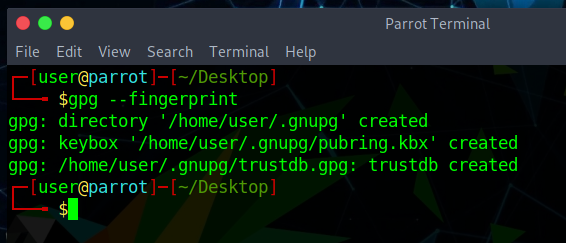
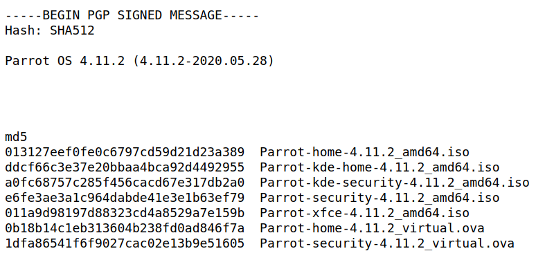
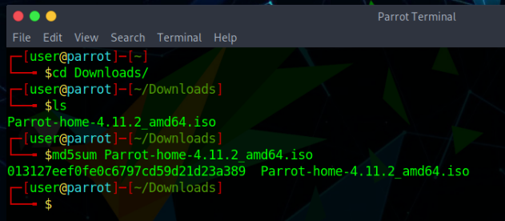
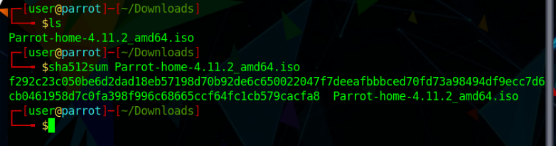

# Hash and key verification #

## किसी को चाबियों और हस्ताक्षरों का सत्यापन क्यों करना चाहिए? ##

अधिकांश लोग - यहां तक ​​कि प्रोग्रामर - डिजिटल हस्ताक्षर की मूल अवधारणाओं के बारे में भ्रमित हैं। इसलिए, अधिकांश लोगों को इस खंड को पढ़ना चाहिए, भले ही यह पहली नजर में तुच्छ लगे।

डिजिटल हस्ताक्षर प्रामाणिकता और सत्यनिष्ठा दोनों को उचित हद तक निश्चितता साबित कर सकते हैं। प्रामाणिकता सुनिश्चित करती है कि दी गई फ़ाइल वास्तव में उस व्यक्ति द्वारा बनाई गई थी जिसने उस पर हस्ताक्षर किए थे (यानी कि यह किसी तीसरे पक्ष द्वारा जाली नहीं थी)। सत्यनिष्ठा सुनिश्चित करती है कि फ़ाइल की सामग्री के साथ छेड़छाड़ नहीं की गई है (यानी कि किसी तीसरे पक्ष ने रास्ते में अपनी सामग्री को अनजाने में नहीं बदला है)।

डिजिटल हस्ताक्षर किसी अन्य संपत्ति को साबित नहीं कर सकते (उदाहरण के लिए कि हस्ताक्षरित फ़ाइल दुर्भावनापूर्ण नहीं है)। ऐसा कुछ भी नहीं है जो किसी को दुर्भावनापूर्ण कार्यक्रम पर हस्ताक्षर करने से रोक सके (और यह वास्तव में समय-समय पर होता है)।

मुद्दा यह है कि हमें यह तय करना होगा कि हम किस पर भरोसा करेंगे (जैसे लिनुस टॉर्वाल्ड्स, माइक्रोसॉफ्ट, या पेरोट प्रोजेक्ट) और यह मान लें कि अगर किसी दी गई फ़ाइल पर किसी विश्वसनीय पार्टी द्वारा हस्ताक्षर किए गए थे, तो यह दुर्भावनापूर्ण या लापरवाही से छोटी गाड़ी नहीं होनी चाहिए। किसी भी पार्टी पर भरोसा करना है या नहीं, इसका फैसला डिजिटल सिग्नेचर के दायरे से बाहर है। यह एक समाजशास्त्रीय और राजनीतिक निर्णय से अधिक है।

एक बार जब हम कुछ पार्टियों पर भरोसा करने का निर्णय लेते हैं, तो डिजिटल हस्ताक्षर उपयोगी होते हैं, क्योंकि वे हमारे लिए अपने विश्वास को केवल उन कुछ पार्टियों तक सीमित करना संभव बनाते हैं जिन्हें हम चुनते हैं और उन सभी बुरी चीजों के बारे में चिंता नहीं करते हैं जो हमारे और उनके बीच हो सकती हैं, उदा। सर्वर समझौता करता है ([parrotsec.org](https://parrotsec.org) निश्चित रूप से एक दिन समझौता किया जाएगा, इसलिए इस साइट के लाइव संस्करण पर आंख मूंदकर भरोसा न करें), होस्टिंग कंपनी में बेईमान आईटी कर्मचारी, बेईमान कर्मचारी आईएसपी, वाई-फाई हमले, आदि।

हमारे द्वारा डाउनलोड की जाने वाली सभी फाइलों को सत्यापित करके, जिस पार्टी पर हमने भरोसा करने के लिए चुना है, उसके लेखक होने के लिए, हम ऊपर चर्चा की गई बुरी चीजों के बारे में चिंताओं को खत्म कर देते हैं, क्योंकि हम आसानी से पता लगा सकते हैं कि क्या किसी फाइल के साथ छेड़छाड़ की गई है (और बाद में बचना चुनें) उन्हें निष्पादित करने, स्थापित करने या खोलने से)।

हालाँकि, डिजिटल हस्ताक्षरों का कोई अर्थ निकालने के लिए, हमें यह सुनिश्चित करना चाहिए कि हस्ताक्षर सत्यापन के लिए हम जिन सार्वजनिक कुंजियों का उपयोग करते हैं, वे वास्तव में मूल हैं। कोई भी जीपीजी कुंजी जोड़ी उत्पन्न कर सकता है जो "तोता ओएस" से संबंधित है, लेकिन निश्चित रूप से केवल मुख्य जोड़ी जो हमने (यानी पेरोट टीम) उत्पन्न की है वह * वैध एक * है। अगला खंड बताता है कि एक पेरोट ओएस आईएसओ को सत्यापित करने की प्रक्रिया में तोता हस्ताक्षर कुंजी की वैधता को कैसे सत्यापित किया जाए। हालांकि, वही सामान्य सिद्धांत उन सभी मामलों पर लागू होते हैं जिनमें आप पीजीपी हस्ताक्षर को सत्यापित करना चाहते हैं, जैसे कि केवल आईएसओ नहीं, बल्कि रिपॉजिटरी का सत्यापन करना।

## कुंजी प्राप्त करें और रिपॉजिटरी सत्यापित करें ##

वैकल्पिक: यदि GnuPG से अपरिचित हैं या यदि वे पहले से निष्पादित नहीं हुए हैं, तो नीचे दिए गए चरणों को पूरा करें। यह अंततः *GPG: चेतावनी: असुरक्षित स्वामित्व चेतावनियों* को ठीक कर देगा।

#### 1. सबसे पहले, सुनिश्चित करें कि आपने GnuPG अपने उपयोगकर्ता डेटा फ़ोल्डर को इनिशियलाइज़ किया है ####

#### 2. चेतावनी मुक्त अनुमतियां सेट करें ####

    chmod --recursive og-rwx ~/.gnupg

#### 3. पेरोट कुंजी प्राप्त करें ####

    wget -q -O - https://deb.parrotsec.org/parrot/misc/parrotsec.gpg | gpg --import

**चेतावनी**: GPG सिग्नेचर टाइमस्टैम्प की जाँच करना समझ में आता है। उदाहरण के लिए, यदि आपने पहले 2018 से एक हस्ताक्षर देखा था और अब 2017 से एक हस्ताक्षर देखते हैं, तो यह एक लक्षित रोलबैक (डाउनग्रेड) या अनिश्चितकालीन फ्रीज हमला हो सकता है।

## ISO सत्यापन ## 

### md5sum hash सत्यापन ###

अपनी पसंद का आईएसओ प्राप्त करने के बाद [यहां: https://download.parrot.sh/parrot/iso/4.11.2/signed-hashes.txt](https://download.parrot.sh/parrot/iso/4.11.2/signed-hashes.txt) पर जाएं, हस्ताक्षरित हैश देखने के लिए।

पहले खंड पर जहां यह "MD5" कहता है, वह हैश ढूंढें जो आपके डाउनलोड किए गए ISO से मेल खाता हो।

इस ट्यूटोरियल के प्रयोजन के लिए हम उपयोग करेंगे **Parrot-home-4.11.2_amd64.iso**.

अब एक टर्मिनल विंडो खोलें और निम्न कमांड चलाएँ:

    md5sum Parrot-home-4.11.2_amd64.iso

**हैश (बाईं ओर अल्फ़ान्यूमेरिक स्ट्रिंग)** की तुलना करें कि आपकी मशीन ने ऊपर लिंक किए गए signed-hashes.txt पेज पर संबंधित हैश के साथ गणना की है।

ऐसा करने का एक आसान तरीका यह है कि आप अपने ब्राउज़र में "signed-hashes.txt" पेज खोलें, फिर टर्मिनल से गणना की गई हैश को अपने ब्राउज़र में "Find" बॉक्स में कॉपी करें (फ़ायरफ़ॉक्स में आप "Find" खोल सकते हैं। " CTRL + F दबाकर बॉक्स)।

जब दोनों हैश बिल्कुल मेल खाते हैं तो डाउनलोड की गई फ़ाइल लगभग निश्चित रूप से बरकरार रहती है। यदि हैश मेल नहीं खाता है, तो डाउनलोड या सर्वर के साथ कोई समस्या थी। यदि आपको सर्वर त्रुटि का संदेह है तो आपको फ़ाइल को या तो उसी दर्पण से, या किसी भिन्न दर्पण से फिर से डाउनलोड करना चाहिए। यदि आपको सर्वर से लगातार कोई त्रुटिपूर्ण फ़ाइल प्राप्त होती है, तो कृपया दया करें और उस दर्पण के तोते की टीम को सूचित करें ताकि हम मामले की जांच कर सकें।

### अन्य हैश ###

अन्य हैश जैसे SHA256 या SHA512 के लिए विधि बिल्कुल उपरोक्त गाइड के साथ समान है, केवल md5 के बजाय आपको उचित हैश का उपयोग करना चाहिए जो आप चाहते हैं। आइए एक उदाहरण बनाते हैं:

    sha512sum Parrot-home-4.11.2_amd64.iso

