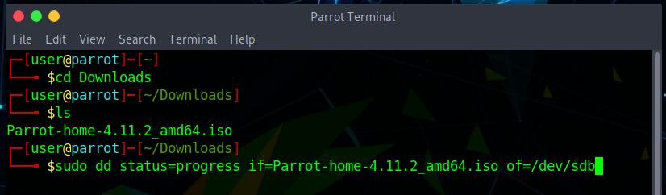

# पेरोट यूएसबी ड्राइव कैसे बनाएं #

## बूट करने योग्य डिवाइस कैसे बनाएं ##

सबसे पहले, आपको हमारी [वेबसाइट](https://parrotsec.org/download/) से नवीनतम आईएसओ फाइल डाउनलोड करनी होगी।

फिर आप इसे [बलेना एचर] (https://www.balena.io/etcher/) या [रोसा इमेजराइटर] (http://wiki.rosalab.ru/en/index.php/ROSA_ImageWriter) का उपयोग करके जला सकते हैं। वे दोनों जीएनयू/लिनक्स, मैक ओएस और विंडोज पर काम करते हैं। हम दृढ़ता से एचर का उपयोग करने की सलाह देते हैं, लेकिन यदि आप इसे पसंद करते हैं तो आप **डीडी कमांड लाइन टूल** का भी उपयोग कर सकते हैं।

पेरोट आईएसओ iso9660 प्रारूप (जिसे आइसोहाइब्रिड के रूप में भी जाना जाता है) का उपयोग करता है। यह एक विशेष आईएसओ प्रारूप है जिसमें न केवल विभाजन सामग्री है, बल्कि विभाजन तालिका भी है।

कुछ आईएसओ लेखन प्रोग्राम यूएसबी ड्राइव में आईएसओ बिट-प्रति-बिट निम्न स्तर पर नहीं लिखते हैं। वे एक कस्टम विभाजन तालिका बनाते हैं और USB ड्राइव में फ़ाइल को अनौपचारिक और गैर-मानक तरीके से कॉपी करते हैं। यह व्यवहार जिसके लिए आइसोहाइब्रिड बनाया गया था, उसके खिलाफ है, और कोर सिस्टम कार्यात्मकताओं को तोड़ सकता है और ऐसे यूएसबी ड्राइव से सिस्टम को अनइंस्टॉल करने योग्य बना सकता है।

यह **अत्यधिक अनुशंसित नहीं** है कि *unetbootin*, या किसी ऐसे प्रोग्राम का उपयोग करें जो आइसोहाइब्रिड के अनुरूप नहीं है।

सुरक्षा संस्करण के लिए आपको कम से कम 8 जीबी की यूएसबी ड्राइव और होम संस्करण के लिए 4 जीबी की आवश्यकता होगी।

अपने पेरोट USB को बनाने के लिए आप किन उपकरणों का उपयोग कर सकते हैं, इसका एक त्वरित सारांश:

- [Balena Etcher](<../en/how-to-create-a-parrot-usb-drive.html#parrot-usb-boot-procedure-using-balena-etcher>)
- [DD command line tool](<../en/how-to-create-a-parrot-usb-drive.html#parrot-usb-boot-procedure-using-dd-command-line-tool>)
- [ROSA image writer](<../en/how-to-create-a-parrot-usb-drive.html#parrot-usb-boot-procedure-using-rosa-image-writer>)

## पेरोट USB बूट प्रक्रिया Balena Etcher का उपयोग कर ##

अपने USB स्टिक को अपने USB पोर्ट में प्लग करें और **Balena Etcher** लॉन्च करें। डाउनलोड करें और इसे अनज़िप करें।
\
*.AppImage फ़ाइल* पर क्लिक करें।

**फ़ाइल से फ़्लैश** पर क्लिक करें। पेरोट आईएसओ का चयन करें और सत्यापित करें कि आप जिस यूएसबी ड्राइव को अधिलेखित करने जा रहे हैं वह सही है।

**फ़्लैश**

एक बार बर्निंग पूरी हो जाने के बाद, आप अपने कंप्यूटर और बूट पेरोट ओएस के बूट डिवाइस के रूप में यूएसबी स्टिक का उपयोग कर सकते हैं।

\

## डीडी कमांड लाइन टूल का उपयोग कर पेरोट यूएसबी बूट प्रक्रिया ## 

**डीडी** (और इसके डेरिवेटिव) प्रत्येक यूनिक्स और यूनिक्स जैसी प्रणाली में एकीकृत एक कमांड लाइन उपकरण है, और इसका उपयोग आईएसओ फाइल को ब्लॉक डिवाइस बिट प्रति बिट में लिखने के लिए किया जा सकता है। आपके सिस्टम को बंद करने की क्षमता के कारण, यदि आप GNU/Linux से परिचित नहीं हैं, तो हम दृढ़ता से Etcher का उपयोग करने की अनुशंसा करते हैं।

i.g.

    sudo dd status=progress if=Parrot-<edition>-<version>_amd64.iso of=/dev/sdX

## रोसा इमेजराइटर का उपयोग कर पेरोट यूएसबी बूट प्रक्रिया ## 

जैसा कि इस अध्याय की शुरुआत में बताया गया है, आप पेरोट के साथ अपना यूएसबी बनाने के लिए रोसा इमेज राइटर का भी उपयोग कर सकते हैं। इसे वेबसाइट से डाउनलोड करें और सभी फाइलों को निकालें। फिर, "*RosaImageWriter*" पर क्लिक करें:

आईएसओ और यूएसबी का चयन करें।

*Write* पर क्लिक करें और लेखन प्रक्रिया समाप्त होने तक प्रतीक्षा करें।
