# विरचालबॉक्स पर पेरोट सुरक्षा स्थापित करना #

## इस गाइड में निम्नलिखित चरण शामिल होंगे: ##

  * एक नई वर्चुअल मशीन बनाएं

  * एक नया वर्चुअल डिस्क बनाएं (VDI, डायनेमिक आवंटन आदि...)

  * वर्चुअलबॉक्स सेटिंग्स को संशोधित करना (भौतिक और वीडियो मेमोरी आवंटित करना, ओएस प्रकार, सीपीयू त्वरण आदि का चयन करना)

  * लोड हो रहा है पेरोट सुरक्षा आईएसओ

  * बूटिंग पेरोट सुरक्षा आईएसओ (प्रारंभिक जानकारी, स्थान, समय क्षेत्र आदि)

  * पेरोट सुरक्षा डिस्क विभाजन

  * विरचालबॉक्स पर पेरोट सुरक्षा की स्थापना को अंतिम रूप देना और चलाना।

## चीजें जो आपको स्थापित करने की आवश्यकता है ##

यदि आप जिस ओएस का उपयोग कर रहे हैं वह विंडोज या मैकओएस है, तो यहां [वर्चुअलबॉक्स](https://www.virtualbox.org/wiki/Downloads) इंस्टॉलर का लिंक दिया गया है।
\

जीएनयू/लिनक्स पर यह वही है, लेकिन आप इसे सीएलआई के माध्यम से स्थापित कर सकते हैं:

    sudo apt install virtualbox

अपनी मशीन में वर्चुअलबॉक्स के माध्यम से पेरोट को स्थापित करने और चलाने के लिए **बिल्कुल** समान चरणों का पालन करें।

### Step 1 - एक नई वर्चुअल मशीन बनाएं ###

आगे बढ़ने से पहले, सुनिश्चित करें कि आपने VirtualBox को सफलतापूर्वक स्थापित कर लिया है। जीएनयू/लिनक्स पर आप टर्मिनल खोलकर इसकी जांच कर सकते हैं और 'वर्चुअलबॉक्स' टाइप कर सकते हैं और/या वर्चुअलबॉक्स शुरू करने के लिए आइकन मेनू में दिखाई देगा। अन्य ऑपरेटिंग सिस्टम के लिए इसे शुरू करने के लिए एक समान आइकन होगा।

वर्चुअलबॉक्स स्थापित करने के बाद:

  - खोलो इसे।
  - नई वर्चुअल मशीन बनाने के लिए न्यू पर क्लिक करें।

### Step 1.1 - अपनी वर्चुअल मशीन के लिए एक नाम दर्ज करें ###

नाम के रूप में पेरोट सुरक्षा दर्ज करें। "Type" को **Linux** पर सेट करें, और "Version" को **Other Linux (64-bit)** पर सेट करें।

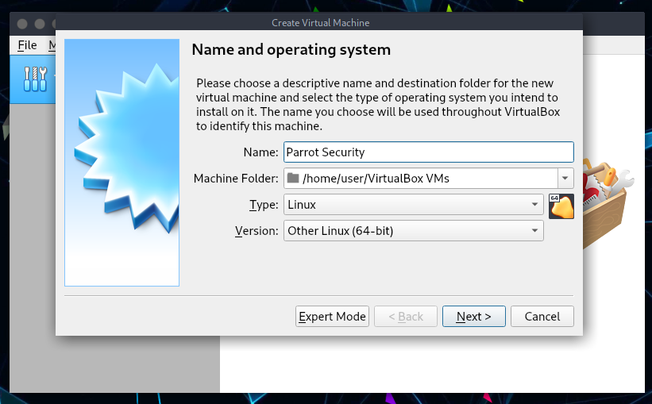

### Step 1.2 - मेमोरी / रैम आवंटित करें ###

OS 512 MB RAM वाली मशीनों पर चल सकता है, लेकिन पेरोट सुरक्षा और गृह संस्करण दोनों के लिए कम से कम **2 GB** की पुरज़ोर अनुशंसा की जाती है।
\

अपनी मशीन के लिए सर्वोत्तम सेटिंग चुनें और *Next* क्लिक करें।

### Step 2 - वर्चुअल हार्ड ड्राइव बनाएं ###
इस स्क्रीन पर **Create a virtual hard disk now** (*दूसरा विकल्प*) चुनें और *Create* क्लिक करें।

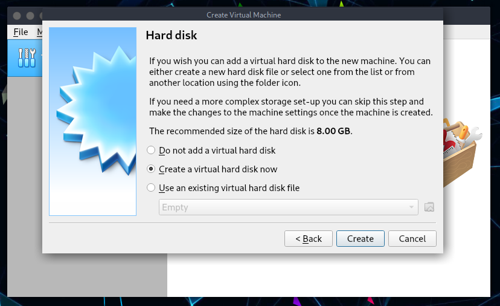

### Step 2.1 - Select Virtual Drive File type ###

वर्चुअल ड्राइव फ़ाइल प्रकार चुनें ### 

अगली स्क्रीन पर अपनी *हार्ड ड्राइव फ़ाइल प्रकार* के रूप में **VDI** - **VirtualBox Disk Image** चुनें।
\
*Next* पर क्लिक करें।

### Step 2.2 - भौतिक हार्ड ड्राइव आवंटन प्रकार चुनें ### 

**Dynamically Allocated** का चयन करें और *Storage on physical hard drive* विंडो पर Next क्लिक करें।

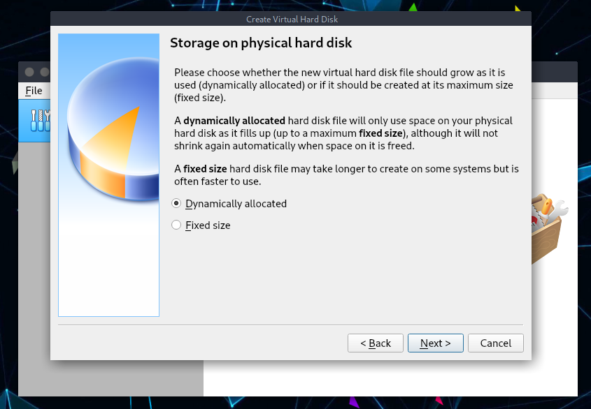

### Step 2.3 - डिस्क आकार आवंटित करें ###

**फ़ाइल स्थान और आकार** स्क्रीन पर, यह डिफ़ॉल्ट आकार के रूप में 8.00 जीबी दिखाएगा (जिसे हमने Step 1.1 पर सेट किया है)। इस उदाहरण में हमने भंडारण कारणों से इसे बढ़ाकर 20 जीबी कर दिया है।
\

चुनें कि आपकी आवश्यकताओं के अनुरूप कौन सा है और *Next* पर क्लिक करें।

### Step 3 - वर्चुअलबॉक्स सेटिंग्स को संशोधित करें ###
अब तक, हमने आपके लिए निम्नलिखित चेकलिस्ट की है:

  * Created a New Virtual Machine
  * Created Virtual Hard disk
  * Fiddled with disk properties, type and size.
 
इस बिंदु पर आपको निम्न स्क्रीन देखनी चाहिए:
  
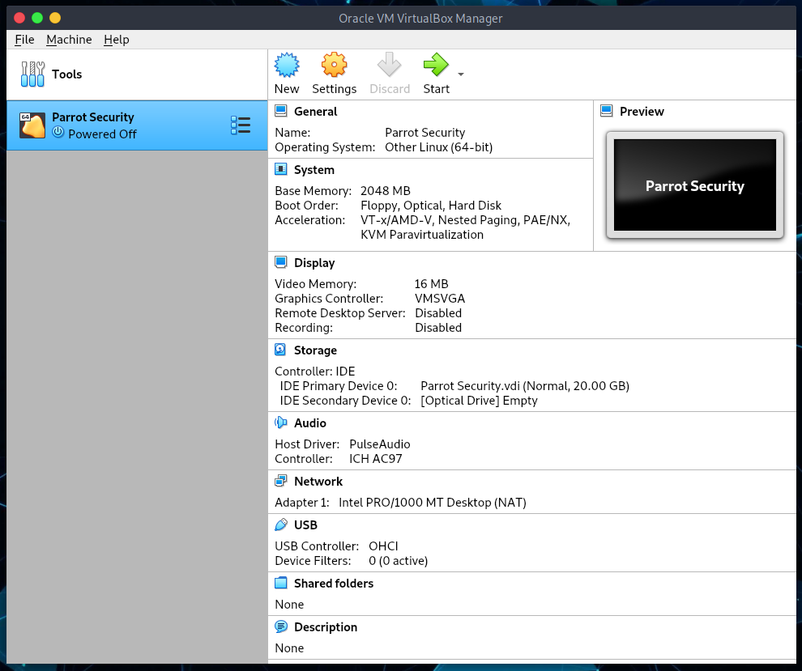
  
### Step 3.1 - Select type of OS ###

आपके द्वारा डाउनलोड किए गए आईएसओ के आधार पर, यहां सही संस्करण का चयन करें।

चूंकि पेरोट सुरक्षा डेबियन से ली गई है, मैंने अन्य लिनक्स (64-बिट) को *General > Basic* पर चुना है।

### Step 3.2 - Enable shared Clipboard and Drag ’n’ Drop feature ###

*General>Advanced Tab* चुनें और **Shared Clipboard** और **'n' Drop** को bidirectional में बदलें। यह आपको फ्लाई पर अपने HOST मशीन से पेस्ट फाइलों को कॉपी करने की अनुमति देगा। *OK* पर क्लिक करके पुष्टि करें।

### Step 3.3 - Update Virtual Motherboard options ###

*सिस्टम> मदरबोर्ड* चुनें, फ्लॉपी को अनचेक करें (जिसके पास अब फ़्लॉपी है?) और [**I/O APIC सक्षम करें**](https://www.virtualbox.org/manual/ch03. html#सेटिंग्स-मदरबोर्ड)।
\

ध्यान दें कि आप उसी स्क्रीन में बेस मेमोरी आवंटन को बदल सकते हैं। हमने इसे पहले 2048 एमबी पर सेट किया था। अगर आपकी मशीन में 8.00 जीबी रैम है, तो इसका मतलब है कि आप वर्चुअल मशीन के रूप में पेरोट सिक्योरिटी को तेजी से प्रतिक्रिया देने के लिए बहुत अधिक आवंटित कर सकते हैं।
\

यदि आपको लगता है कि आपकी वर्चुअलाइज्ड पेरोट सुरक्षा धीमी है, तो आपको इस बेस मेमोरी आवंटन को बढ़ा देना चाहिए।

गणना इस प्रकार है:

  * 1.00 GB = 1024 MB
  * 2.00 GB = 2048 MB
  * 3.00 GB = 3072 MB
  * 4.00 GB = 4096 MB
    \
    and so on.

1024 को आप जितनी मेमोरी/रैम चाहते हैं उससे गुणा करें और यहां मान डालें।

### Step 3.4 - Select number of Processors and enable PAE/NX ###

वर्चुअल CPU कोर की संख्या सेट करता है जिसे अतिथि OS देख सकता है।
2 वर्चुअल कोर अच्छा काम करते हैं। 4, 6, इत्यादि के साथ, प्रदर्शन काफी बेहतर होगा।

आपको भौतिक रूप से उपलब्ध CPU से अधिक कोर का उपयोग करने के लिए वर्चुअल मशीन को कॉन्फ़िगर नहीं करना चाहिए। इसमें वास्तविक कोर शामिल हैं, जिसमें कोई हाइपरथ्रेड नहीं है। VirtualBox वेबसाइट पर [प्रोसेसर टैब](https://www.virtualbox.org/manual/ch03.html#settings-processor) देखें।

**Enable PAE/NX** के लिए बॉक्स चेक करें।

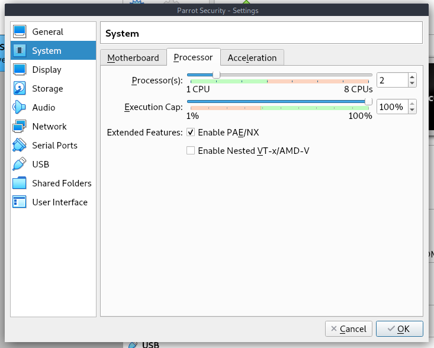

### Step 3.5 - Allocate Video memory and 3D acceleration ###

Select **Display > Screen > set Video Memory to 128 MB**. यह एक अच्छे उत्तरदायी डेस्कटॉप वातावरण की अनुमति देता है।

*3D एक्सेलेरेशन सक्षम करें* के लिए बॉक्स को भी चेक करें।

यदि आपके पास एक से अधिक मॉनिटर हैं, तो आप यहां भी अपनी सेटिंग्स बदल सकते हैं।

### Step 4 - Loading Parrot Security ISO ###

Select **Storage > Controller: IDE** और खाली सीडी आइकन को हाइलाइट करें। अब आपके दाहिनी ओर, आप छोटे सीडी आइकन पर क्लिक करने में सक्षम होना चाहिए (यह सीडी/डीवीडी ड्राइव होना चाहिए: आईडीई सेकेंडरी मास्टर पहले से ही, अगर इसे नहीं बदला है) और अपने डाउनलोड किए गए आईएसओ का चयन करें।
\

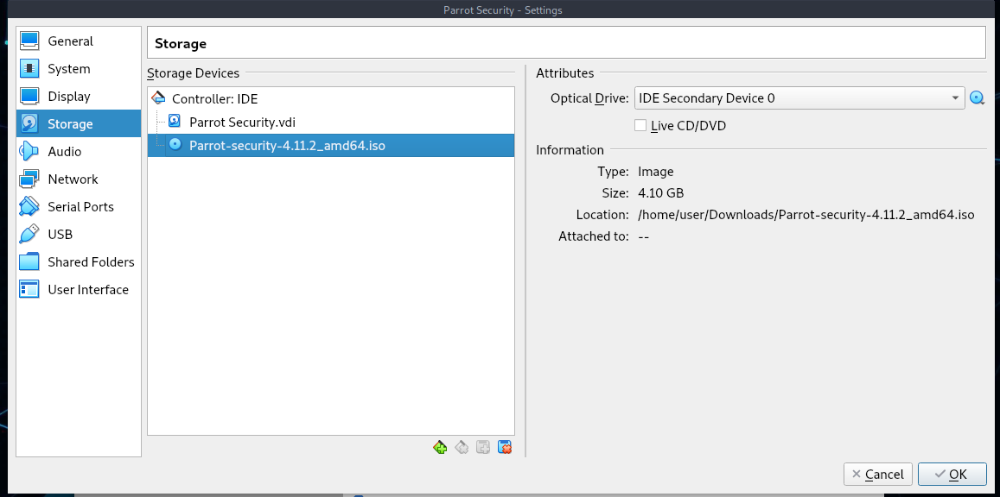

एक बार जब आप अपना डाउनलोड किया गया आईएसओ चुन लेते हैं (इस मामले में, यह पेरोट सिक्योरिटी 4.11.2 आईएसओ है)। तदनुसार गुण और जानकारी के परिवर्तन देखें।
\

**महत्वपूर्ण**: यदि आपकी डिस्क का आकार बेमेल है, तो आपके पास एक दूषित डिस्क हो सकती है। आकार संबंधी जानकारी के लिए इस दस्तावेज़ के माध्यम से पेरोट सिक्योरिटी [अध्याय](../en/download-parrot.html) देखें। यह सुनिश्चित करने के लिए कि आपकी डिस्क दूषित नहीं है, आप SHA1 जाँच भी कर सकते हैं।

**नोट**: यदि आप लाइव मोड में पेरोट का परीक्षण करना चाहते हैं, तो *"लाइव सीडी/डीवीडी"* बॉक्स को चेक करें

### Step 4.1 - Select Network connection type ###

यदि आपका कंप्यूटर इंटरनेट से जुड़ा है, तो *Network > Adapter 1* पर NAT चुनें। यदि आपको लगता है कि आप ऐसा करना चाहते हैं तो आप अधिक नेटवर्क एडेप्टर सक्षम कर सकते हैं।

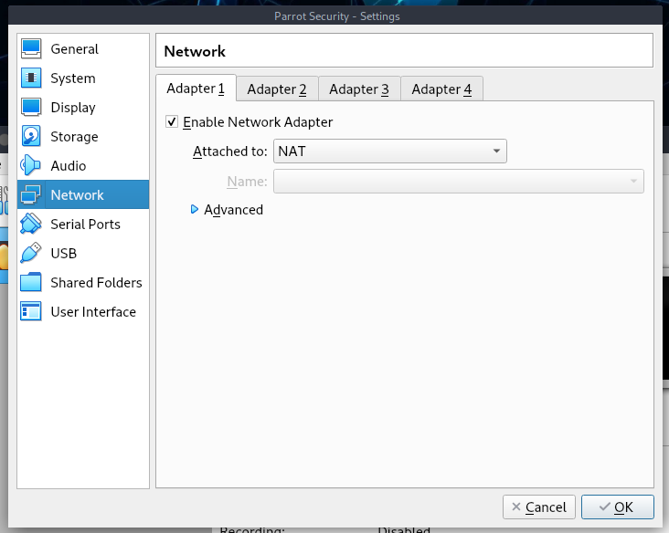

### Step 4.2 - USB 2.0 और 3.0 नियंत्रक सक्षम करें ###

सबसे पहले, सुनिश्चित करें कि आपने *एक्सटेंशन पैक* स्थापित किया है, या आप यूएसबी 2.0 और 3.0 नियंत्रकों को सक्षम नहीं कर पाएंगे।

यदि आपने इसे इंस्टॉल नहीं किया है, तो आप इसे [यहां] (https://download.virtualbox.org/virtualbox/6.1.22/Oracle_VM_VirtualBox_Extension_Pack-6.1.22.vbox-extpack) डाउनलोड कर सकते हैं।

फिर **files > preferences > extensions** पर जाएं, दाईं ओर एक `+` बटन होगा जहां आप एक्सटेंशन इंस्टॉल कर सकते हैं।

GNU/Linux में, आप इसे टर्मिनल से `sudo apt install virtualbox-ext-pack` के साथ भी स्थापित कर सकते हैं

एक बार इंस्टाल हो जाने पर, यह वर्चुअलबॉक्स रिमोट डेस्कटॉप प्रोटोकॉल (VRDP) सपोर्ट और होस्ट वेबकैम पासथ्रू सपोर्ट को सक्षम करेगा।

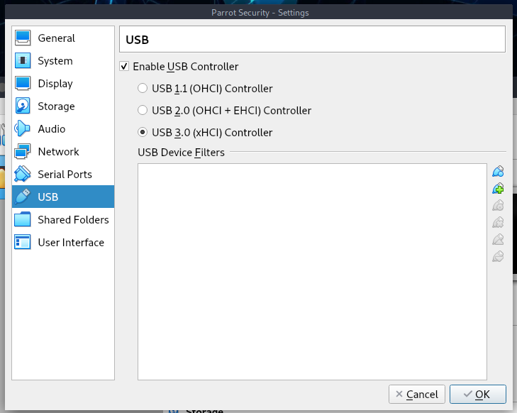

### Step 4.3 - यह सब सेट हो गया है? ###

अंत में, अपनी नई वर्चुअल मशीन पर क्लिक करके, आपको यह देखना चाहिए:

आप हमेशा अपनी पसंद के अनुसार कॉन्फ़िगरेशन बदल सकते हैं।

### Step 5 - बूटिंग पेरोट सुरक्षा आईएसओ ###

वर्चुअलबॉक्स मेन स्क्रीन से स्टार्ट एंड बूट पेरोट सिक्योरिटी पर क्लिक करें।

### Step 5.1 - ### Install चुनें

वर्चुअलबॉक्स मेन स्क्रीन से, यह पेरोट सिक्योरिटी को बूट करेगा, वर्चुअल मशीन में क्लिक करें, *Try/Install* चुनें और फिर Enter पर क्लिक करें।

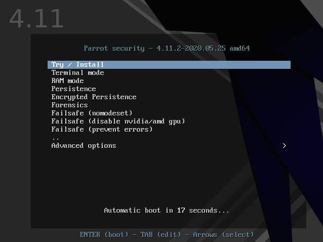

### Step 5.2 - डिफ़ॉल्ट इंस्टॉलर चुनें (कैलामारेस) ###

यहां आप पूरी तरह से ओएस का परीक्षण कर सकते हैं, फिर आप स्थापना के साथ आगे बढ़ सकते हैं।
\
**Install Parrot** पर क्लिक करें:

और डिफ़ॉल्ट इंस्टॉलर, Calamares, प्रारंभ हो जाएगा।

### Step 5.3 - भाषा का चयन करें ###

इस उदाहरण में हमने अमेरिकी अंग्रेजी को चुना है। *Next* पर क्लिक करें।

### Step 5.4 - स्थान चुनें ###

यहां हमने अमेरिका और न्यूयॉर्क जोन को चुना है। *Next* पर क्लिक करें।

### Step 5.5 - कीबोर्ड लेआउट ### चुनें

उस लेआउट का चयन करें जो आपके कीबोर्ड के लिए सबसे उपयुक्त है, आप कीबोर्ड की कुंजी का परीक्षण भी कर सकते हैं जहां यह लिखा है *type here to test your keyboard*। फिर *Next* पर क्लिक करें।

### Step 5.6 - पेरोट सुरक्षा डिस्क विभाजन ###

चूंकि यह सब वर्चुअलाइज्ड है, आप अपनी इच्छानुसार कुछ भी चुन सकते हैं।
\

हमें लगता है कि कम अनुभवी उपयोगकर्ताओं के लिए निर्देशित विभाजन की सिफारिश की जाती है, 40 जीबी या अधिक पर्याप्त हैं, जब तक कि आप बहुत अधिक प्रोग्राम स्थापित करने या अपनी हार्ड ड्राइव पर अधिक फाइलें नहीं रखने जा रहे हैं।

यहां आप तय कर सकते हैं कि स्वैप को सक्षम करना है या नहीं। स्वैप के बारे में अधिक जानकारी के लिए,\
[https://wiki.debian.org/Swap](https://wiki.debian.org/Swap) \
[https://www.kernel.org/doc/html/latest/power/swsusp.html](https://www.kernel.org/doc/html/latest/power/swsusp.html)

*यदि आप चाहें*, तो आप पासफ़्रेज़ जोड़कर सिस्टम को एन्क्रिप्ट भी कर सकते हैं:

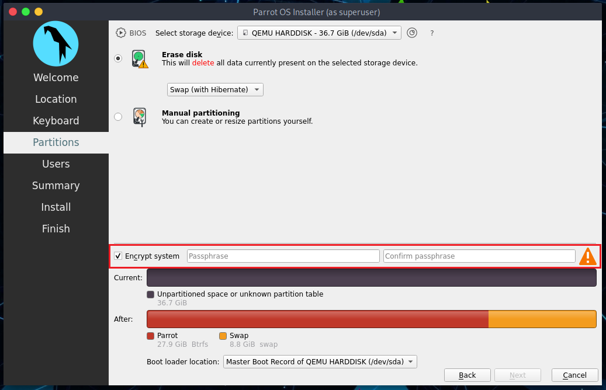

### Step 5.7 - एक नया user खाता बनाना ###

आपको एक नया उपयोगकर्ता बनाने के लिए कहा जाएगा, सरलता के लिए हमने एक **user** चुना है।
आप यहां कोई भी नाम दर्ज कर सकते हैं।

फिर, *Next* पर क्लिक करें।

### Step 6 - स्थापना प्रक्रिया को पूरा करना ###

अंत में, प्रक्रिया के दौरान किए गए विकल्पों का सारांश:

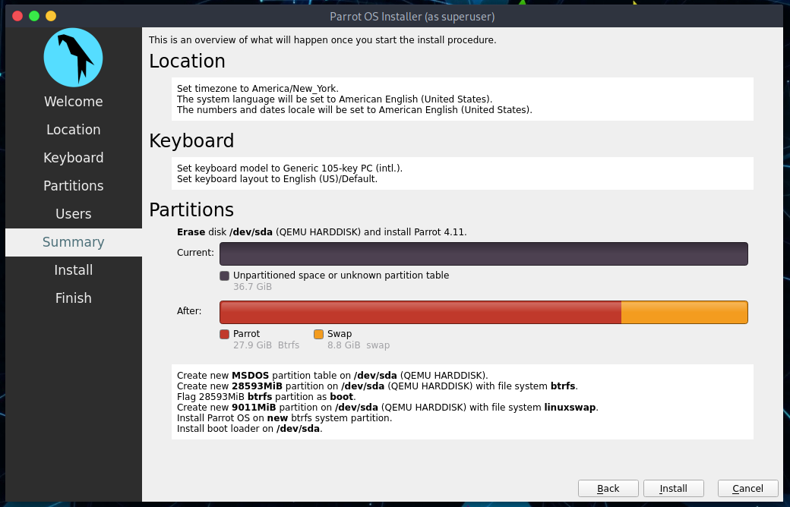

आप तय कर सकते हैं कि चुनी गई सेटिंग्स को बदलना है या नहीं, और फिर वापस जाएं, या सिस्टम की स्थापना के साथ आगे बढ़ें। **Install** पर क्लिक करें।

**Install now** पर क्लिक करके पुष्टि करें

और स्थापना पूर्ण होने की प्रतीक्षा करें!
\
SSD (Sata) के साथ, इसमें कुछ मिनट लगते हैं।

**बहुत बढ़िया! आपने अपने कंप्यूटर पर पेरोट ओएस को सफलतापूर्वक स्थापित कर लिया है!**

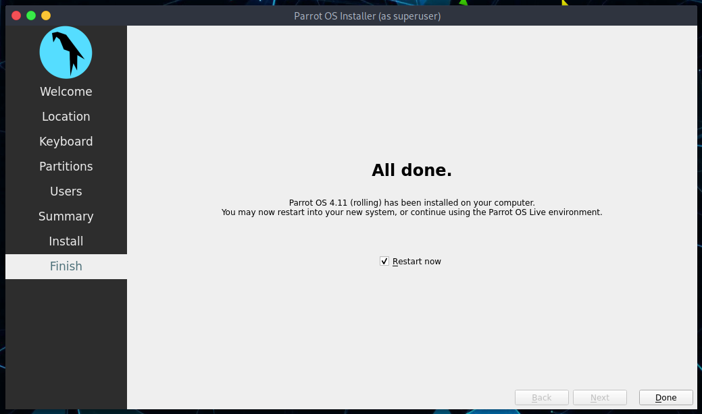

### Step 7: पहली बार पेरोट सिक्योरिटी में लॉगिन करें ###

अपना पासवर्ड भरें:

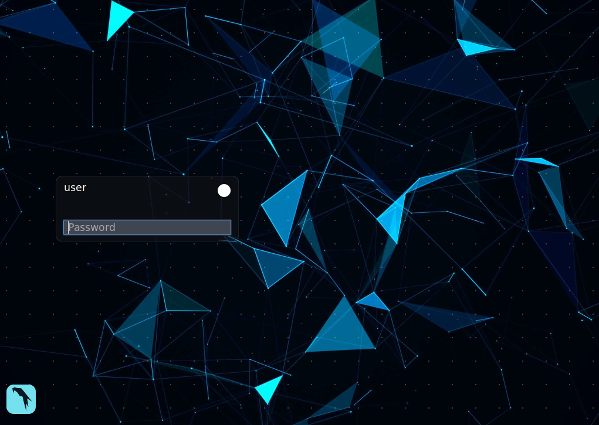

**आपने अभी-अभी पेरोट सिक्योरिटी इंस्टॉल की है! बधाई!**

