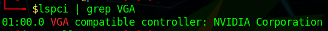
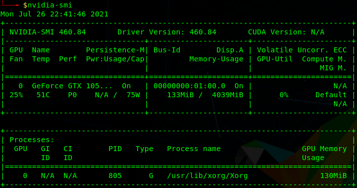
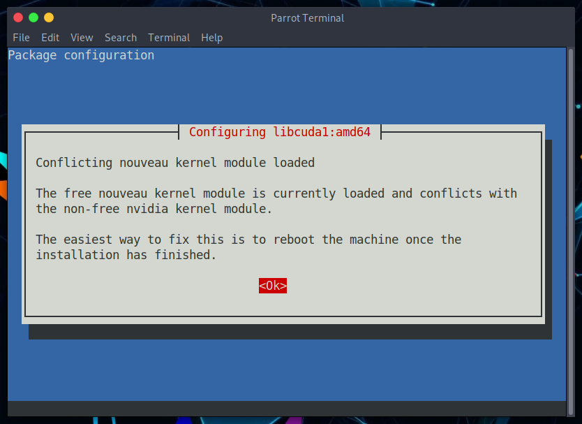
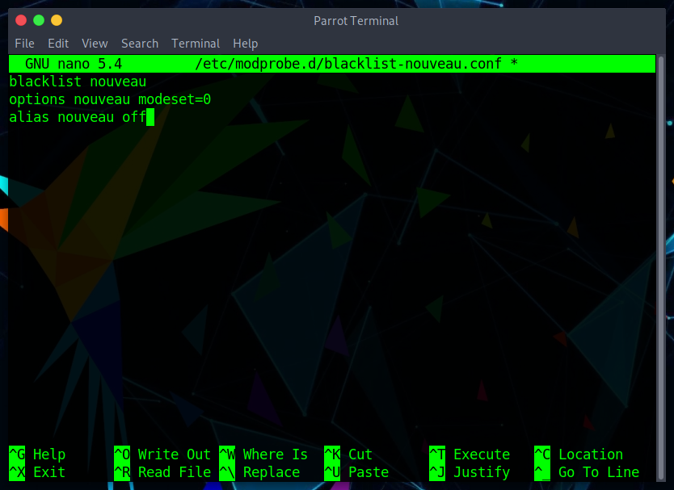
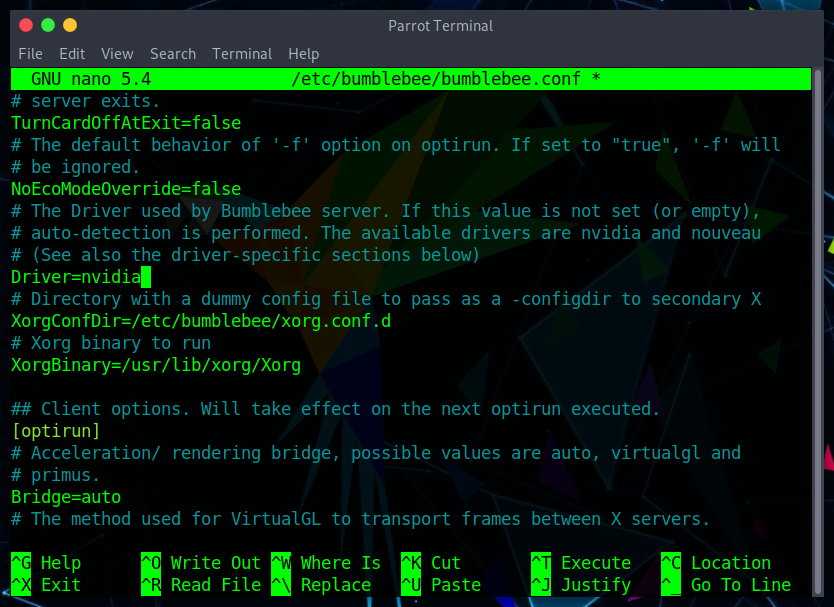

# एनवीडिया जीपीयू ड्राइवर स्थापित करें #

प्रारंभ में, पेरोट एनवीडिया **nouveau ओपन सोर्स ड्राइवरों** का उपयोग करता है, क्योंकि वे अधिकांश एनवीडिया कार्ड का समर्थन करते हैं। ये अच्छी स्थिरता की गारंटी देते हैं और आपको रोजमर्रा के उपयोग के लिए बिना किसी समस्या के अपने जीपीयू का उपयोग करने की अनुमति देते हैं।

हालाँकि, अन्य ड्राइवरों का उपयोग करना आवश्यक हो सकता है जो विभिन्न सॉफ़्टवेयर के साथ अधिक अनुकूलता प्रदान करते हैं और आपके GPU का अधिकतम लाभ उठाते हैं। इस कारण से, आप **एनवीडिया के आधिकारिक (बंद स्रोत) ड्राइवर** स्थापित कर सकते हैं।

आपके पास स्थापित करने के दो तरीके हैं, या तो [पेरोट रेपो](./nvidia-drivers.html#install-the-driver-via-the-parrot-repository) के माध्यम से या [आधिकारिक एनवीडिया वेबसाइट से](./nvidia-drivers.html#install-the-driver-from-the-official-nvidia-website).

  

    <i class="fa fa-info-circle badge" aria-hidden="true"></i>

**Note 1**

  

  

  कृपया ध्यान दें कि लैपटॉप या डेस्कटॉप कंप्यूटर के लिए ड्राइवर इंस्टॉलेशन और कॉन्फ़िगरेशन भिन्न हो सकते हैं। उदाहरण के लिए, उपयोगकर्ता के पास एक iGPU (एकीकृत GPU) और एक dGPU (समर्पित GPU) वाला CPU हो सकता है। उपयोगकर्ता को यह चुनना होगा कि संदर्भ के आधार पर किसका उपयोग करना है।

  [इस दस्तावेज़ में मतभेदों पर प्रकाश डाला जाएगा](./nvidia-drivers.html#nvidia-driver-on-a-computer-with-igpu-and-dgpu).
  

  

    <i class="fa fa-info-circle badge" aria-hidden="true"></i>

**Note 2**

  

  

  यहां वर्णित प्रत्येक चरण का परीक्षण किया गया है, इसलिए यह अत्यधिक अनुशंसा की जाती है कि आप इस दस्तावेज़ में सब कुछ बहुत ध्यान से पढ़ें।
  

## पेरोट भंडार के माध्यम से ड्राइवर स्थापित करें ##

यदि आप अपने GPU मॉडल को नहीं जानते हैं, तो टर्मिनल खोलें और यह कमांड टाइप करें:

    lspci | grep VGA

यह आपके GPU मॉडल और उसके आर्किटेक्चर को दिखाएगा। अधिक जानकारी के लिए उपयोग करें:

    inxi -F

यह आपके कंप्यूटर की जानकारी दिखाएगा, जिसमें GPU मॉडल और उपयोग किए गए ड्राइवर का प्रकार भी शामिल है।

एक बार जब आप यह सुनिश्चित कर लें कि आप नोव्यू ड्राइवर का उपयोग कर रहे हैं और आप इसके बजाय मालिकाना ड्राइवर का उपयोग करना चाहते हैं, तो ड्राइवर संघर्ष के कारणों के लिए, आपको पहले नोव्यू ड्राइवर को अक्षम करना होगा।

    sudo nano /etc/modprobe.d/blacklist-nouveau.conf

निम्न पंक्तियाँ जोड़ें और फ़ाइल को सहेजें।
    
    blacklist nouveau
    options nouveau modeset=0
    alias nouveau off 

एक बार फ़ाइल के सहेजे जाने के बाद, निम्नलिखित कमांड का उपयोग करके एनवीडिया ड्राइवर की स्थापना के साथ आगे बढ़ें:

    sudo apt update && sudo apt install nvidia-driver

यह इंस्टॉलेशन को पूरा करता है, लेकिन हम अनुशंसा करते हैं कि आप जांच लें कि सब कुछ ठीक हो गया है। ऐसा करने के लिए, आप एनवीडिया से आधिकारिक उपयोगिता का उपयोग कर सकते हैं जिसे [एनवीडिया-एसएमआई] (https://developer.nvidia.com/nvidia-system-management-interface) कहा जाता है।

इसे चलाकर स्थापित करें:

    sudo apt install nvidia-smi

इसे निम्न आदेश से प्रारंभ करें:

    nvidia-smi

इसके अलावा, सेटिंग्स प्रबंधक स्वचालित रूप से ड्राइवरों के साथ स्थापित हो जाएगा। यहां से आप अपने मॉनिटर के रेजोल्यूशन और रिफ्रेश रेट जैसे पैरामीटर बदल सकते हैं।

### आईजीपीयू और डीजीपीयू वाले कंप्यूटर पर एनवीडिया ड्राइवर ###

अधिकांश आधुनिक कंप्यूटर सीपीयू में एक एकीकृत वीडियो कार्ड (iGPU, ज्यादातर मामलों में एक इंटेल ग्राफिक कार्ड या AMD की तरह) और एक समर्पित वीडियो कार्ड (dGPU, Nvidia) के साथ आते हैं।

इस गाइड में हम दोनों वीडियो कार्ड के ड्राइवरों से निपटेंगे और दिखाएंगे कि उनके बीच कैसे स्विच किया जाए।

#### Step 1 - NVIDIA ड्राइवर और CUDA टूलकिट स्थापित करें ####

टर्मिनल खोलें और टाइप करें:

    sudo apt update 

\

    sudo apt install bumblebee-nvidia primus-nvidia primus-vk-nvidia nvidia-smi nvidia-cuda-dev nvidia-cuda-toolkit

स्थापना के आगे बढ़ने की प्रतीक्षा करें। जब **nvidia** ड्राइवर के साथ विरोध करने वाले **nouveau** ड्राइवर को सूचित करने वाली चेतावनी दिखाई दे, तो **ok** पर क्लिक करें:

#### Step 2 - ब्लैकलिस्ट नोव्यू ####

  

    <i class="fa fa-info-circle badge" aria-hidden="true"></i>

**Note**

  

  

  यदि आप पहले से ही <a href="./nvidia-drivers.html#install-the-driver-via-the-parrot-repository">पेरोट रेपो के माध्यम से nvidia स्थापना</a> का पालन कर चुके हैं, तो आप <a href="./nvidia-drivers.html#step-3---configure-bumblebee">step 3</a> पर जा सकते हैं।
  

इंस्टॉलेशन समाप्त होने के बाद, एनवीडिया ड्राइवर को काम करने के लिए **nouveau ** ड्राइवर को ब्लैकलिस्ट करने का समय आ गया है।

टर्मिनल में, टाइप करें:

    sudo nano /etc/modprobe.d/blacklist-nouveau.conf

और जोड़:

    blacklist nouveau
    options nouveau modeset=0
    alias nouveau off

फ़ाइल को सहेजें और रिबूट करें।
 
#### Step 3 - Bumblebee कॉन्फ़िगर करें ####

अब यह बताने का समय है **bumblebee** किस ड्राइवर का उपयोग किया जाना चाहिए।

टर्मिनल में `bumblebee.conf` खोलें:

    sudo nano /etc/bumblebee/bumblebee.conf

स्ट्रिंग `Driver=` की तलाश करें और `nvidia` जोड़ें, फिर स्ट्रिंग `KernelDriver=` देखें और `nvidia-current` जोड़ें।

\

फ़ाइल को सहेजें और रिबूट करें।

#### Step 4 - ड्राइवरों का परीक्षण ####

एक टर्मिनल खोलें और टाइप करें:

    watch nvidia-smi

एक नए टर्मिनल में निम्न कमांड दर्ज करें:

    optirun hashcat -b -d 1

परिणाम इस के समान होना चाहिए:

`nvidia-smi` इंटरफ़ेस में, `hashcat` आपके एनवीडिया वीडियो कार्ड का उपयोग करते हुए चलना चाहिए।

  

    <i class="fa fa-info-circle badge" aria-hidden="true"></i>

**Note**

  

  

  <strong>primusrun</strong> के साथ एप्लिकेशन लॉन्च करना PRIMUS तकनीक का उपयोग करेगा, जबकि <strong>optirun</strong> का उपयोग करने पर VirtualGL का उपयोग किया जाएगा।
  

## एनवीडिया की आधिकारिक वेबसाइट से ड्राइवर स्थापित करें ##

जैसा कि इस दस्तावेज़ की शुरुआत में बताया गया है, ड्राइवरों को एनवीडिया वेबसाइट से भी स्थापित किया जा सकता है।

आप नवीनतम ड्राइवर को सीधे [यहां](https://www.nvidia.com/en-us/drivers/unix/) से डाउनलोड कर सकते हैं, जहां पुराने GPU के लिए पुराने ड्राइवर भी हैं।

**या**

अपने GPU, ऑपरेटिंग सिस्टम (लिनक्स 64 बिट) और शाखा [यहां](https://www.nvidia.com/Download/index.aspx?lang=en-us) के मॉडल का चयन करें।

एनवीडिया वेबसाइट से:

"*उत्पादन शाखा*: उत्पादन शाखा ड्राइवर यूनिक्स ग्राहकों के लिए आईएसवी प्रमाणीकरण और इष्टतम स्थिरता और प्रदर्शन प्रदान करते हैं। यह ड्राइवर आमतौर पर उद्यमों में तैनात किया जाता है, निरंतर बग फिक्स और आमतौर पर आवश्यक सुरक्षा अपडेट के लिए समर्थन प्रदान करता है।

*नई फीचर शाखा*: नए फीचर ब्रांच ड्राइवर उत्पादन शाखाओं में एकीकृत होने से पहले नवीनतम ड्राइवर सुविधाओं तक शुरुआती अपनाने वाले और ब्लीडिंग एज डेवलपर्स को एक्सेस प्रदान करते हैं।"

**Download** पर क्लिक करें और इस नाम की एक फाइल डाउनलोड हो जाएगी: \
`NVIDIA-Linux-x86_64-<driver version>.run` (लगभग 260 mb)

एक्स ग्राफिक्स सर्वर के साथ संघर्ष से बचने के लिए, हमें ग्राफिकल इंटरफेस के बिना पेरोट का उपयोग करना होगा (हमें [रनलेवल 3] (https://en.wikipedia.org/wiki/Runlevel) पर जाना होगा)।

हम इसे केवल systemd के माध्यम से, systemctl कमांड के साथ कर सकते हैं:

    sudo systemctl set-default multi-user.target

  

    <i class="fa fa-info-circle badge" aria-hidden="true"></i>

**Note**

  

  

  यदि किसी भी तरह से आप वापस जाना चाहते हैं और MATE के साथ पेरोट का पुन: उपयोग करना चाहते हैं, तो निम्न आदेशों का उपयोग करें:
        
    sudo systemctl set-default graphical.target 

\

    reboot

  

नए ड्राइवर की स्थापना के साथ टकराव से बचने के लिए, nouveau ड्राइवर को ब्लैकलिस्ट करना याद रखें:

    sudo nano /etc/modprobe.d/blacklist-nouveau.conf

इन पंक्तियों को जोड़ें फिर फ़ाइल को सहेजें:

    nouveau blacklist
    options nouveau modeset=0
    alias nouveau off

initramfs छवि को पुन: उत्पन्न करने के लिए निम्न आदेश चलाएँ।

    sudo update-initramfs -u

अंतिम चरण मशीन को रिबूट करके nouveau ड्राइवरों को अक्षम करना है:

    reboot

अब उस फ़ोल्डर में नेविगेट करें जहां आपने **.run** फ़ाइल डाउनलोड की है और इसे निष्पादन अनुमतियां दें:

    sudo chmod +x NVIDIA-Linux-x86_64-<driver version>.run

  

    <i class="fa fa-info-circle badge" aria-hidden="true"></i>

**Note**

  

  

  यदि आपको याद नहीं है कि chmod क्या करता है, तो यह अनुशंसा की जाती है कि आप [फ़ाइल और निर्देशिका अनुमतियाँ](./file-and-directory-permissions.html) दस्तावेज़ पढ़ें।
  

उसके बाद आप **.run** फ़ाइल प्रारंभ कर सकते हैं:

    sudo ./NVIDIA-Linux-x86_64-<driver version>.run

इंस्टॉलेशन विज़ार्ड प्रक्रिया शुरू हो जाएगी और ड्राइवरों को सभी उपयोगिताओं (एनवीडिया ड्राइवर एक्स सेटिंग्स सहित) के साथ स्थापित किया जाएगा।

कमांड के माध्यम से MATE पर लौटें:

    sudo systemctl set-default graphical.target 

आप रनलेवल 3 से रनलेवल 5 तक जाएंगे, और अंत में आप एनवीडिया ड्राइवर का उपयोग करने में सक्षम होंगे।

यह सत्यापित करने के लिए कि सब कुछ ठीक रहा, nvidia-smi शुरू करें (पहले से ही *.run* फ़ाइल के माध्यम से स्थापित):

    nvidia-smi

ध्यान दें कि इस मामले में नवीनतम एनवीडिया (470.57.02) ड्राइवर स्थापित किया गया था।
