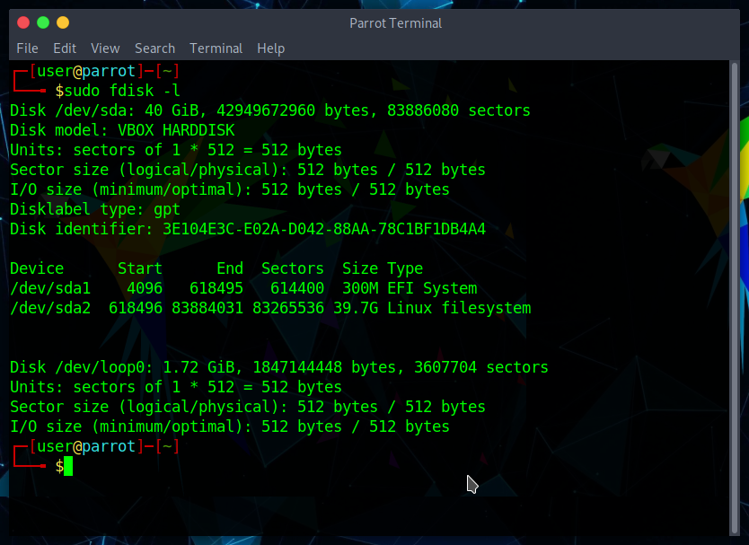
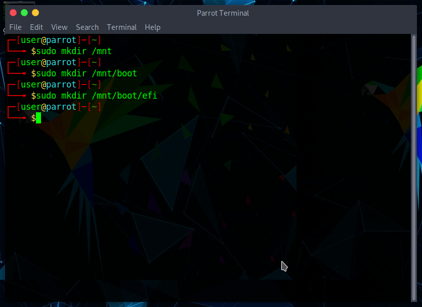
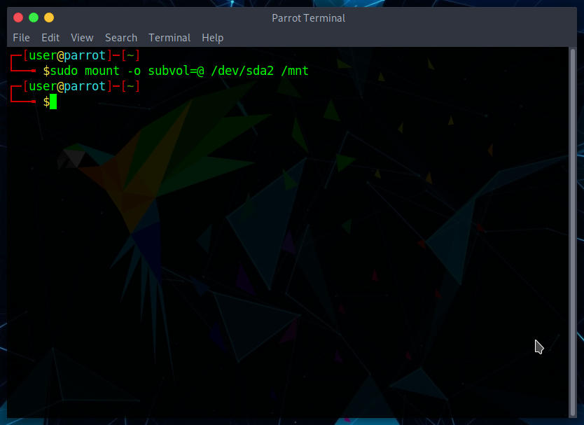
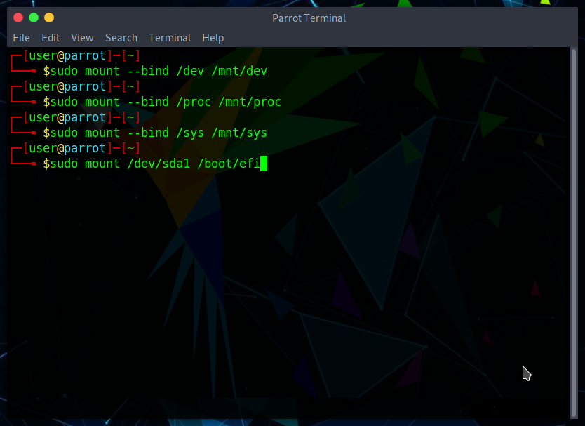
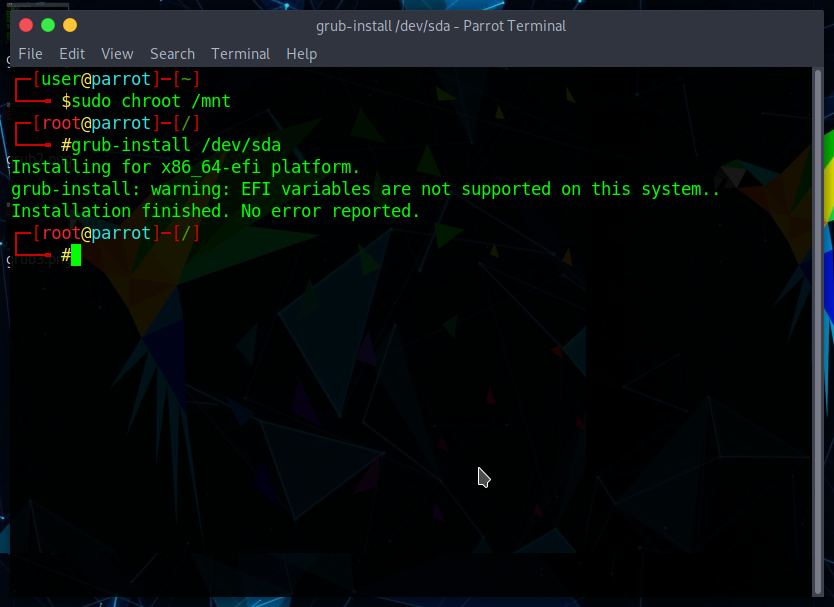
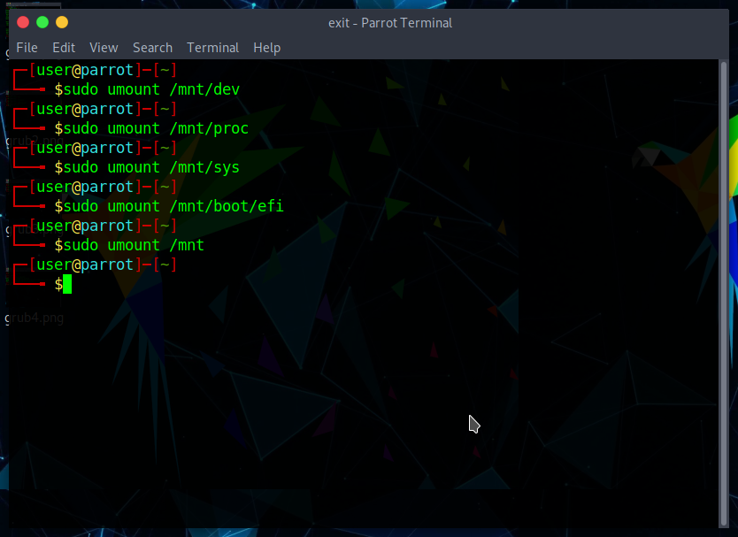
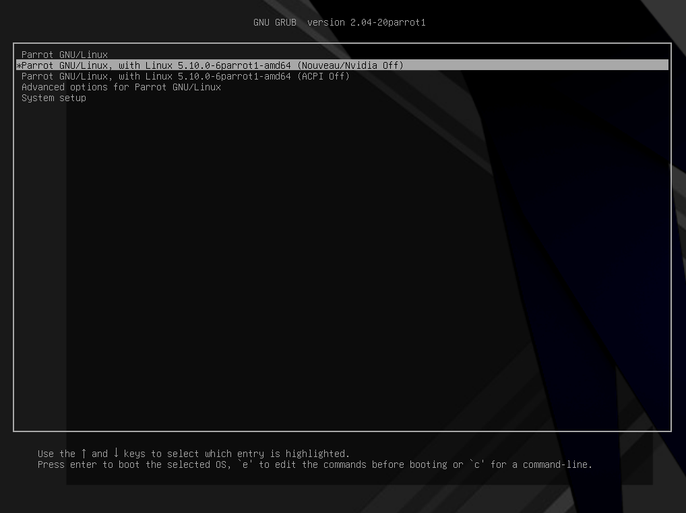

# Troubleshooting GRUB

यह मार्गदर्शिका आपको ज्ञात समाधानों की एक सूची प्रदान करेगी जिनका उपयोग आप GRUB के साथ समस्या होने पर कर सकते हैं।

यदि आप GRUB के बारे में अधिक जानना चाहते हैं:
-
[GRUB - gnu.org](https://www.gnu.org/software/grub/)

[GRUB -  Wikipedia](https://en.wikipedia.org/wiki/GNU_GRUB)

GRUB की मरम्मत के लिए:

## Step 1 - पेरोट लाइव आईएसओ उठाओ

[डाउनलोड](https://parrotsec.org/download/) नवीनतम पेरोट.iso, [इसे USB ड्राइव पर फ्लैश करें](https://parrotsec.org/docs/how-to-create-a-parrot-usb-drive.html) और इसे बूट करें।

## Step 2 - डिस्क और विभाजन की पहचान

लाइव मोड में प्रवेश करने के बाद, टर्मिनल खोलें और टाइप करें

    sudo fdisk -l

आउटपुट इसके समान होना चाहिए। `/dev/sda` आमतौर पर पहला SSD या HDD होता है। यदि आपके पास NVMe M.2 है, तो डिस्क का नाम `/dev/nvme0n1` होगा।

* `/dev/sda1` आमतौर पर EFI विभाजन है, जिसका उपयोग UEFI सिस्टम में ओएस को बूट करने के लिए किया जाता है।
* `/ dev/sda2` पेरोट विभाजन है।

## Step 3 - माउंट फोल्डर बनाएं

इस ऑपरेशन को करने के लिए एक माउंट फोल्डर की जरूरत होती है। तो, उसी टर्मिनल विंडो में, टाइप करें
    
    mkdir /mnt 

यह मुख्य फ़ोल्डर है। अगला प्रकार

    mkdir /mnt/boot 

के बाद

    mkdir /boot/efi

जो EFI पार्टीशन को माउंट करने के लिए उपयोग की जाने वाली डायरेक्टरी बनाता है। सही GRUB संकुल को संस्थापित करने के लिए यह आवश्यक है।
 

 
## Step 4 - माउंट विभाजन

अब विभाजन को माउंट करने का समय आ गया है। उसी टर्मिनल विंडो में, टाइप करें

    sudo mount -o subvol=@ /dev/sda2 /mnt

  

    <i class="fa fa-info-circle badge" aria-hidden="true"></i>

**Note**

  

  

  इसकी आवश्यकता है क्योंकि ParrotOS डिफ़ॉल्ट फाइल सिस्टम BTRFS है और इसमें सबवॉल्यूम सक्षम हैं।
  

सिस्टम तक पहुंच प्राप्त करने के लिए `dev`, `proc`, `sys` फ़ोल्डर और `EFI` भाग को माउंट करें।

उसी टर्मिनल विंडो में, टाइप करें

    sudo mount --bind /dev /mnt/dev
\

    sudo mount --bind /proc /mnt/proc
\

    sudo mount --bind /sys /mnt/sys
\

    sudo mount /dev/sda1 /mnt/boot/efi
   

## Step 5 - GRUB को chroot करना और स्थापित करना

सिस्टम में प्रवेश करने का समय। उसी टर्मिनल विंडो में, टाइप करें

    sudo chroot /mnt

एक बार chroot वातावरण में, टाइप करें

    grub-install /dev/sda

स्थापना समाप्त होने के बाद, `exit` टाइप करें ताकि chroot पर्यावरण से बाहर निकल सकें।

## Step 6 - अनमाउंटिंग पार्टिशन और रीबूटिंग सिस्टम

chroot वातावरण से बाहर निकलने के बाद, उपयोग किए गए सभी विभाजनों और फ़ोल्डरों को अनमाउंट करें।
उसी टर्मिनल विंडो प्रकार में:

    sudo umount /mnt/dev
\

    sudo umount /mnt/proc
\

    sudo umount /mnt/sys
\

    sudo umount /mnt/boot/efi
\

    sudo umount /mnt
   

`reboot` टाइप करें और एंटर दबाएं। अब आपके पास एक पुनर्स्थापित GRUB त्रुटिपूर्ण रूप से कार्य करना चाहिए।

