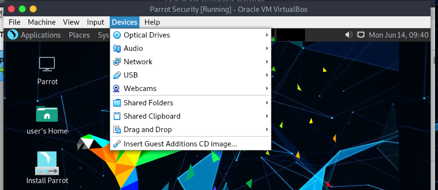
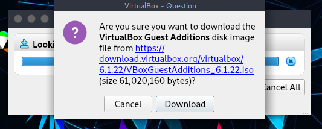
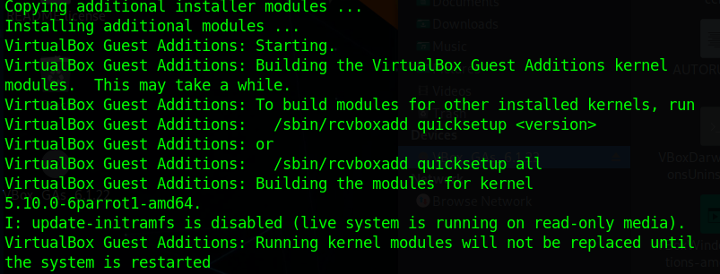

# वर्चुअलबॉक्स अतिथि एडिशंस का परिचय #
गेस्ट ऑपरेटिंग सिस्टम के इंस्टाल होने के बाद गेस्ट एडिशंस को वर्चुअल मशीन के अंदर इंस्टाल करने के लिए डिज़ाइन किया गया है। इनमें डिवाइस ड्राइवर और सिस्टम एप्लिकेशन शामिल हैं जो बेहतर प्रदर्शन और उपयोगिता के लिए अतिथि ऑपरेटिंग सिस्टम को अनुकूलित करते हैं।

## वर्चुअलबॉक्स अतिथि एडिशंस की विशेषताएं ##

  * **Mouse pointer integration**
    * होस्ट key को दबाने के लिए अब माउस को अतिथि OS द्वारा कैप्चर किए जाने से "मुक्त" करने की आवश्यकता नहीं है।

  * **Shared folders**
    * होस्ट और पेरोट के बीच साझा किए गए फ़ोल्डर।

  * **Better video support**
    * जबकि वर्चुअल ग्राफिक्स कार्ड जो किसी भी अतिथि ऑपरेटिंग सिस्टम के लिए वर्चुअलबॉक्स का अनुकरण करता है, सभी बुनियादी सुविधाएँ प्रदान करता है, कस्टम वीडियो ड्राइवर जो गेस्ट एडिशंस के साथ स्थापित होते हैं, आपको अतिरिक्त उच्च और गैर-मानक वीडियो मोड के साथ-साथ त्वरित वीडियो प्रदर्शन प्रदान करते हैं।
    \
    **(आम तौर पर मॉनिटर रिज़ॉल्यूशन बदलने के लिए उपयोग किया जाता है)**

  * **Seamless windows**
    * इस सुविधा के साथ, वर्चुअल मशीन के डेस्कटॉप पर प्रदर्शित होने वाली अलग-अलग विंडो को होस्ट के डेस्कटॉप पर मैप किया जा सकता है, जैसे कि अंतर्निहित एप्लिकेशन वास्तव में होस्ट पर चल रहा था।

  * **Generic host/guest communication channels**
    * अतिथि एडिशंस आपको ऊपर बताए गए तरीकों के अलावा अन्य तरीकों से अतिथि निष्पादन को नियंत्रित और मॉनिटर करने में सक्षम बनाता है। तथाकथित "अतिथि गुण" एक अतिथि और एक होस्ट के बीच डेटा बिट्स का आदान-प्रदान करने के लिए एक सामान्य स्ट्रिंग-आधारित तंत्र प्रदान करते हैं, जिनमें से कुछ अतिथि को नियंत्रित करने और निगरानी करने के लिए विशेष अर्थ रखते हैं।

  * **Time synchronization**
    * होस्ट से पेरोट के लिए दिनांक और समय सिंक्रनाइज़ करें।

  * **Shared clipboard**
    * होस्ट से पेरोट को क्लिपबोर्ड साझा किया।

अधिक जानकारी के लिए, [वर्चुअलबॉक्स मैनुअल](https://www.virtualbox.org/manual/ch04.html) देखें।

\
\
# गेस्ट एडिशंस इंस्टालेशन #

## Method 1 (Easiest) ##

**1.** एक टर्मिनल खोलें और रिपॉजिटरी से अपनी पैकेज सूची को अपडेट करें
 
    sudo apt update

\

**2.** रिपोजिटरी से अतिथि एडिशंस स्थापित करें

    sudo apt install virtualbox-guest-utils

\

**3.** और इसके साथ अंतिम पैकेज स्थापित करें
    
    sudo apt install virtualbox-guest-x11

\

**4.** जब इंस्टॉलेशन पूरा हो जाए, तो आप अपनी मशीन को रीबूट कर सकते हैं

    sudo reboot

\

**5.** चलकर जांचें कि क्या अतिथि एडिशंस सही ढंग से स्थापित हैं

    sudo /usr/sbin/VBoxService -V 

## Method 2 (From ISO) ##

**1.** वर्चुअल मशीन मेनू बार पर, `Devices > Insert Guest Additions CD image...` चुनें।

 

\

**2.** वर्चुअलबॉक्स में गेस्ट एडिशंस नहीं मिलेगा और इसके लिए यह आपको उन्हें डाउनलोड करने के लिए कहेगा, *डाउनलोड* पर क्लिक करें। हम एक अतिरिक्त माध्यमिक ऑप्टिकल ड्राइव जोड़ने की सलाह देते हैं, क्योंकि एक बार अतिथि परिवर्धन डाउनलोड हो जाने के बाद, उन्हें दूसरी ड्राइव पर माउंट किया जाएगा।

 

\

 

\

 

\

"**Insert**" पर क्लिक करें। यदि यह एक त्रुटि देता है (हो सकता है कि यह आपके द्वारा अभी डाउनलोड किए गए आईएसओ को माउंट नहीं कर सकता है, तो वर्चुअल मशीन को बंद कर दें, और मुख्य वर्चुअलबॉक्स स्क्रीन पर वापस आएं, *Setting > Storage* पर जाएं, यहां एक और ऑप्टिकल ड्राइव जोड़ें (सुनिश्चित करें कि यह माध्यमिक है ताकि डिस्ट्रो को बूट करने में समस्या न हो)।

 

**3.** फिर गेस्ट एडिशन आईएसओ फोल्डर में जाएं, और यहां एक टर्मिनल खोलें और दें

    sudo chmod +x VBoxLinuxAdditions.run

एक बार इसे करने के बाद, निष्पादित करें

    sudo ./VBoxLinuxAdditions.run

**4.** स्थापना प्रक्रिया की प्रतीक्षा करें। स्थापना पूर्ण होने पर, वर्चुअल मशीन को इसके साथ रीबूट करें

 

    sudo reboot
