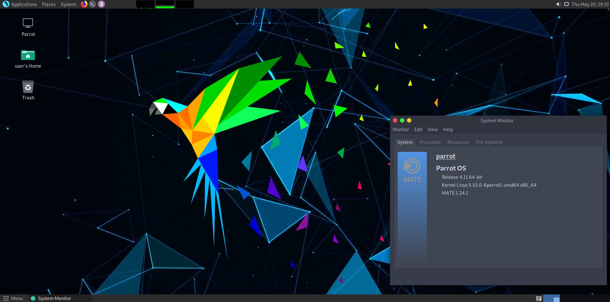

\

<h1 align="center">पेरोट ओएस क्या है?</h1>

पेरोट सुरक्षा (पेरोट ओएस, पेरोट) सुरक्षा विशेषज्ञों, डेवलपर्स और गोपनीयता जागरूक लोगों के लिए डिज़ाइन किए गए *डेबियन परीक्षण* पर आधारित एक स्वतंत्र और खुला स्रोत जीएनयू/लिनक्स वितरण है।

इसमें आईटी सुरक्षा और डिजिटल फोरेंसिक संचालन के लिए एक पूर्ण पोर्टेबल शस्त्रागार शामिल है। इसमें वह सब कुछ भी शामिल है जो आपको अपने स्वयं के कार्यक्रम विकसित करने या नेट पर सर्फिंग करते समय अपनी गोपनीयता की रक्षा करने के लिए चाहिए।

पेरोट [Security](https://parrotsec.org/security-edition) और [Home](https://parrotsec.org/home-edition) संस्करणों में उपलब्ध है, यहां तक ​​कि VM और Docker पर भी।

ऑपरेटिंग सिस्टम डिफ़ॉल्ट रूप से MATE, KDE और XFCE (केवल होम संस्करण) डेस्कटॉप वातावरण के साथ शिप करता है।

\
\

<h5 align="center">Parrot Security 4.11 with MATE Desktop</h5>

\

## इतिहास और टीम ##

पहली सार्वजनिक रिलीज़ 10 अप्रैल, 2013 को लोरेंजो फलेत्रा के काम के परिणाम के रूप में दिखाई दी, जो विकास का नेतृत्व करना जारी रखे हुए है।

मूल रूप से फ्रोजनबॉक्स (पेरोट के एक ही निर्माता द्वारा एक सामुदायिक मंच) के हिस्से के रूप में विकसित किया गया है, यह प्रयास दुनिया भर के ओपन सोर्स डेवलपर्स, पेशेवर सुरक्षा विशेषज्ञों, डिजिटल अधिकारों के अधिवक्ताओं और लिनक्स उत्साही लोगों के समुदाय को शामिल करने के लिए बढ़ा है।

इस परियोजना का मुख्यालय पलेर्मो, इटली में है और यह यूके में पंजीकृत एक सामुदायिक हित कंपनी Parrot Security CIC द्वारा शासित है।

## Why "Parrot"? ##

*Because it was born as a game, and every pirate of the seven seas needs a parrot on his shoulders if he wants to board the galleons with his crew of jailbird filibusters*.

### यह किसके लिए बनाया गया है ###

सिस्टम को सुरक्षा विशेषज्ञ के लिए परिचित होने और नए प्रवेश छात्र के लिए उपयोग में आसान होने के लिए डिज़ाइन किया गया है, लेकिन यह अपने आंतरिक को छिपाने की कोशिश नहीं करता है क्योंकि अन्य सामान्य उद्देश्य वितरण करने का प्रयास करते हैं।

पेरोट को दैनिक प्रणाली के रूप में इस्तेमाल किया जा सकता है। यह सिस्टम के एक समर्पित संस्करण ([Parrot Home Edition](../en/download-parrot.html#security-or-home-edition-which-one-should-i-choose)) जिसमें सुरक्षा उपकरण शामिल नहीं हैं।

 
### सॉफ्टवेयर प्रबंधन ###

डेबियन द्वारा समर्थित सभी पैकेजों सहित सिस्टम का अपना एप्लिकेशन रिपॉजिटरी है, साथ ही कई अन्य एप्लिकेशन और टूल डेबियन अभी तक प्रदान नहीं कर सकते हैं। ये सभी एपीटी पैकेज मैनेजर से सीधे पहुंच योग्य हैं।

इसके अतिरिक्त, पेरोट [स्नैप](https://snapcraft.io/) का समर्थन करता है, एक पैकेज वितरण प्रणाली जो कई अन्य कार्यक्रमों तक आसान पहुंच प्रदान करती है जो जीएनयू/लिनक्स वितरण हमेशा अपने सॉफ़्टवेयर संग्रह में शिप नहीं करते हैं।

[फ्लैटपैक](https://flatpak.org/) Snap की तरह ही एक यूनिवर्सल सॉफ्टवेयर स्टोर है। इसे पेरोट आधिकारिक भंडार से स्थापित किया जा सकता है।

इसके अलावा पेरोट [वाइन](https://www.winehq.org/) का समर्थन करता है, जो जीएनयू/लिनक्स वातावरण में विंडोज अनुप्रयोगों को चलाने के लिए एक संगतता परत है।
 
## क्या मुझे पेरोट का इस्तेमाल करना चाहिए? ##

### पेरोट अलग क्यों है ###

यहां तक ​​​​कि अगर हम चाहते हैं कि हर कोई पेरोट प्रणाली का उपयोग करे या, कम से कम, इसे आज़माएं, तो कुछ महत्वपूर्ण विचार हैं कि हम किससे पेरोट का उपयोग करने की उम्मीद करते हैं और इससे किसे बुरा अनुभव हो सकता है।

सबसे पहले, भले ही पेरोट सामान्य प्रयोजन के स्वाद प्रदान करता है, फिर भी इसका मूल सुरक्षा और फोरेंसिक संचालन के लिए तैयार है। इस खंड में हम बताएंगे कि अन्य सामान्य प्रयोजन वितरणों की तुलना में पेरोट कितना अलग है और यह अन्य पेंटेस्ट और फोरेंसिक वितरण से कितना अलग है। फिर हम कुछ श्रेणियों के लोगों को प्रस्तुत करेंगे और इस प्रणाली का उपयोग करके उन्हें किस तरह का अनुभव हो सकता है।

### सामान्य प्रयोजन वितरण ###

पेरोट एक सामान्य प्रयोजन वितरण (यानी उबंटू) से अलग है क्योंकि यह किसी भी तरह से अपने आंतरिक भाग को छिपाने की कोशिश नहीं करता है।

इसका अर्थ यह है कि उपयोग में आसान बनाने के लिए सिस्टम में कई स्वचालन उपकरण शामिल किए गए हैं, फिर भी सिस्टम में हुड के नीचे क्या है, इसे अच्छी तरह से उजागर करें।

एक अच्छा उदाहरण पेरोट अपडेट रिमाइंडर है: यह एक सरल लेकिन शक्तिशाली प्रोग्राम है जो उपयोगकर्ता को सप्ताह में एक बार सिस्टम अपग्रेड की जांच करने के लिए प्रेरित करता है। लेकिन अपग्रेड प्रक्रिया को प्रगति पट्टी के पीछे छिपाने के बजाय, यह उपयोगकर्ता को उपयुक्त आउटपुट से पूर्ण अपग्रेड प्रक्रिया दिखाता है।

एक और महत्वपूर्ण अंतर यह है कि पेरोट सिस्टम में पहले से स्थापित सभी नेटवर्क सेवाओं को डिफ़ॉल्ट रूप से अक्षम कर देता है, न केवल बहुत कम रैम पदचिह्न बनाए रखने और बेहतर प्रदर्शन प्रदान करने के लिए, बल्कि लक्ष्य नेटवर्क में सेवाओं के जोखिम से बचने के लिए भी। प्रत्येक नेटवर्क सेवा को उपयोगकर्ता की आवश्यकता होने पर मैन्युअल रूप से प्रारंभ करने की आवश्यकता होती है।

### पेंटेस्ट वितरण ###

पेंटेस्ट वितरण केवल सुरक्षा उपकरणों को एकीकृत करने, आसान रूट एक्सेस की अनुमति देने और सभी सुरक्षा प्रणाली बाधाओं को दूर करने के लिए प्रसिद्ध हैं जो एक पेंटर के वर्कफ़्लो को प्रभावित कर सकते हैं।

पेरोट को सुरक्षा विशेषज्ञों और शोधकर्ताओं के लिए एक बहुत ही आरामदायक वातावरण के रूप में डिजाइन किया गया था। इसमें दैनिक उपयोग के लिए कई बुनियादी कार्यक्रम शामिल हैं, जो आमतौर पर पेंटिंग वितरण को बाहर करते हैं (एक अतिरिक्त गीगाबाइट भंडारण से कम की कीमत पर)। यह विकल्प पेरोट को न केवल सुरक्षा परीक्षण करने के लिए एक अच्छी प्रणाली बनाने के लिए लिया गया था, बल्कि एक अच्छा वातावरण भी था जहां आप अतिरिक्त कंप्यूटर, ऑपरेटिंग सिस्टम या कॉन्फ़िगरेशन की आवश्यकता के बिना रिपोर्ट लिख सकते हैं, अपने उपकरण बना सकते हैं, और टीम के साथियों के साथ निर्बाध रूप से संवाद कर सकते हैं। .

हमारा लक्ष्य किसी भी पेशेवर पेंटर को शुरुआत से ही एक पेरोट आईएसओ और एक औसत लैपटॉप के साथ पूरी सुरक्षा परीक्षण करने की अनुमति देना है।

### सुरक्षित वितरण ###

AppArmor और अन्य linux हार्डनिंग तकनीकों के लिए कस्टम हार्डनिंग प्रोफाइल और कॉन्फ़िगरेशन के साथ पेरोट सुरक्षा जहाज, और अन्य परियोजनाओं की सफलता से प्रेरणा लेता है जो GNU/Linux परिदृश्य में उच्चतम स्तर की सुरक्षा प्रदान करते हैं, जैसे कि सिस्टम को सैंडबॉक्स करने और वितरित करने के लिए टेल्स और व्होनिक्स औसत से ऊपर सुरक्षा की एक परत।

यह सभी अतिरिक्त सुरक्षा लागत के साथ आती है: पेरोट पर बुरे व्यवहार को अपनाना कठिन होता है। उदाहरण के लिए, संपूर्ण डेस्कटॉप वातावरण के साथ रूट के रूप में लॉग इन करना संभव नहीं है, या अनावश्यक विशेषाधिकार प्राप्त अनुमतियों के साथ ब्राउज़र, मीडिया प्लेयर या उन्नत दस्तावेज़ रीडर जैसे महत्वपूर्ण एप्लिकेशन प्रारंभ करना संभव नहीं है।

उपयोगकर्ता अभी भी रूट कंसोल खोल सकता है, विशेषाधिकार प्राप्त अनुमतियों के साथ सुरक्षा उपकरण लॉन्च कर सकता है और बिना सीमा के सिस्टम का उपयोग कर सकता है। केवल एक चीज जो बदलती है वह यह है कि सभी महत्वपूर्ण उपयोगकर्ता एप्लिकेशन अब बहुत खराब व्यवहार और सामान्य शोषण तकनीकों, या यहां तक ​​​​कि शून्य-दिनों से सुरक्षित हैं, और उन्नत कारनामों के कारण होने वाले नुकसान बहुत सीमित हैं।

### फोरेंसिक वितरण ###

डिजिटल फोरेंसिक विशेषज्ञों को ऐसे माहौल की जरूरत है जो उनके साक्ष्य से समझौता न करे।

फोरेंसिक अधिग्रहण को सुरक्षित तरीके से करने की अनुमति देने के लिए पेरोट डिफ़ॉल्ट रूप से अक्षम ऑटोमाउंट फ़ंक्शन के साथ आता है। वैश्विक ऑटोमाउंट नीति को सिस्टम स्टैक की सभी परतों में एक अनावश्यक तरीके से कॉन्फ़िगर किया गया है, बूट पर डिफ़ॉल्ट रूप से पारित नोऑटोमाउंट कर्नेल विकल्प से, ऑटो माउंट और प्लग एंड प्ले सुविधाओं को अक्षम करने के लिए विशिष्ट फ़ाइल प्रबंधक सेटिंग्स तक।

यह मत भूलो कि डिस्क अभी भी सिस्टम द्वारा पहचाने जाते हैं, और सिस्टम उन्हें बिना सुरक्षा के माउंट करेगा यदि उपयोगकर्ता गलती से उन्हें खोल देता है।

नो-ऑटोमाउंट व्यवहार सुसंगत और स्थिर है, लेकिन आकस्मिक माउंट के मामले में कोई सुरक्षा प्रदान नहीं की जाती है। किसी भी डिजिटल फोरेंसिक परिदृश्य में हमेशा राइट ब्लॉकर की सिफारिश की जाती है।

संक्षेप में, पेरोट किसके लिए बनाया गया है:

- सुरक्षा विशेषज्ञ
- डिजिटल फोरेंसिक विशेषज्ञ
- कंप्यूटर साइंस/इंजीनियरिंग के छात्र
- शोधकर्ताओं
- वानाबे हैकर्स
- सॉफ्टवेयर डेवलपर
